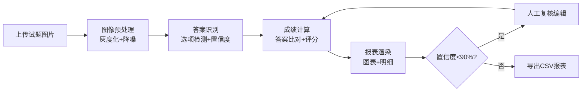

## 1. 产品概述

智能选择题批改系统是一款面向在线教育场景的自动化批改工具，旨在帮助教师高效处理大量选择题答题卡，通过图片识别技术自动完成答案提取、评分和成绩统计，显著减轻教师工作负担。

- 核心价值：将传统人工批改流程自动化，批改效率提升90%以上
- 目标用户：K12教师、高校讲师、培训机构教务人员
- 市场定位：专业级在线教育辅助工具，聚焦选择题批量批改场景

## 2. 核心 Features

### 2.1 用户角色

| 角色 | 注册方式 | 核心权限 |
|------|----------|----------|
| 教师用户 | 无需注册，直接使用 | 上传试题图片、配置标准答案、查看批改报表、导出成绩数据、人工复核调整 |

### 2.2 Feature Module

1. **Dashboard 主页面**：图片上传区、批量处理队列、标准答案配置、批改结果展示、报表可视化
2. **图像预处理模块**：灰度化处理、降噪算法、像素矩阵输出
3. **答案识别模块**：选项涂黑检测、置信度计算、单选/多选模式支持
4. **成绩计算模块**：答案比对、对错标记、总分统计、正确率计算
5. **报表渲染模块**：柱状图成绩分布、横向条形图错误率排行、批改明细列表、CSV导出

### 2.3 Page Details

| 页面名称 | 模块名称 | Feature 描述 |
|---------|----------|-------------|
| Dashboard | 品牌导航栏 | 显示系统Logo、名称、版本信息，固定在页面顶部 |
| Dashboard | 图片上传区 | 支持拖拽/点击上传JPG/PNG，实时显示上传进度条，单张进度动画 |
| Dashboard | 批量队列管理 | 支持最多10张图片排队处理，显示当前处理进度、预计剩余时间、队列状态 |
| Dashboard | 标准答案配置 | JSON格式粘贴输入，实时校验格式，支持单选/多选题混合配置 |
| Dashboard | 识别结果面板 | 展示每道题识别答案、置信度、对错标记，置信度<90%高亮标记待复核 |
| Dashboard | 复核编辑功能 | 点击待复核题目可编辑答案，重新提交后实时更新报表数据 |
| Dashboard | 成绩分布图表 | 柱状图展示各分数段人数分布，支持平滑过渡动画 |
| Dashboard | 错误率排行图表 | 横向条形图展示错误率最高的题目，按错误率降序排列 |
| Dashboard | 批改明细列表 | 展示每道题的详细批改结果，支持滚动浏览，60FPS流畅滚动 |
| Dashboard | CSV导出功能 | 一键导出所有批改结果为CSV格式文件 |

## 3. 核心流程

### 用户批改主流程

教师上传试题图片 → 系统自动灰度化和降噪处理 → 识别选项涂黑标记并计算置信度 → 根据标准答案自动比对评分 → 生成可视化报表和批改明细 → 教师复核低置信度题目 → 导出成绩报表

### 批量处理流程

## 4. User Interface Design

### 4.1 Design Style

- **主色调**：深蓝 #1a237e（专业教育感）
- **辅助色**：白色 #ffffff、浅灰 #f5f5f00
- **强调色**：绿色 #4caf50（正确）、红色 #f44336（错误）、橙色 #ff9800（待复核）
- **按钮风格**：圆角8px，悬停时阴影变换 box-shadow: 0 4px 12px rgba(0,0,0,0.2)
- **字体**：展示字体用 Playfair Display（优雅专业），正文字体用 Source Sans Pro（清晰易读）
- **布局风格**：卡片式布局，桌面端三栏、平板双栏、手机单栏堆叠
- **动效**：组件切换淡入淡出 0.3s ease，图表平滑过渡，数据加载骨架屏

### 4.2 Page Design Overview

| 页面名称 | 模块名称 | UI Elements |
|---------|----------|-------------|
| Dashboard | 顶部导航栏 | 深蓝背景、白色Logo文字、固定定位、高度64px |
| Dashboard | 左侧上传区 | 浅灰卡片、拖拽虚线边框、悬停高亮、进度条动画 |
| Dashboard | 中间操作面板 | 白色卡片、标准答案输入框、批量队列列表、处理进度指示器 |
| Dashboard | 右侧报表区 | 白色卡片、图表容器、骨架屏加载、图表淡入动画 |
| Dashboard | 底部明细区 | 全宽卡片、表格布局、滚动容器、行悬停高亮 |
| Dashboard | 复核弹窗 | 半透明遮罩、居中对话框、编辑表单、确认/取消按钮 |

### 4.3 Responsiveness

- **设计策略**：桌面优先（Desktop-first），移动端自适应
- **断点设置**：
  - 桌面端 ≥ 1200px：三栏布局（上传区25% + 操作面板35% + 报表区40%）
  - 平板端 768px - 1199px：双栏布局（上传区+操作面板50% + 报表区50%）
  - 手机端 < 768px：单栏堆叠，全部垂直排列
- **触摸优化**：按钮最小高度48px，点击区域足够，支持滑动浏览

### 4.4 微交互设计

- 上传按钮悬停：阴影加深 + 背景色微亮
- 拖拽区域激活：边框变实 + 背景色变深蓝5%
- 进度条动画：线性渐变从左到右填充
- 图表加载：骨架屏脉冲动画 → 数据平滑过渡
- 复核点击：行背景色变橙色 + 缩放效果
- 提交成功：canvas-confetti 庆祝动效
