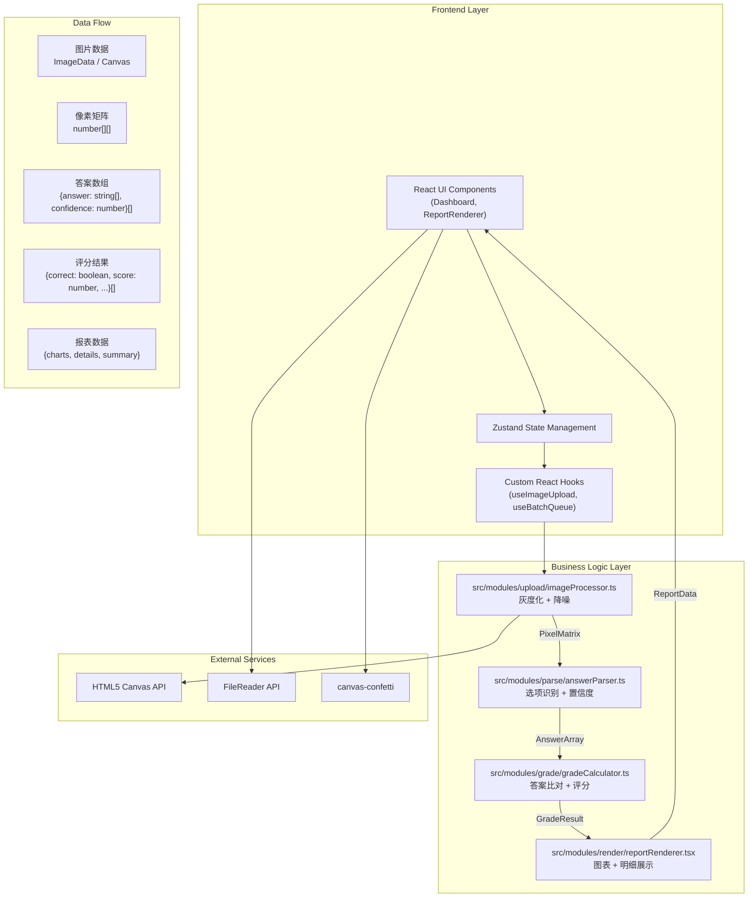
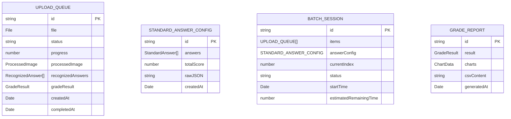

## 1. Architecture Design



## 2. Technology Description

- **Frontend Framework**：React 18 + TypeScript 5
- **Build Tool**：Vite 5（配置 React 插件和路径别名 @）
- **Styling**：Tailwind CSS 3 + 自定义 CSS 变量
- **State Management**：Zustand（轻量级状态管理）
- **Chart Library**：Recharts（React 图表库，支持柱状图、条形图）
- **Icons**：Lucide React
- **Image Processing**：HTML5 Canvas API（原生实现，无需额外库）
- **Effects**：canvas-confetti（提交成功庆祝效果）
- **HTTP Client**：Axios（预留后端接口扩展）
- **Performance**：
  - 图片预处理 ≤ 500ms（1080p）
  - 答案识别 ≤ 2s
  - 总时延 ≤ 5s
  - 滚动帧率 60FPS

## 3. Route Definitions

| 路由路径 | 页面组件 | 用途说明 |
|---------|----------|---------|
| `/` | [Dashboard.tsx](file:///d:/Pro/tasks/auto1/src/pages/Dashboard.tsx) | 主页面，整合上传、识别、批改、报表全流程 |

## 4. API Definitions

本项目为纯前端应用，所有处理在浏览器端完成。以下为内部模块接口定义：

### 4.1 图像预处理模块

```typescript
// src/modules/upload/imageProcessor.ts
export interface ProcessedImage {
  pixelMatrix: number[][];      // 灰度像素矩阵 (0-255)
  width: number;
  height: number;
  originalImage: HTMLImageElement;
}

export interface ImageProcessorOptions {
  denoiseStrength?: number;     // 降噪强度 0-10，默认5
  contrastLevel?: number;       // 对比度增强级别 0-2，默认1
}

export function processImage(
  imageData: ImageData,
  options?: ImageProcessorOptions
): Promise<ProcessedImage>;
```

### 4.2 答案识别模块

```typescript
// src/modules/parse/answerParser.ts
export interface RecognizedAnswer {
  questionNumber: number;
  answers: string[];            // 识别的选项，如 ['A'] 或 ['A', 'C']
  confidence: number;           // 置信度 0-1
  isMultiple: boolean;          // 是否多选题
  needsReview: boolean;         // 是否需要人工复核 (confidence < 0.9)
}

export interface ParserOptions {
  mode: 'single' | 'multiple' | 'auto';  // 单选/多选/自动检测
  optionCount: number;          // 选项数量，默认4
  threshold?: number;           // 涂黑阈值 0-1，默认0.6
}

export function parseAnswers(
  pixelMatrix: number[][],
  options: ParserOptions
): Promise<RecognizedAnswer[]>;
```

### 4.3 成绩计算模块

```typescript
// src/modules/grade/gradeCalculator.ts
export interface StandardAnswer {
  questionNumber: number;
  correctAnswers: string[];
  isMultiple: boolean;
  score: number;                // 单题分值
}

export interface GradedQuestion {
  questionNumber: number;
  recognizedAnswers: string[];
  correctAnswers: string[];
  isCorrect: boolean;
  score: number;                // 实际得分
  maxScore: number;             // 满分
  confidence: number;
  needsReview: boolean;
}

export interface GradeResult {
  questions: GradedQuestion[];
  totalScore: number;
  maxScore: number;
  accuracy: number;             // 正确率 0-1
  correctCount: number;
  wrongCount: number;
  reviewCount: number;
}

export function calculateGrade(
  recognizedAnswers: RecognizedAnswer[],
  standardAnswers: StandardAnswer[],
  totalScore?: number
): GradeResult;
```

### 4.4 报表渲染模块

```typescript
// src/modules/render/reportRenderer.tsx
export interface ChartData {
  scoreDistribution: { range: string; count: number }[];
  errorRateRanking: { questionNumber: number; errorRate: number }[];
}

export interface ReportData {
  gradeResult: GradeResult;
  chartData: ChartData;
}

interface ReportRendererProps {
  data: ReportData | null;
  loading: boolean;
  onReview: (questionNumber: number) => void;
  onExportCSV: () => void;
}

export function ReportRenderer({
  data,
  loading,
  onReview,
  onExportCSV,
}: ReportRendererProps): JSX.Element;
```

## 5. 数据模型

### 5.1 数据模型定义



### 5.2 Zustand Store 定义

```typescript
// src/store/useGradingStore.ts
interface GradingState {
  // 批量队列
  queue: UploadQueueItem[];
  currentIndex: number;
  isProcessing: boolean;
  
  // 标准答案配置
  standardAnswers: StandardAnswer[];
  totalScore: number;
  answerConfigError: string | null;
  
  // 当前结果
  currentResult: GradeResult | null;
  chartData: ChartData | null;
  
  // Actions
  addToQueue: (files: File[]) => void;
  removeFromQueue: (id: string) => void;
  clearQueue: () => void;
  processNext: () => Promise<void>;
  setStandardAnswers: (json: string) => boolean;
  updateAnswer: (questionNumber: number, answers: string[]) => void;
  recalculateGrade: () => void;
  exportCSV: () => string;
}
```

## 6. 文件结构

```
d:\Pro\tasks\auto1\
├── .trae\documents\
│   ├── PRD_智能选择题批改系统.md
│   └── Technical_Architecture_智能选择题批改系统.md
├── package.json
├── vite.config.js
├── tsconfig.json
├── index.html
├── src\
│   ├── main.tsx
│   ├── App.tsx
│   ├── index.css
│   ├── pages\
│   │   └── Dashboard.tsx
│   ├── modules\
│   │   ├── upload\
│   │   │   └── imageProcessor.ts
│   │   ├── parse\
│   │   │   └── answerParser.ts
│   │   ├── grade\
│   │   │   └── gradeCalculator.ts
│   │   └── render\
│   │       └── reportRenderer.tsx
│   ├── components\
│   │   ├── UploadArea.tsx
│   │   ├── BatchQueue.tsx
│   │   ├── AnswerConfig.tsx
│   │   ├── ProgressBar.tsx
│   │   ├── ReviewModal.tsx
│   │   └── Skeleton.tsx
│   ├── store\
│   │   └── useGradingStore.ts
│   ├── hooks\
│   │   ├── useImageUpload.ts
│   │   └── useBatchProcessor.ts
│   ├── types\
│   │   └── index.ts
│   └── utils\
│       ├── csv.ts
│       └── canvas.ts
└── public\
    └── favicon.ico
```

## 7. 性能优化策略

### 7.1 图片处理优化
- 使用 OffscreenCanvas 进行后台处理，避免阻塞主线程
- 图像缩放到合适尺寸后再处理，减少计算量
- 采用分块处理策略，使用 requestIdleCallback 处理大块数据

### 7.2 识别算法优化
- 使用积分图（Integral Image）加速区域像素统计
- 采用 WebAssembly（预留）或 SIMD 优化核心计算
- 提前终止：置信度足够高时停止进一步计算

### 7.3 渲染优化
- 长列表使用虚拟滚动（Virtual Scrolling）
- 图表数据使用 memo 缓存，避免重复计算
- 使用 CSS transform 和 opacity 实现动画，触发 GPU 加速
- 实现 shouldComponentUpdate / React.memo 减少不必要重渲染

### 7.4 内存管理
- 及时释放 Canvas 资源和 ImageData
- 处理完成后清除大对象引用
- 使用 WeakMap 存储临时数据
