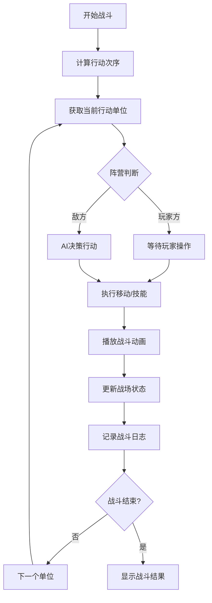

## 1. 产品概述

回合制战术战斗场景构建器 - 帮助游戏设计师快速搭建、测试和验证回合制战术战斗的数值平衡与玩法设计。

- **核心目标**：解决游戏设计阶段手动验证技能数值、行动次序和战场地形影响效率低下的问题
- **目标用户**：游戏设计师、战术游戏策划、战斗系统开发者
- **产品价值**：可视化快速迭代战斗设计，减少原型开发周期

## 2. 核心功能

### 2.1 用户角色
| 角色 | 注册方式 | 核心权限 |
|------|----------|----------|
| 游戏设计师 | 无需注册，本地使用 | 完整的战场编辑、战斗模拟、数据配置权限 |

### 2.2 功能模块
1. **战场编辑器**：8x8六边形网格地图，地形布置，单位部署
2. **战斗模拟器**：回合制战斗执行，行动次序计算，AI自动行动
3. **单位系统**：属性配置，技能系统，buff/debuff管理
4. **地形系统**：五种地形类型，移动消耗，攻防加成
5. **战斗日志**：实时战斗记录，颜色分类显示
6. **信息面板**：单位详情展示，技能列表，状态效果

### 2.3 页面详情
| 页面名称 | 模块名称 | 功能描述 |
|----------|----------|----------|
| 主界面 | 战场画布 | 8x8六边形网格渲染，单位绘制，地形显示，战斗动画 |
| 主界面 | 左侧信息面板 | 选中单位属性、技能列表、当前状态效果 |
| 主界面 | 底部战斗日志 | 回合记录，按时间排序，颜色区分阵营 |
| 主界面 | 顶部控制栏 | 回合控制，速度调节，重置功能 |

## 3. 核心流程

### 3.1 战斗准备阶段
1. 用户进入应用，自动加载初始战场配置
2. 在网格上部署/调整玩家和敌方单位
3. 确认地形布置和单位属性
4. 开始战斗

### 3.2 战斗执行阶段
1. 系统按速度属性计算行动次序
2. 当前行动单位高亮显示
3. 玩家选择己方单位执行移动或技能
4. 移动时显示可达范围，技能选择时显示作用范围
5. 执行后播放战斗动画并更新战场状态
6. 敌方单位由AI自动决策行动
7. 循环直至一方全灭或手动结束

## 4. 用户界面设计

### 4.1 设计风格
- **主色调**：靛蓝（Indigo）与琥珀金（Amber Gold）搭配
- **背景**：浅褐色史诗羊皮纸纹理
- **风格定位**：复古奇幻战术风格，精致细腻的UI细节
- **圆角设计**：所有UI控件采用圆角设计
- **交互反馈**：按钮点击缩放0.95倍，过渡动画200ms ease-out

### 4.2 视觉元素
- **六边形网格**：彩色圆角六边形图标表示单位
  - 玩家方：蓝色系
  - 敌方：红色系
- **地形表现**：
  - 平原：浅绿底色
  - 树林：深绿带随机点状阴影
  - 岩石：灰色带斜纹纹理
  - 河流：半透明蓝色波纹效果
  - 沼泽：暗绿带气泡纹理
- **战斗动画**：
  - 目标抖动效果
  - 伤害数字弹出并消散
  - 暴击时数字放大变红+爆裂粒子效果
  - 移动/技能范围半透明高亮

### 4.3 页面设计概述
| 页面名称 | 模块名称 | UI元素 |
|----------|----------|--------|
| 主界面 | 战场画布 | 六边形网格、单位图标、地形纹理、范围高亮、战斗动画 |
| 主界面 | 左侧信息面板 | 属性数值条、技能图标网格、状态效果图标、单位头像 |
| 主界面 | 底部日志区 | 滚动日志列表、彩色文字标签、滑入动画 |
| 主界面 | 顶部控制区 | 回合数显示、当前行动者、控制按钮组 |

### 4.4 响应式
- 桌面端优先设计
- 战场画布自适应居中
- 信息面板固定宽度，内容区可滚动
- 底部日志区域固定高度

### 4.5 动效设计
- **页面加载**：元素淡入+位移动画，错落延迟
- **按钮交互**：hover时轻微上浮+阴影加深，click时缩放0.95
- **单位选中**：呼吸光环效果
- **伤害数字**：弹出+上浮+渐隐，暴击时放大+红色+粒子爆裂
- **日志新增**：从下方滑入+淡入效果
- **地形悬停**：信息提示气泡淡入

## 5. 性能要求
- 战场渲染帧率 ≥ 30FPS
- 单位数量上限20个时操作延迟 &lt; 100ms
- 技能/移动范围计算响应 &lt; 50ms
- AI决策时间 &lt; 200ms

