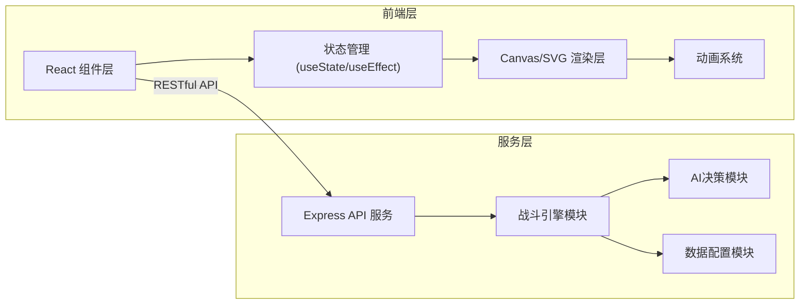

## 1. 架构设计



## 2. 技术描述

- **前端框架**: React 18 + TypeScript
- **构建工具**: Vite 5
- **后端框架**: Express 4
- **UI渲染**: Canvas API 用于战场网格和动画
- **状态管理**: React Hooks (useState, useEffect, useCallback)
- **通信方式**: RESTful API
- **ID生成**: uuid

### 依赖包
- react, react-dom - 前端框架
- express - 后端服务器
- typescript - 类型系统
- vite, @vitejs/plugin-react - 构建工具
- uuid - 唯一ID生成
- body-parser - 请求体解析
- cors - 跨域支持

## 3. 项目结构

```
auto101/
├── package.json              # 项目依赖和脚本
├── vite.config.js            # Vite配置
├── tsconfig.json             # TypeScript配置
├── index.html                # 入口HTML
├── src/
│   ├── client/               # 前端代码
│   │   ├── main.tsx          # React入口
│   │   ├── App.tsx           # 主应用组件
│   │   ├── components/       # 组件
│   │   │   ├── BattleField.tsx   # 战场组件
│   │   │   └── InfoPanel.tsx     # 信息面板
│   │   └── utils/            # 工具函数
│   │       └── animations.ts     # 动画工具
│   └── server/               # 后端代码
│       └── battleEngine.ts   # 战斗引擎和API
```

## 4. API 定义

### 4.1 获取初始战场配置
- **路径**: `GET /api/init`
- **描述**: 获取初始战场配置，包括地图、单位、地形等
- **响应**:
```typescript
interface BattleState {
  grid: TerrainCell[][];      // 8x8地形网格
  units: Unit[];              // 所有单位列表
  turnOrder: string[];        // 行动次序（单位ID数组）
  currentTurnIndex: number;   // 当前行动单位索引
  round: number;              // 当前回合数
  logs: BattleLog[];          // 战斗日志
  gameOver: boolean;          // 游戏是否结束
  winner?: 'player' | 'enemy'; // 获胜方
}

interface TerrainCell {
  type: 'plain' | 'forest' | 'rock' | 'river' | 'swamp';
  moveCost: number;           // 移动消耗
  defenseBonus: number;       // 防御加成
  attackBonus: number;        // 攻击加成
}

interface Unit {
  id: string;
  name: string;
  faction: 'player' | 'enemy';
  position: HexCoord;
  hp: number;
  maxHp: number;
  attack: number;
  defense: number;
  speed: number;
  moveRange: number;
  skills: Skill[];
  buffs: Buff[];
  hasActed: boolean;
  hasMoved: boolean;
}

interface Skill {
  id: string;
  name: string;
  type: 'damage' | 'heal' | 'buff' | 'shield';
  range: number;
  areaType: 'single' | 'circle' | 'fan';
  areaSize: number;
  power: number;
  cooldown: number;
  currentCooldown: number;
  description: string;
}

interface HexCoord {
  q: number;  // 列坐标 (0-7)
  r: number;  // 行坐标 (0-7)
}

interface BattleLog {
  id: string;
  timestamp: number;
  type: 'player' | 'enemy' | 'system';
  message: string;
}
```

### 4.2 执行行动
- **路径**: `POST /api/act`
- **描述**: 执行一个战斗行动（移动或技能）
- **请求体**:
```typescript
interface ActionRequest {
  unitId: string;
  actionType: 'move' | 'skill';
  targetPosition?: HexCoord;  // 移动目标
  skillId?: string;           // 使用的技能ID
  targetUnitId?: string;      // 目标单位ID
}
```
- **响应**: `BattleState` - 更新后的战场状态

## 5. 核心数据类型

```typescript
// 地形类型枚举
type TerrainType = 'plain' | 'forest' | 'rock' | 'river' | 'swamp';

// 六边形坐标系统 (axial coordinates)
interface HexCoord {
  q: number;
  r: number;
}

// 单位属性
interface UnitStats {
  hp: number;
  maxHp: number;
  attack: number;
  defense: number;
  speed: number;
  moveRange: number;
}

// 技能定义
interface Skill {
  id: string;
  name: string;
  type: 'damage' | 'heal' | 'buff' | 'shield';
  range: number;
  areaType: 'single' | 'circle' | 'fan';
  areaSize: number;
  power: number;
  cooldown: number;
  description: string;
  icon?: string;
}

// Buff/Debuff效果
interface Buff {
  id: string;
  name: string;
  type: 'buff' | 'debuff';
  effect: 'attack' | 'defense' | 'speed' | 'shield' | 'dot' | 'hot';
  value: number;
  duration: number;
  icon?: string;
}

// 战斗日志
interface BattleLog {
  id: string;
  timestamp: number;
  type: 'player' | 'enemy' | 'system';
  message: string;
}

// 完整战斗状态
interface BattleState {
  grid: TerrainCell[][];
  units: Unit[];
  turnOrder: string[];
  currentTurnIndex: number;
  round: number;
  logs: BattleLog[];
  gameOver: boolean;
  winner?: 'player' | 'enemy';
}
```

## 6. 六边形网格系统

使用轴向坐标系（axial coordinates）表示六边形网格：
- `q`: 列坐标 (0-7)
- `r`: 行坐标 (0-7)

### 6.1 邻居方向
六个方向的偏移量：
```
[+1, 0], [+1, -1], [0, -1], [-1, 0], [-1, +1], [0, +1]
```

### 6.2 距离计算
两个六边形之间的距离：
```typescript
function hexDistance(a: HexCoord, b: HexCoord): number {
  return (Math.abs(a.q - b.q) + Math.abs(a.q + a.r - b.q - b.r) + Math.abs(a.r - b.r)) / 2;
}
```

### 6.3 像素坐标转换
点顶式六边形（pointy-top）：
```typescript
function hexToPixel(hex: HexCoord, size: number): { x: number; y: number } {
  const x = size * (Math.sqrt(3) * hex.q + Math.sqrt(3) / 2 * hex.r);
  const y = size * (3 / 2 * hex.r);
  return { x, y };
}
```

## 7. AI 决策逻辑

敌方AI采用简单但有效的决策流程：
1. 评估所有可攻击目标
2. 优先攻击低血量目标
3. 如果在攻击范围内，直接攻击
4. 如果不在范围内，向最近目标移动
5. 选择威力最大且可用的技能

## 8. 前端渲染方案

### 8.1 Canvas 渲染
- 战场网格使用 Canvas 2D API 绘制
- 每帧重绘，保证动画流畅
- 单位、地形、特效分层绘制

### 8.2 动画系统
- 使用 requestAnimationFrame 实现流畅动画
- 动画类型：单位移动、伤害数字、抖动效果、粒子特效
- 动画队列管理，确保顺序执行

## 9. 性能优化策略

- 使用 Canvas 离屏渲染地形图层
- 单位位置缓存，减少重复计算
- 动画帧合并，避免频繁重绘
- 事件防抖，减少高频操作的计算量
- 合理使用 requestAnimationFrame 调度渲染

