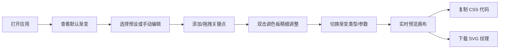

## 1. 产品概述

CSS 渐变调色板工具是一款面向设计师和前端开发者的在线渐变设计工具，帮助用户通过直观的交互快速构建、预览和导出复杂的 CSS 渐变效果。

- 核心价值：将复杂的 CSS 渐变语法转化为可视化、可拖拽的交互操作，大幅提升设计效率
- 目标用户：UI 设计师、前端开发者、创意工作者
- 产品定位：轻量、专业、高效的渐变设计与代码生成工具

## 2. 核心功能

### 2.1 功能模块

1. **渐变条编辑器**：添加/删除/拖拽渐变关键点，实时预览渐变效果
2. **精细调色板**：色相环、饱和度亮度滑块、HEX/RGB/HSL 多格式颜色输入
3. **渐变类型控制**：支持线性渐变（可调角度）、径向渐变（圆形/椭圆、可调中心）、锥形渐变（可调起始角度）
4. **预设色卡库**：6 款精选预设渐变（暖阳橙、海洋蓝、极光绿、日落紫、迷雾灰、糖果粉）
5. **代码导出**：一键复制 CSS background 代码，语法高亮展示
6. **SVG 导出**：一键下载 400x200 像素 SVG 渐变纹理

### 2.2 页面详情

| 页面名称 | 模块名称 | 功能描述 |
|----------|----------|----------|
| 主工作区 | 渐变条编辑器 | 多关键点管理、拖拽调整位置、双击打开调色板、实时渐变预览条 |
| 主工作区 | 预览画布 | 300x200 像素 Canvas 实时渲染渐变效果 |
| 左侧边栏 | 预设色卡区 | 6 个预设渐变色卡，点击快速应用 |
| 右侧边栏 | 类型控制面板 | 渐变类型切换、角度/形状/中心位置参数调节 |
| 右侧边栏 | 代码面板 | CSS 代码展示、语法高亮、一键复制 |
| 右侧边栏 | 导出按钮 | SVG 纹理下载功能 |

## 3. 核心流程

用户打开应用 → 查看默认渐变效果 → 通过左侧预设快速选择或手动编辑渐变 → 在渐变条上添加/拖拽/删除关键点 → 双击关键点打开调色板精细调色 → 在右侧面板切换渐变类型并调节参数 → 预览画布实时更新 → 复制 CSS 代码或下载 SVG 文件

## 4. 用户界面设计

### 4.1 设计风格

- **主题**：深色主题，配合柔和渐变色点缀
- **主色调**：深灰背景 (#0f1117)，面板背景 (#1a1d29)，边框 (#2a2e42)
- **强调色**：柔和的蓝紫渐变作为交互高亮
- **按钮风格**：圆角胶囊按钮，悬停微弱发光效果
- **字体**：现代无衬线字体，清晰的层级对比
- **布局风格**：宽屏三分栏布局，卡片式面板
- **动效**：所有交互 0.3 秒缓动过渡，平滑自然

### 4.2 页面设计概述

| 区域 | 模块 | UI 元素 |
|------|------|---------|
| 左侧窄栏 | 预设色卡区 | 垂直排列的渐变色卡缩略图，悬停放大效果 |
| 中间核心区 | 渐变条 + 预览画布 | 渐变条居上（可交互关键点），画布居下（实时渲染），半透明网格背景辅助对齐 |
| 右侧窄栏 | 控制面板 + 代码面板 | 类型切换按钮组、滑块控件、代码展示区、复制与导出按钮 |

### 4.3 响应式

- **设计策略**：桌面端优先，移动端自适应
- **断点**：768px 以下转为上下两栏布局
- **移动端**：控制面板折叠为可展开抽屉，渐变条和画布占据主区域
- **触摸优化**：关键点触控区域放大，滑块更易操作

### 4.4 性能要求

- 预览画布重绘延迟 ≤ 50ms
- 关键点拖拽 60fps 流畅度
- 颜色计算使用高效算法，避免阻塞主线程
