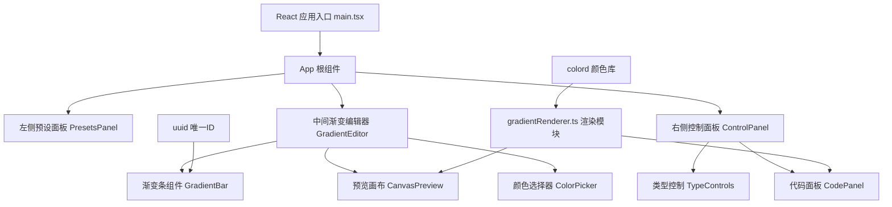

## 1. 架构设计



## 2. 技术描述

- **前端框架**：React 18 + TypeScript
- **构建工具**：Vite 5 + @vitejs/plugin-react
- **颜色处理**：colord（轻量高效的颜色转换库）
- **唯一标识**：uuid（生成渐变关键点 ID）
- **状态管理**：React useState/useCallback（轻量场景，无需额外状态库）
- **渲染方式**：Canvas 2D API 实现高性能渐变预览
- **样式方案**：原生 CSS + CSS 变量（深色主题变量体系）

## 3. 文件结构

| 文件路径 | 职责 |
|----------|------|
| `package.json` | 项目依赖与脚本配置 |
| `vite.config.js` | Vite 构建配置，React 插件 |
| `tsconfig.json` | TypeScript 严格模式，JSX react-jsx |
| `index.html` | 入口 HTML，全屏深色背景 |
| `src/main.tsx` | React 入口渲染 |
| `src/App.tsx` | 根组件，布局与全局状态管理 |
| `src/GradientEditor.tsx` | 主工作区组件，渐变条与关键点交互逻辑 |
| `src/ControlPanel.tsx` | 右侧控制面板，类型切换与参数调节 |
| `src/PresetsPanel.tsx` | 左侧预设色卡面板 |
| `src/ColorPicker.tsx` | 精细调色板弹窗组件 |
| `src/gradientRenderer.ts` | 纯函数渲染模块，Canvas/CSS/SVG 输出 |
| `src/types.ts` | TypeScript 类型定义 |
| `src/presets.ts` | 预设渐变数据 |
| `src/index.css` | 全局样式与 CSS 变量 |

## 4. 核心类型定义

```typescript
interface GradientStop {
  id: string;
  color: string;
  position: number; // 0-100 百分比
  opacity: number; // 0-1
}

type GradientType = 'linear' | 'radial' | 'conic';

interface GradientConfig {
  type: GradientType;
  stops: GradientStop[];
  angle: number; // 线性渐变角度 0-360
  radialShape: 'circle' | 'ellipse';
  centerX: number; // 径向渐变中心 0-100
  centerY: number;
  startAngle: number; // 锥形渐变起始角度
}
```

## 5. 性能优化策略

1. **Canvas 复用**：使用 useRef 保存 canvas 上下文，避免重复创建
2. **防抖渲染**：拖拽操作使用 requestAnimationFrame 节流
3. **纯函数计算**：gradientRenderer 为无副作用纯函数，便于缓存
4. **memo 优化**：使用 React.memo 包裹子组件，减少不必要重渲染
5. **颜色计算**：使用 colord 库高效进行颜色空间转换
6. **CSS 硬件加速**：动画效果使用 transform 和 opacity，触发 GPU 加速
