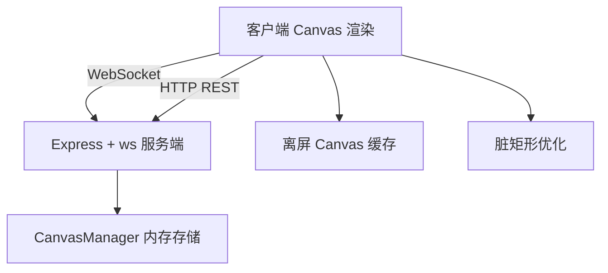
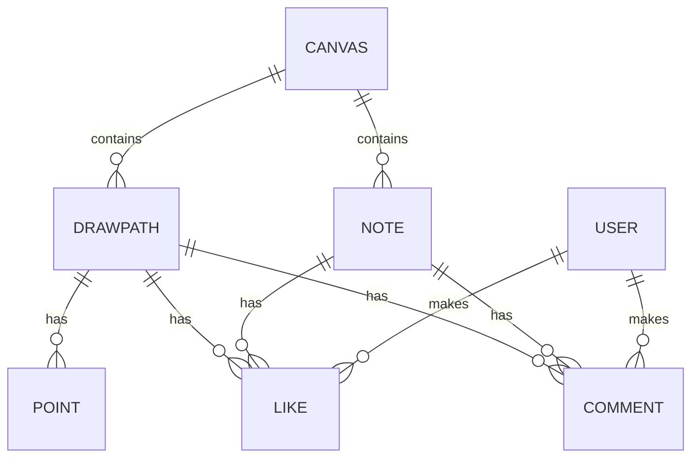

## 1. 架构设计



## 2. 技术描述

- **前端**：React 18 + TypeScript + Vite
- **构建工具**：Vite + @vitejs/plugin-react
- **后端**：Express 4 + ws (WebSocket)
- **数据存储**：内存对象存储（CanvasManager）
- **状态管理**：React Hooks + 自定义 useWebSocket Hook
- **图标**：lucide-react

### 项目依赖
- react, react-dom
- express
- typescript
- vite, @vitejs/plugin-react
- ws
- uuid
- cors
- body-parser

## 3. 目录结构

```
├── package.json
├── vite.config.js
├── tsconfig.json
├── index.html
├── server/
│   ├── index.ts          # Express 服务入口
│   └── canvasManager.ts  # 画布数据管理
└── src/
    ├── main.tsx          # React 入口
    ├── App.tsx           # 主布局组件
    ├── components/
    │   ├── Canvas.tsx    # 核心画布组件
    │   └── Toolbar.tsx   # 工具栏组件
    └── hooks/
        └── useWebSocket.ts  # WebSocket Hook
```

## 4. API 定义

### 4.1 REST API
| 方法 | 路径 | 用途 |
|------|------|------|
| GET | /api/canvas | 获取画布数据 |
| GET | /api/users | 获取在线用户列表 |

### 4.2 WebSocket 消息类型

```typescript
// 客户端发送
type ClientMessage = 
  | { type: 'draw'; data: DrawPath }
  | { type: 'addNote'; data: Note }
  | { type: 'updateNote'; data: Note }
  | { type: 'like'; data: { elementId: string } }
  | { type: 'comment'; data: { elementId: string; text: string } }
  | { type: 'userJoin'; data: { username: string; color: string } };

// 服务端广播
type ServerMessage =
  | { type: 'init'; data: CanvasState }
  | { type: 'draw'; data: DrawPath; from: string }
  | { type: 'addNote'; data: Note; from: string }
  | { type: 'updateNote'; data: Note; from: string }
  | { type: 'like'; data: { elementId: string; userId: string; count: number } }
  | { type: 'comment'; data: { elementId: string; comment: Comment } }
  | { type: 'userJoin'; data: User }
  | { type: 'userLeave'; data: { userId: string } }
  | { type: 'batch'; data: ServerMessage[] };
```

## 5. 数据模型

### 5.1 数据模型定义



### 5.2 类型定义

```typescript
interface User {
  id: string;
  username: string;
  color: string;
}

interface Point {
  x: number;
  y: number;
}

interface DrawPath {
  id: string;
  type: 'path';
  points: Point[];
  color: string;
  width: number;
  userId: string;
  likes: string[];
  comments: Comment[];
}

interface Note {
  id: string;
  type: 'note';
  x: number;
  y: number;
  width: number;
  height: number;
  text: string;
  color: string;
  userId: string;
  likes: string[];
  comments: Comment[];
}

interface Comment {
  id: string;
  userId: string;
  username: string;
  text: string;
  timestamp: number;
}

interface CanvasState {
  elements: (DrawPath | Note)[];
  users: User[];
}
```

## 6. 性能优化策略

1. **离屏 Canvas 缓存**：静态图形缓存到离屏 Canvas，减少重复绘制
2. **脏矩形渲染**：仅重绘变化区域，提高帧率
3. **分层渲染**：静态层 + 动态层分离
4. **消息批量处理**：WebSocket 消息频率控制在 30 条/秒，超过时合并批量更新
5. **节流与防抖**：绘制消息发送节流，窗口大小变化防抖

## 7. 启动脚本
- `npm run dev`：同时启动前端 Vite 开发服务器和后端 Express 服务器
