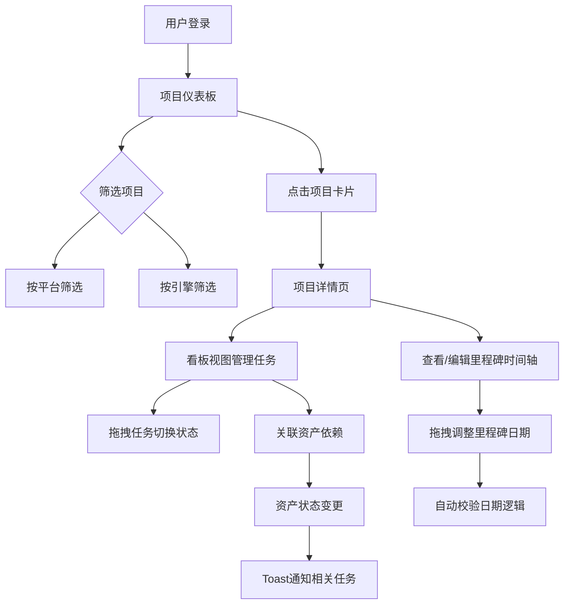

## 1. 产品概述

GameDev Milestone Tracker 是面向小型独立游戏工作室和游戏开发初学者的项目开发周期与版本里程碑管理应用。它解决了使用电子表格或通用项目管理软件时缺乏针对游戏开发特殊流程（资源产出节奏、版本迭代中的测试与修复循环、资产依赖追踪）而导致的效率低下问题，提供一站式游戏项目管理体验。

- 目标用户：小型独立游戏工作室（2-15人）、游戏开发初学者、独立开发者
- 核心价值：为游戏开发量身定制的里程碑管理、看板式任务流转与资产依赖追踪，减少项目管理摩擦，聚焦创作

## 2. 核心功能

### 2.1 用户角色

| 角色 | 注册方式 | 核心权限 |
|------|----------|----------|
| 项目成员 | 登录入口（模拟登录） | 创建/管理项目、里程碑、任务及资产依赖 |

### 2.2 功能模块

1. **项目仪表板**：项目卡片网格展示、平台/引擎筛选、倒计时显示
2. **项目详情页**：里程碑时间轴泳道图、看板视图、资产依赖管理
3. **任务管理**：拖拽式看板、优先级标签、工时预估、任务类型分类
4. **资产依赖追踪**：资产关联、状态变更通知（Toast）

### 2.3 页面详情

| 页面名称 | 模块名称 | 功能描述 |
|----------|----------|----------|
| 项目仪表板 | 项目卡片网格 | 展示所有项目的卡片，每张卡片含渐变色几何图案缩略图、名称、平台图标、发布倒计时天数；悬浮浮起动画；按发布时间倒序排列 |
| 项目仪表板 | 筛选栏 | 按平台（PC/手机/主机）或引擎（Unity/Unreal/Godot/自定义）筛选项目 |
| 项目仪表板 | 侧边栏 | 固定宽度深色侧边栏，含项目图标列表、用户登录入口 |
| 项目详情页 | 里程碑时间轴 | 横向泳道图展示所有里程碑；不同状态用不同样式（灰色虚线/蓝色渐变脉冲/黄色斜条纹/绿色勾选）；拖拽调整日期；禁止重叠与自动校验 |
| 项目详情页 | 看板视图 | 四列看板（待分配/进行中/测试中/已完成）；拖拽任务卡片切换列；平滑位移动画；资产依赖小标签展示 |
| 项目详情页 | 资产依赖追踪 | 任务关联虚拟资产；资产状态变更触发Toast通知（右侧滑入，5秒淡出） |

## 3. 核心流程

用户打开应用后进入项目仪表板，浏览所有游戏项目卡片。通过筛选栏按平台或引擎筛选项目。点击项目卡片进入项目详情页，在顶部查看里程碑时间轴泳道图，可拖拽调整里程碑日期。在下方看板视图中管理任务，拖拽任务卡片在不同状态列间移动。任务可关联资产，当资产状态变更时，相关任务收到实时通知。

## 4. 用户界面设计

### 4.1 设计风格

- 主色调：蓝紫色渐变（#667eea → #764ba2）
- 次要操作色：青色（#48c6ef）
- 背景色：深蓝黑色渐变
- 卡片/面板：毛玻璃效果（半透明磨砂质感，backdrop-filter: blur）
- 文本：浅灰色（#e0e0e0）确保深色背景可读性
- 按钮：圆角，悬浮高亮，点击缩放（scale: 0.98 → 1.0）
- 字体：使用 Orbitron 作为标题展示字体（科技/游戏感），Noto Sans SC 作为正文UI字体
- 布局：左侧固定宽度侧边栏 + 右侧主内容区域

### 4.2 页面设计概览

| 页面名称 | 模块名称 | UI元素 |
|----------|----------|--------|
| 项目仪表板 | 项目卡片 | 渐变色几何图案缩略图、项目名称、平台图标、倒计时天数、悬浮浮起投影动画 |
| 项目仪表板 | 筛选栏 | 引擎/平台下拉选择器，蓝紫色渐变按钮 |
| 项目仪表板 | 侧边栏 | 深色背景、项目图标列表、用户头像入口 |
| 项目详情页 | 里程碑时间轴 | 横向泳道、不同状态圆角矩形（灰虚线/蓝脉冲/黄斜纹/绿勾选）、拖拽手柄 |
| 项目详情页 | 看板视图 | 四列布局、任务卡片（优先级色标、工时、负责人头像、资产标签）、拖拽交互 |
| 项目详情页 | Toast通知 | 右侧滑入、横条样式、5秒淡出 |

### 4.3 响应式设计

- 桌面优先设计（1280px+）
- ≥1280px：三列网格卡片布局，侧边栏固定展开
- 768px-1280px：双列网格卡片布局，侧边栏固定展开
- <768px：单列堆叠布局，侧边栏收缩为汉堡菜单

### 4.4 动效设计

- 项目卡片悬浮：向上浮起 + 投影加深（translateY + box-shadow）
- 里程碑脉冲动画：蓝色渐变里程碑带脉冲圆点（CSS animation）
- 看板拖拽：平滑位移动画（CSS transition）
- Toast通知：从右侧滑入（translateX），5秒后淡出（opacity）
- 点击反馈：scale: 0.98 → 1.0 过渡
