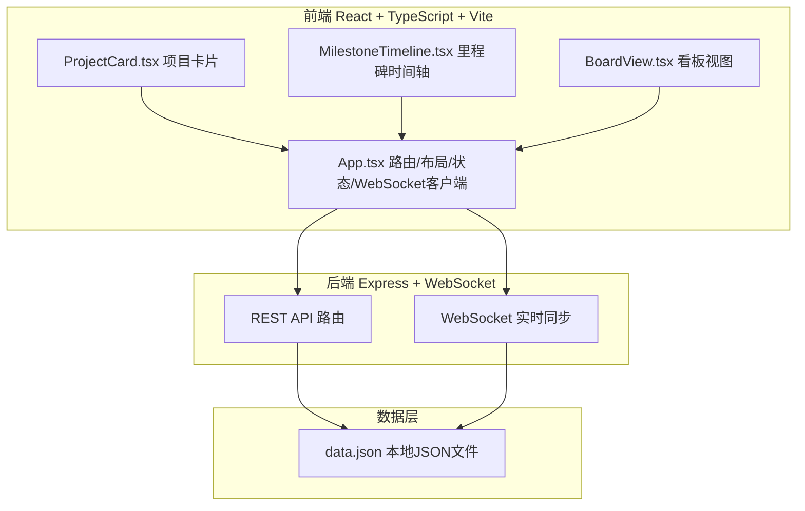
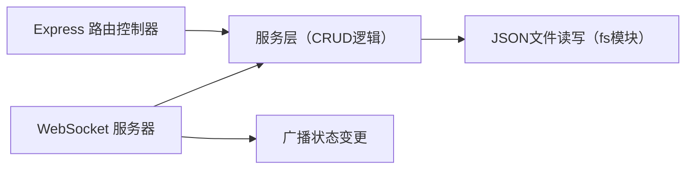
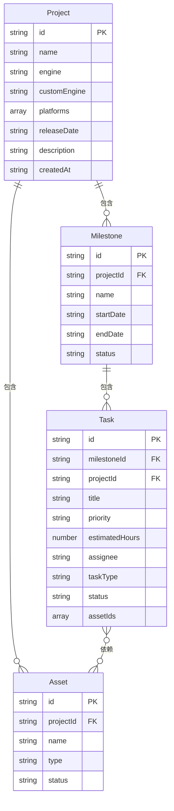

## 1. 架构设计



## 2. 技术说明

- 前端：React 18 + TypeScript + Vite + Tailwind CSS + Zustand
- 初始化工具：vite-init（react-express-ts 模板）
- 后端：Express 4 + WebSocket (ws)
- 数据库：本地 JSON 文件（通过 fs 模块读写）
- 实时通信：WebSocket（ws 库），用于拖拽状态变更和资产状态变更的实时广播

## 3. 路由定义

| 路由 | 用途 |
|------|------|
| `/` | 项目仪表板，展示所有项目卡片网格 |
| `/project/:id` | 项目详情页，展示里程碑时间轴和看板视图 |

## 4. API 定义

### 4.1 项目管理 API

| 方法 | 路径 | 描述 | 请求体 | 响应 |
|------|------|------|--------|------|
| GET | `/api/projects` | 获取所有项目 | - | `Project[]` |
| GET | `/api/projects/:id` | 获取单个项目 | - | `Project` |
| POST | `/api/projects` | 创建项目 | `CreateProjectDTO` | `Project` |
| PUT | `/api/projects/:id` | 更新项目 | `UpdateProjectDTO` | `Project` |
| DELETE | `/api/projects/:id` | 删除项目 | - | `{ success: boolean }` |

### 4.2 里程碑 API

| 方法 | 路径 | 描述 | 请求体 | 响应 |
|------|------|------|--------|------|
| GET | `/api/projects/:projectId/milestones` | 获取项目里程碑 | - | `Milestone[]` |
| POST | `/api/projects/:projectId/milestones` | 创建里程碑 | `CreateMilestoneDTO` | `Milestone` |
| PUT | `/api/milestones/:id` | 更新里程碑 | `UpdateMilestoneDTO` | `Milestone` |
| DELETE | `/api/milestones/:id` | 删除里程碑 | - | `{ success: boolean }` |

### 4.3 任务 API

| 方法 | 路径 | 描述 | 请求体 | 响应 |
|------|------|------|--------|------|
| GET | `/api/milestones/:milestoneId/tasks` | 获取里程碑下任务 | - | `Task[]` |
| POST | `/api/milestones/:milestoneId/tasks` | 创建任务 | `CreateTaskDTO` | `Task` |
| PUT | `/api/tasks/:id` | 更新任务 | `UpdateTaskDTO` | `Task` |
| DELETE | `/api/tasks/:id` | 删除任务 | - | `{ success: boolean }` |

### 4.4 资产 API

| 方法 | 路径 | 描述 | 请求体 | 响应 |
|------|------|------|--------|------|
| GET | `/api/projects/:projectId/assets` | 获取项目资产 | - | `Asset[]` |
| POST | `/api/projects/:projectId/assets` | 创建资产 | `CreateAssetDTO` | `Asset` |
| PUT | `/api/assets/:id` | 更新资产状态 | `UpdateAssetDTO` | `Asset` |
| DELETE | `/api/assets/:id` | 删除资产 | - | `{ success: boolean }` |

### 4.5 TypeScript 类型定义

```typescript
interface Project {
  id: string;
  name: string;
  engine: 'Unity' | 'Unreal' | 'Godot' | 'Custom';
  customEngine?: string;
  platforms: ('PC' | 'Mobile' | 'Console')[];
  releaseDate: string;
  description: string;
  createdAt: string;
}

type MilestoneStatus = 'planning' | 'in_progress' | 'frozen' | 'completed';

interface Milestone {
  id: string;
  projectId: string;
  name: string;
  startDate: string;
  endDate: string;
  status: MilestoneStatus;
}

type TaskPriority = 'low' | 'medium' | 'high' | 'urgent';
type TaskType = 'design' | 'programming' | 'art' | 'audio' | 'qa';
type TaskStatus = 'unassigned' | 'in_progress' | 'testing' | 'completed';

interface Task {
  id: string;
  milestoneId: string;
  projectId: string;
  title: string;
  priority: TaskPriority;
  estimatedHours: number;
  assignee: string | null;
  taskType: TaskType;
  status: TaskStatus;
  assetIds: string[];
}

type AssetStatus = 'in_production' | 'completed';

interface Asset {
  id: string;
  projectId: string;
  name: string;
  type: 'image' | '3d_model' | 'audio' | 'other';
  status: AssetStatus;
}
```

## 5. 服务端架构图



## 6. 数据模型

### 6.1 数据模型定义



### 6.2 WebSocket 消息类型

| 消息类型 | 方向 | 描述 |
|----------|------|------|
| `task:status_changed` | 服务端→客户端 | 任务状态变更（拖拽看板列） |
| `asset:status_changed` | 服务端→客户端 | 资产状态变更通知 |
| `milestone:updated` | 服务端→客户端 | 里程碑更新（拖拽调整日期） |

## 7. 性能要求

- 加载包含500个任务的项目详情页首次渲染时间不超过2秒
- 拖拽操作帧率不低于30fps且无卡顿
- 使用虚拟化列表优化大量任务渲染
- CSS动画使用 transform 和 opacity 触发GPU加速
