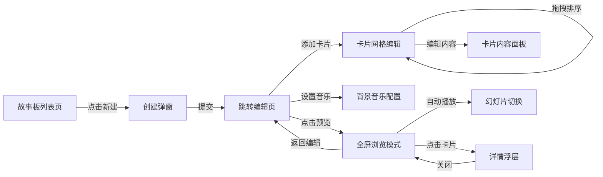

## 1. 产品概述
面向独立插画师和设计师的在线作品集故事板编排工具，解决系列作品缺乏统一视觉叙事结构的痛点，提供轻量级的故事板式页面布局创建与浏览体验。
- 目标用户：独立插画师、设计师、视觉创意工作者
- 核心价值：快速创建系列作品视觉叙事，沉浸式全屏浏览体验

## 2. 核心功能

### 2.1 用户角色
| 角色 | 注册方式 | 核心权限 |
|------|----------|----------|
| 普通用户 | 无需注册（本地存储） | 创建、编辑、浏览故事板 |

### 2.2 功能模块
1. **主页/故事板列表页**：故事板卡片列表、新建故事板入口、删除操作
2. **故事板编辑页**：3列网格卡片布局、拖拽排序、卡片内容编辑、时间线侧栏、背景音乐设置、预览入口
3. **故事板浏览页**：全屏幻灯片播放、自动播放控制、缩略图导航条、详情浮层弹窗

### 2.3 页面详情
| 页面名称 | 模块名称 | 功能描述 |
|----------|----------|----------|
| 故事板列表页 | 新建故事板弹窗 | 输入标题、上传封面URL/自动生成占位色块 |
| 故事板列表页 | 故事板卡片网格 | 展示封面、标题、创建时间，点击进入编辑，悬停显示删除按钮 |
| 故事板编辑页 | 卡片网格区域 | 3列响应式网格，最多12张卡片槽，支持拖拽排序，4:3比例 |
| 故事板编辑页 | 卡片内容编辑 | 图片上传、标题输入、多行描述文本、过渡动画下拉选择 |
| 故事板编辑页 | 时间线侧栏 | 固定300px宽，竖条时间线展示卡片顺序，当前选中高亮+呼吸光晕，红色指示条 |
| 故事板编辑页 | 底部工具栏 | 添加新卡片按钮、背景音乐URL输入框、预览按钮 |
| 故事板浏览页 | 全屏幻灯片 | 0.6s ease-in-out切换动画，5秒自动切换，暂停/继续控制 |
| 故事板浏览页 | 进度与导航 | 左下角进度显示(5/12)，底部毛玻璃缩略图条，悬停显示标题，点击跳转 |
| 故事板浏览页 | 详情浮层 | 毛玻璃背景，居中大图+放大镜缩放，左侧标题+全文描述，ESC/点击外部关闭+微缩消失动画 |

## 3. 核心流程
用户在列表页创建新故事板 → 填写标题和封面 → 跳转编辑页 → 添加/拖拽排列卡片 → 编辑每张卡片的标题、描述、动画 → 设置背景音乐 → 点击预览进入浏览模式 → 自动播放幻灯片 → 点击卡片查看详情 → 返回继续编辑

## 4. 用户界面设计

### 4.1 设计风格
- **主色调**：深色主题，背景#1a1a2e，卡片背景#16213e
- **强调色**：#e94560（亮红）、#0f3460（深蓝）
- **按钮风格**：圆角12px，悬停上浮transform: translateY(-2px)，颜色微变
- **字体**：系统无衬线字体 stack
- **布局风格**：卡片式布局，编辑页左右分栏（网格+时间线侧栏）
- **动效**：拖拽弹性动画、卡片删除缩小消失、详情浮层微缩关闭、呼吸光晕

### 4.2 页面设计概览
| 页面名称 | 模块名称 | UI元素 |
|----------|----------|--------|
| 列表页 | 新建按钮 | 亮红背景，悬停上浮，+图标 |
| 列表页 | 故事板卡片 | 封面图4:3，圆角12px，柔和阴影，悬停阴影加深 |
| 编辑页 | 卡片网格 | 3列grid gap:16px，卡片4:3比例，圆角12px，背景#16213e |
| 编辑页 | 拖拽状态 | 卡片scale(1.05)，阴影加深，半透明占位提示 |
| 编辑页 | 时间线项 | 左侧红色指示条，选中项呼吸光晕动画 |
| 编辑页 | 删除按钮 | 卡片右上角圆形，悬停放大，点击卡片缩小消失 |
| 浏览页 | 幻灯片容器 | 全屏黑色背景，切换动画0.6s ease-in-out |
| 浏览页 | 缩略图条 | 底部悬浮，毛玻璃backdrop-filter，圆角8px，选中亮红边框 |
| 浏览页 | 详情浮层 | 半透黑毛玻璃，居中卡片，关闭时scale缩小 |

### 4.3 响应式设计
- **桌面端(>1024px)**：3列卡片网格，右侧300px固定时间线面板
- **平板(768-1024px)**：2列卡片网格，右侧面板折叠为可展开抽屉
- **手机端(<768px)**：1列卡片网格，右侧面板折叠为底部工具栏图标，底部缩略图条缩小

## 4.4 性能优化
- 图片懒加载：IntersectionObserver实现，首屏仅加载可见卡片
- 图片预缓存：最多预缓存5张，超出释放最早缓存
- 拖拽性能：排序响应延迟≤50ms，使用CSS transforms避免重排
- 动画帧率：全屏切换稳定55FPS+，使用will-change提示浏览器优化
