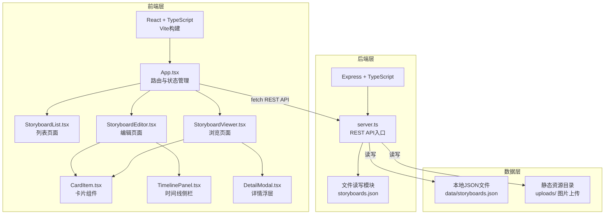
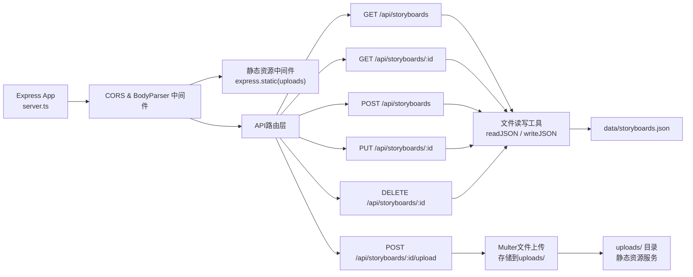
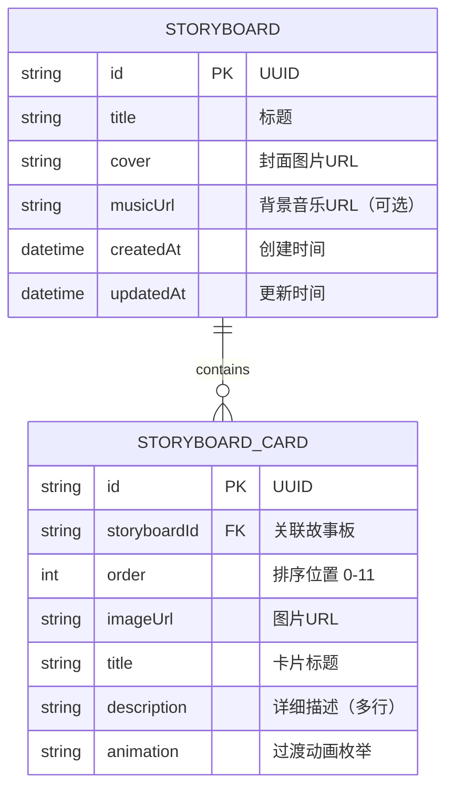

## 1. 架构设计



## 2. 技术描述

- **前端**：React@18 + TypeScript@5 + Vite@5 + @vitejs/plugin-react@4
- **状态管理**：React useState/useEffect（轻量级场景，无需引入zustand）
- **拖拽库**：react-beautiful-dnd@13
- **路由**：Hash路由（无react-router，避免额外依赖，手动实现轻量路由）
- **后端**：Express@4 + TypeScript@5
- **中间件**：cors@2 + body-parser@1
- **ID生成**：uuid@9
- **数据库**：本地JSON文件（data/storyboards.json），文件系统持久化
- **构建工具**：Vite（前端）+ ts-node（后端开发）+ concurrently（前后端并发启动）

## 3. 路由定义

| 路由（前端Hash） | 用途 |
|-------------------|------|
| #/ | 故事板列表页，展示所有已创建的故事板 |
| #/editor/:id | 故事板编辑页，拖拽排序与内容编辑 |
| #/viewer/:id | 故事板浏览页，全屏幻灯片播放 |

## 4. API 定义

### 4.1 TypeScript 类型

```typescript
// 卡片动画类型
type CardAnimation = 'none' | 'slideLeft' | 'slideUp' | 'zoomFade';

// 故事板卡片
interface StoryboardCard {
  id: string;
  imageUrl: string;
  title: string;
  description: string;
  animation: CardAnimation;
}

// 故事板
interface Storyboard {
  id: string;
  title: string;
  cover: string;
  cards: StoryboardCard[];
  musicUrl: string;
  createdAt: string;
  updatedAt: string;
}

// API响应
interface ApiResponse<T> {
  success: boolean;
  data?: T;
  error?: string;
}
```

### 4.2 REST 接口

| 方法 | 路径 | 请求体 | 响应 | 说明 |
|------|------|--------|------|------|
| GET | /api/storyboards | - | ApiResponse\<Storyboard[]> | 获取故事板列表 |
| GET | /api/storyboards/:id | - | ApiResponse\<Storyboard> | 获取单个故事板详情 |
| POST | /api/storyboards | { title, cover } | ApiResponse\<Storyboard> | 创建新故事板（含12个空白卡片） |
| PUT | /api/storyboards/:id | Storyboard | ApiResponse\<Storyboard> | 更新故事板（含卡片排序、内容编辑、音乐设置） |
| DELETE | /api/storyboards/:id | - | ApiResponse\<{}> | 删除故事板 |
| POST | /api/storyboards/:id/upload | FormData(file) | ApiResponse\<{ imageUrl: string }> | 上传单张图片，返回可访问URL |

## 5. 服务器架构图



## 6. 数据模型

### 6.1 ER 模型



### 6.2 JSON 数据结构示例

```json
{
  "storyboards": [
    {
      "id": "a1b2c3d4-...",
      "title": "我的插画系列：四季物语",
      "cover": "/uploads/cover-spring.png",
      "musicUrl": "",
      "createdAt": "2026-06-20T10:00:00.000Z",
      "updatedAt": "2026-06-20T14:30:00.000Z",
      "cards": [
        {
          "id": "c001",
          "imageUrl": "/uploads/spring-1.jpg",
          "title": "春·萌芽",
          "description": "春日的第一缕阳光唤醒了沉睡的大地，嫩芽破土而出……",
          "animation": "zoomFade"
        }
      ]
    }
  ]
}
```

## 7. 文件结构与职责

```
auto105/
├── package.json                    # 依赖管理+启动脚本（concurrently前后端并发）
├── vite.config.js                  # Vite配置：React插件+代理/api到后端端口
├── tsconfig.json                   # TS严格模式配置
├── index.html                      # Vite入口HTML，挂载#root
├── data/
│   └── storyboards.json            # 故事板持久化存储
├── uploads/                        # 上传图片目录（静态资源服务）
└── src/
    ├── server.ts                   # Express后端入口，API路由+静态服务
    ├── types.ts                    # 前后端共享类型定义
    │
    ├── client/                     # 前端代码
    │   ├── App.tsx                 # 根组件：Hash路由+全局状态
    │   ├── main.tsx                # React入口：渲染App
    │   ├── api/
    │   │   └── client.ts           # fetch封装：API调用集中管理
    │   ├── hooks/
    │   │   ├── useLazyLoad.ts      # 图片懒加载hook（IntersectionObserver）
    │   │   └── useImageCache.ts    # 图片预缓存管理（最多5张）
    │   ├── components/
    │   │   ├── StoryboardList.tsx  # 列表页组件
    │   │   ├── StoryboardEditor.tsx# 编辑页主组件
    │   │   ├── StoryboardViewer.tsx# 浏览页主组件
    │   │   ├── CardItem.tsx        # 可编辑/展示卡片
    │   │   ├── TimelinePanel.tsx   # 右侧时间线面板
    │   │   ├── DetailModal.tsx     # 浏览详情浮层
    │   │   ├── ThumbnailBar.tsx    # 浏览模式底部缩略图条
    │   │   └── CreateModal.tsx     # 新建故事板弹窗
    │   └── styles/
    │       └── globals.css         # 全局样式+CSS变量+响应式
```

## 8. 性能保障方案

| 性能指标 | 实现方案 |
|----------|----------|
| 图片懒加载 | 自定义useLazyLoad hook，IntersectionObserver监听可见性 |
| 预缓存策略 | useImageCache维护大小为5的LRU队列，new Image()预加载 |
| 拖拽流畅度 | react-beautiful-dnd原生CSS transforms，无重排，will-change提示 |
| 动画帧率 | 所有过渡使用transform/opacity，0.6s ease-in-out，避免layout thrash |
| 首屏加载 | Vite代码分割，图片按需加载，空白卡片使用轻量占位色块 |
