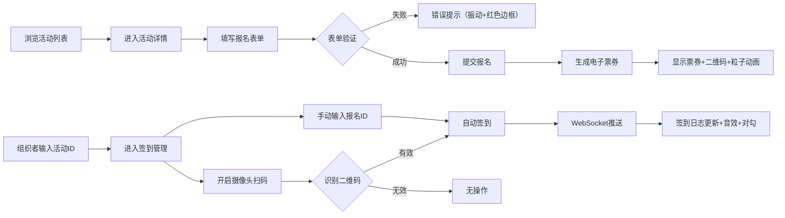

## 1. 产品概述

在线活动报名与签到管理系统，为活动组织者提供活动创建、报名管理和扫码签到一体化解决方案，为参与者提供便捷的在线报名和电子票券服务。解决传统活动报名流程繁琐、签到效率低下的问题，提升活动管理的数字化水平。

## 2. 核心功能

### 2.1 用户角色

| 角色 | 登录方式 | 核心权限 |
|------|----------|----------|
| 普通参与者 | 无需登录 | 浏览活动、在线报名、获取电子票券 |
| 活动组织者 | 输入活动ID进入后台 | 查看签到统计、扫码签到、手动补录签到 |

### 2.2 功能模块

1. **首页**：活动列表卡片展示、活动筛选、快速报名入口
2. **活动详情页**：活动信息展示、报名表单、表单验证
3. **电子票券页**：二维码展示、票券信息、粒子动画效果
4. **签到管理页**：签到统计、实时签到日志、摄像头扫码、手动签到

### 2.3 页面详情

| 页面名称 | 模块名称 | 功能描述 |
|-----------|-------------|---------------------|
| 首页 | 活动卡片网格 | 展示活动名称、日期、地点、名额状态，剩余名额<10%时橙色边框闪烁，名额已满时按钮禁用 |
| 活动详情页 | 两栏布局 | 左侧活动图文信息，右侧报名表单（姓名、邮箱、手机号、自定义问题），前端表单验证 |
| 电子票券页 | 票券卡片 | 圆角卡片展示活动名称、二维码（活动ID+报名ID）、用户名、报名时间，带淡入动画和粒子撒花效果 |
| 签到管理页 | 签到控制台 | 顶部签到统计（已签到/总人数），实时滚动签到日志，摄像头扫码区域，手动签到输入框 |

## 3. 核心流程

### 3.1 参与者报名流程

用户浏览活动列表 → 点击活动卡片进入详情页 → 填写报名表单 → 表单验证通过 → 提交报名 → 服务器生成报名记录和二维码 → 显示电子票券页面

### 3.2 组织者签到流程

组织者进入/admin页面 → 输入活动ID → 进入签到管理页 → 开启摄像头扫描二维码 → 识别有效票券 → 自动签到 → WebSocket实时推送签到事件 → 签到日志更新并播放提示音 → 显示绿色对勾覆盖层

## 4. 用户界面设计

### 4.1 设计风格

- **主色调**：深蓝 #1a2a40
- **底色**：白色、浅灰 #f0f4f8
- **成功色**：翠绿 #2ecc71
- **警告色**：橙黄 #f1c40f
- **危险色**：红色 #e74c3c
- **按钮风格**：圆角、悬浮微放大（1.05倍）、点击涟漪效果
- **卡片风格**：10px圆角、轻微阴影
- **页面过渡**：淡入淡出 0.3s

### 4.2 页面设计概述

| 页面名称 | 模块名称 | UI 元素 |
|-----------|-------------|-------------|
| 首页 | 活动卡片网格 | 3-4列网格布局、卡片悬停效果、名额紧张时橙色闪烁边框、名额已满灰色标签 |
| 活动详情页 | 两栏布局 | 左侧活动封面占位符+活动信息、右侧表单（输入框验证失败时红色边框+振动动画） |
| 电子票券页 | 票券卡片 | 圆角卡片、淡入动画、Canvas粒子撒花背景、二维码居中展示 |
| 签到管理页 | 签到控制台 | 顶部统计数字、实时滚动日志列表（新记录绿色闪烁）、摄像头预览区域、扫码成功绿色对勾覆盖层 |

### 4.3 响应式设计

- **桌面端**：首页3-4列网格，详情页左右两栏布局
- **移动端**：首页单列布局，详情页上下单栏布局，按钮和输入框尺寸优化
- **触摸优化**：按钮最小高度44px，足够的点击区域

### 4.4 性能指标

- 活动列表初始加载时间 ≤ 1.5秒
- WebSocket签到消息推送延迟 ≤ 500ms
