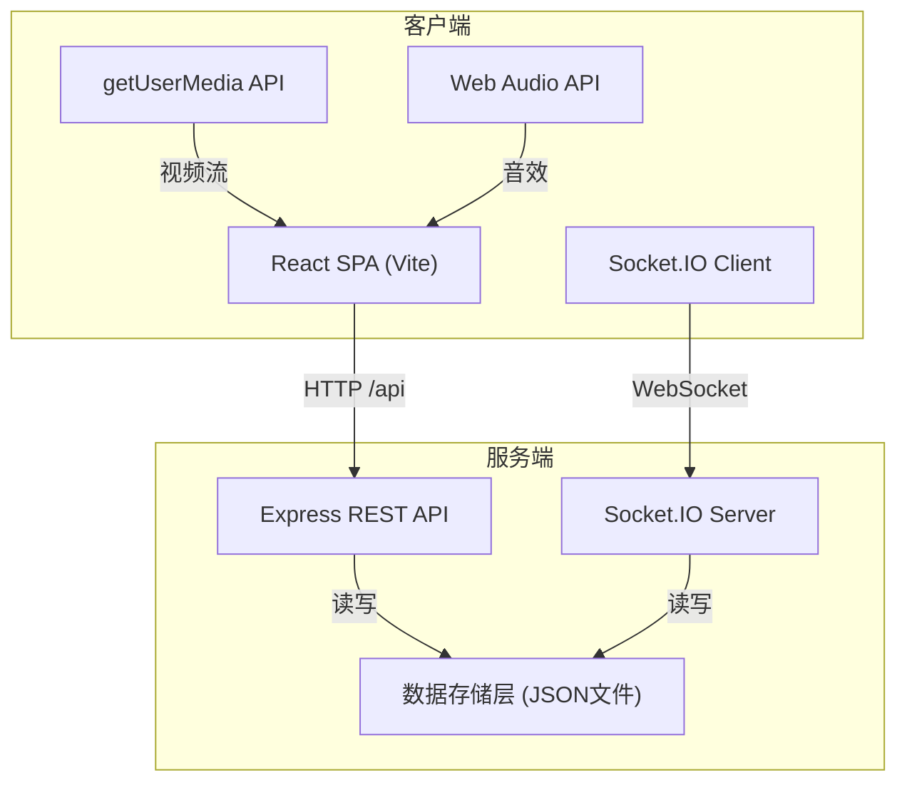
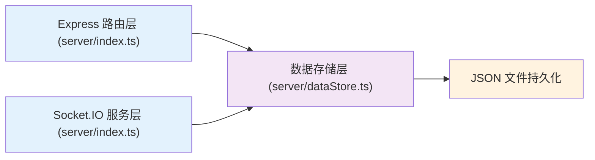
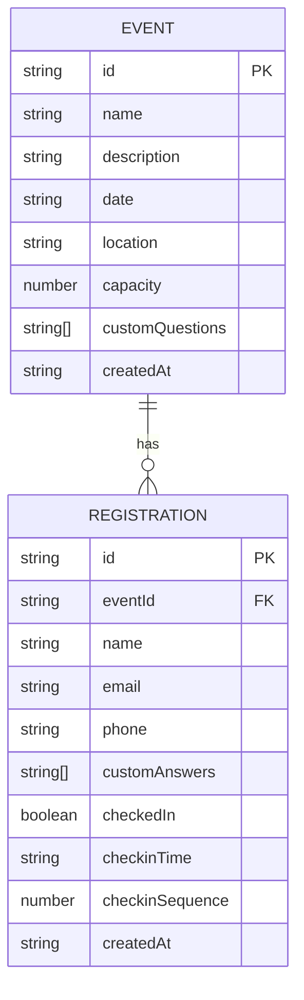

## 1. 架构设计



## 2. 技术描述

- **前端框架**：React 18 + TypeScript + Vite
- **后端框架**：Express 4 + TypeScript
- **实时通信**：Socket.IO 4
- **二维码**：qrcode (服务端生成)
- **唯一ID**：uuid
- **跨域处理**：cors
- **状态管理**：React Context + useState
- **路由**：React Router DOM
- **样式方案**：Tailwind CSS 3 + 自定义CSS动画

## 3. 路由定义

### 前端路由

| 路由路径 | 页面组件 | 说明 |
|----------|----------|------|
| `/` | Home | 首页，活动列表 |
| `/event/:id` | EventDetail | 活动详情页 |
| `/ticket/:eventId/:registrationId` | Ticket | 电子票券页 |
| `/admin` | AdminLogin | 管理员登录页 |
| `/admin/event/:id` | CheckinManager | 签到管理页 |

### 后端API路由

| 方法 | 路径 | 说明 |
|------|------|------|
| `GET` | `/api/events` | 获取活动列表 |
| `GET` | `/api/events/:id` | 获取活动详情 |
| `POST` | `/api/events` | 创建活动 |
| `POST` | `/api/events/:id/register` | 提交报名 |
| `GET` | `/api/events/:id/registrations/:registrationId` | 查询报名状态 |
| `POST` | `/api/events/:id/checkin` | 执行签到 |
| `GET` | `/api/events/:id/qrcode/:registrationId` | 获取二维码图片 |

## 4. API 类型定义

```typescript
// 活动
interface Event {
  id: string;
  name: string;
  description: string;
  date: string;
  location: string;
  capacity: number;
  customQuestions: string[];
  createdAt: string;
}

// 报名记录
interface Registration {
  id: string;
  eventId: string;
  name: string;
  email: string;
  phone: string;
  customAnswers: string[];
  checkedIn: boolean;
  checkinTime?: string;
  checkinSequence?: number;
  createdAt: string;
}

// 创建活动请求
interface CreateEventRequest {
  name: string;
  description: string;
  date: string;
  location: string;
  capacity: number;
  customQuestions?: string[];
}

// 报名请求
interface RegisterRequest {
  name: string;
  email: string;
  phone: string;
  customAnswers: string[];
}

// 签到请求
interface CheckinRequest {
  registrationId: string;
}

// 签到推送事件
interface CheckinEvent {
  registrationId: string;
  name: string;
  checkinTime: string;
  checkinSequence: number;
}

// 报名响应
interface RegisterResponse {
  registrationId: string;
  eventId: string;
  qrcodeUrl: string;
}
```

## 5. 服务端架构



## 6. 数据模型

### 6.1 实体关系图



### 6.2 数据存储结构

```json
// server/data/events.json
{
  "events": [
    {
      "id": "uuid-string",
      "name": "技术分享大会",
      "description": "...",
      "date": "2026-07-01T09:00:00",
      "location": "北京国际会议中心",
      "capacity": 100,
      "customQuestions": ["公司名称", "职位"],
      "createdAt": "2026-06-01T00:00:00"
    }
  ]
}

// server/data/registrations.json
{
  "registrations": [
    {
      "id": "uuid-string",
      "eventId": "event-uuid",
      "name": "张三",
      "email": "zhangsan@example.com",
      "phone": "13800138000",
      "customAnswers": ["某科技公司", "工程师"],
      "checkedIn": false,
      "createdAt": "2026-06-15T10:30:00"
    }
  ]
}
```

## 7. 文件结构

```
├── package.json
├── vite.config.js
├── tsconfig.json
├── index.html
├── server/
│   ├── index.ts          # Express + Socket.IO 服务端
│   └── dataStore.ts      # 数据存储层
├── src/
│   ├── App.tsx           # 主应用组件
│   ├── main.tsx          # 入口文件
│   ├── index.css         # 全局样式
│   ├── pages/
│   │   ├── Home.tsx          # 首页
│   │   ├── EventDetail.tsx   # 活动详情页
│   │   ├── Ticket.tsx        # 电子票券页
│   │   ├── AdminLogin.tsx    # 管理员登录
│   │   └── CheckinManager.tsx # 签到管理页
│   ├── components/
│   │   ├── EventCard.tsx     # 活动卡片组件
│   │   ├── TicketCard.tsx    # 票券卡片组件
│   │   └── CheckinLog.tsx    # 签到日志组件
│   └── hooks/
│       └── useSocket.ts      # Socket.IO 客户端 hook
```
