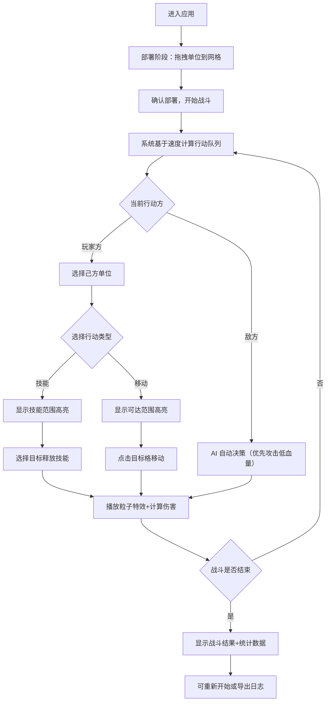

## 1. 产品概述

回合制战术战斗场景构建器（Tactical Battle Simulator）是一款面向游戏设计师的快速原型验证工具，解决在设计阶段手动验证技能数值、行动次序和战场地形影响时效率低下的问题。通过可视化的六边形网格战场，设计师可以快速部署单位、测试战斗逻辑并导出战斗日志，大幅缩短数值平衡迭代周期。

## 2. 核心功能

### 2.1 用户角色
| 角色 | 注册方式 | 核心权限 |
|------|----------|----------|
| 游戏设计师 | 无需注册 | 部署单位、执行战斗、查看统计、导出日志 |

### 2.2 功能模块
1. **战场编辑页**：8x8 六边形网格地图，单位拖拽部署，行动选择与执行
2. **战斗监控面板**（右侧边栏）：实时统计、行动日志、单位状态、技能操作

### 2.3 页面详情
| 页面名称 | 模块名称 | 功能描述 |
|----------|----------|----------|
| 战场编辑页 | 六边形网格地图 | 8x8 六边形网格，深灰格线+淡蓝光点交叉点，支持缩放拖动，60FPS 渲染 |
| 战场编辑页 | 单位部署 | 拖拽部署玩家方（蓝色）和敌方（红色）单位，落点高亮绿色可行/红色不可行 |
| 战场编辑页 | 行动执行 | 选择己方单位→移动（半透明高亮可达范围）或释放技能（扇形/圆形高亮作用范围） |
| 战场编辑页 | 粒子特效 | 火焰弹爆裂火星、治疗波绿色波纹扩散、护盾金色光罩闪烁 |
| 战场编辑页 | AI 决策 | 敌方自动最优决策，优先攻击低血量单位 |
| 战斗监控面板 | 行动日志 | 每条日志带时间戳+颜色区分行动方 |
| 战斗监控面板 | 实时统计 | 回合数、双方剩余单位、总伤害输出、技能命中率 |
| 战斗监控面板 | 单位状态栏 | 选中单位属性条+技能按钮（悬停显示技能描述浮窗） |
| 战斗监控面板 | 操作按钮 | 重新开始、导出战斗日志（JSON 格式含每回合行动记录） |

## 3. 核心流程

## 4. 用户界面设计

### 4.1 设计风格
- **主色调**：深蓝灰 #1a1a2e（主体背景）、青蓝 #00d4ff（高亮/选中）
- **阵营色**：友方蓝 #4488ff、敌方红 #ff4444
- **按钮风格**：圆角胶囊形，深色玻璃质感，悬停时青蓝发光边框
- **字体**：Exo 2（Google Fonts），标题 24px bold，正文 14px regular，数据 12px light
- **布局风格**：左侧70%主战场 + 右侧30%深色半透明玻璃面板
- **动效**：0.2秒平滑过渡动画，选中单位旋转光环，单位脉动呼吸光效

### 4.2 页面设计概览
| 页面名称 | 模块名称 | UI 元素 |
|----------|----------|---------|
| 战场编辑页 | 六边形网格 | Canvas 全屏渲染，深灰格线，淡蓝光点，网格缩放拖动 |
| 战场编辑页 | 单位图标 | 彩色圆角六边形，蓝色/红色阵营，阴影+脉动呼吸光效，选中旋转光环 |
| 战场编辑页 | 部署高亮 | 可行绿色半透明高亮，不可行红色半透明高亮 |
| 战场编辑页 | 移动范围 | 半透明青蓝高亮网格 |
| 战场编辑页 | 技能范围 | 扇形/圆形青蓝半透明高亮 |
| 战斗监控面板 | 面板背景 | 深色半透明玻璃质感，毛玻璃模糊效果 |
| 战斗监控面板 | 行动日志 | 时间戳+颜色区分（蓝=友方/红=敌方），滚动列表 |
| 战斗监控面板 | 统计数据 | 回合数、单位数、伤害、命中率，数字高亮青蓝 |
| 战斗监控面板 | 技能按钮 | 圆角按钮+悬停浮窗技能描述 |
| 战斗监控面板 | 操作按钮 | 重新开始（红）、导出日志（青蓝），胶囊形 |

### 4.3 响应式设计
- 桌面优先设计，主战场 70% + 侧面板 30%
- 最小支持 1280px 宽度，低于此宽度侧面板折叠为底部抽屉

### 4.4 性能指标
- 网格渲染和单位动画保持 60FPS
- 单位数量不超过 30 个时无卡顿
- Canvas 渲染 + requestAnimationFrame 游戏循环
