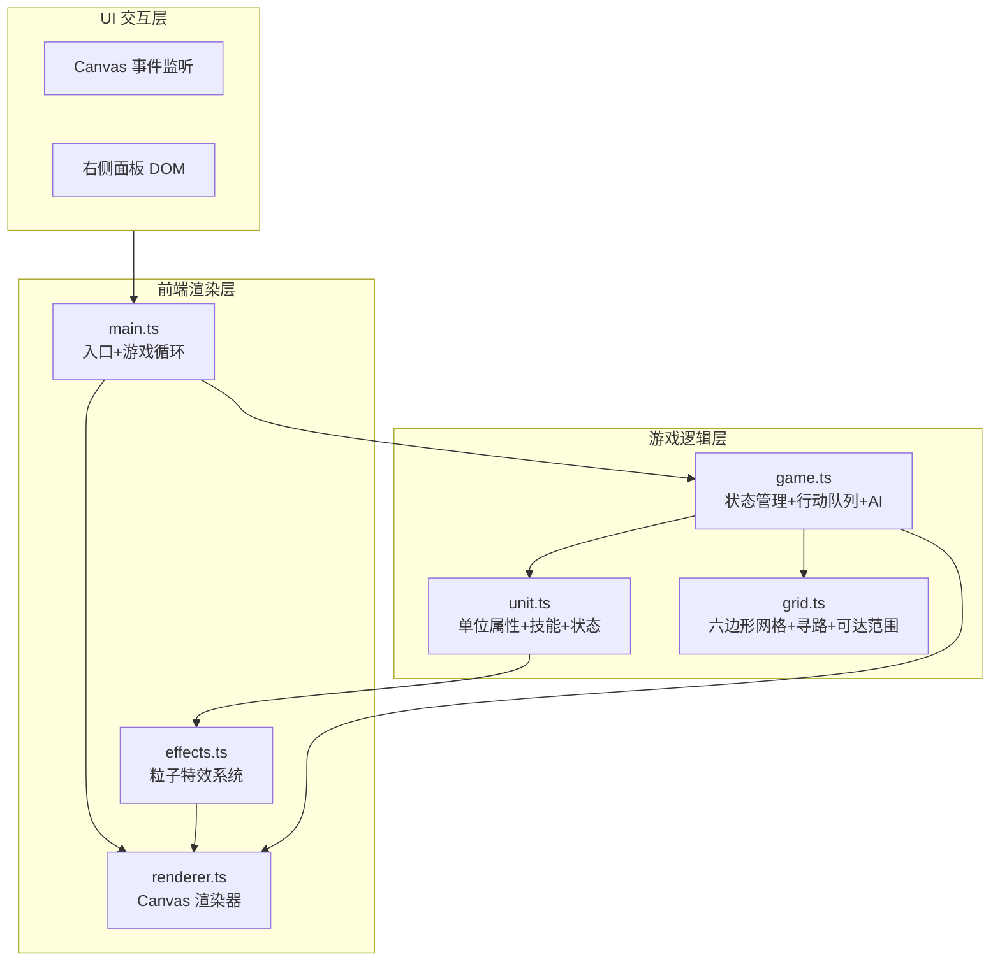

## 1. 架构设计



## 2. 技术说明
- **前端**：TypeScript + 原生 Canvas 渲染引擎（无第三方游戏框架）
- **构建工具**：Vite
- **依赖库**：typescript, vite, canvas-confetti, uuid
- **后端**：无
- **数据库**：无（纯前端应用）

## 3. 文件结构

| 文件路径 | 职责 |
|----------|------|
| package.json | 项目依赖与启动脚本 |
| vite.config.js | Vite + TypeScript 配置 |
| tsconfig.json | TypeScript 严格模式，target ES2020 |
| index.html | 入口页面，全屏 Canvas + 右侧面板，引用 Exo 2 字体 |
| src/main.ts | 入口：初始化 Canvas、UI 面板，管理游戏循环（requestAnimationFrame） |
| src/grid.ts | 六边形网格类：坐标计算、寻路算法（BFS）、可达范围检测 |
| src/unit.ts | 单位类：生命、攻击、防御、速度、技能列表，受击/移动/释放技能方法 |
| src/game.ts | 游戏状态管理：行动队列、回合逻辑、AI 决策（优先攻击低血量） |
| src/renderer.ts | Canvas 渲染器：绘制网格、单位、特效、UI 叠加层 |
| src/effects.ts | 粒子特效系统：技能特效（火焰弹/治疗波/护盾）、选中光环 |

## 4. 数据模型

### 4.1 单位数据模型
```typescript
interface UnitData {
  id: string;
  name: string;
  team: 'player' | 'enemy';
  hp: number;
  maxHp: number;
  atk: number;
  def: number;
  spd: number;
  moveRange: number;
  skills: Skill[];
  col: number;
  row: number;
  shield: number;
}

interface Skill {
  id: string;
  name: string;
  type: 'damage' | 'heal' | 'shield';
  value: number;
  range: number;
  aoeType: 'single' | 'circle' | 'fan';
  aoeRadius: number;
  hitRate: number;
  description: string;
}
```

### 4.2 战斗日志模型
```typescript
interface BattleLog {
  timestamp: string;
  round: number;
  unitId: string;
  team: 'player' | 'enemy';
  action: 'move' | 'skill';
  skillName?: string;
  from: { col: number; row: number };
  to: { col: number; row: number };
  targets: {
    unitId: string;
    damage?: number;
    heal?: number;
    shield?: number;
    hit: boolean;
  }[];
}

interface BattleSummary {
  rounds: number;
  playerRemaining: number;
  enemyRemaining: number;
  totalDamageDealt: number;
  totalDamageReceived: number;
  skillHitRate: number;
  logs: BattleLog[];
}
```

### 4.3 六边形网格坐标模型
```typescript
interface HexCoord {
  col: number;
  row: number;
}

// 使用 odd-r 偏移坐标系（奇数行右移）
// 六边形尺寸：边长约 40px
// 网格大小：8 列 x 8 行
```

## 5. 关键算法

### 5.1 行动次序计算
- 所有单位按速度降序排列
- 每回合按此顺序依次行动
- 速度相同时随机打破平局

### 5.2 六边形可达范围
- BFS 从单位位置出发
- 考虑移动范围和障碍物（其他单位）
- 返回可达格子坐标列表

### 5.3 AI 决策逻辑
- 遍历所有可行动敌方单位
- 对每个单位：评估所有可攻击目标
- 优先攻击低血量单位
- 若无可攻击目标则向最近敌方移动

### 5.4 伤害计算
- 伤害 = 技能基础值 * (1 - 防御/(防御+100))
- 命中判定：随机数 < hitRate 则命中
- 护盾优先吸收伤害
