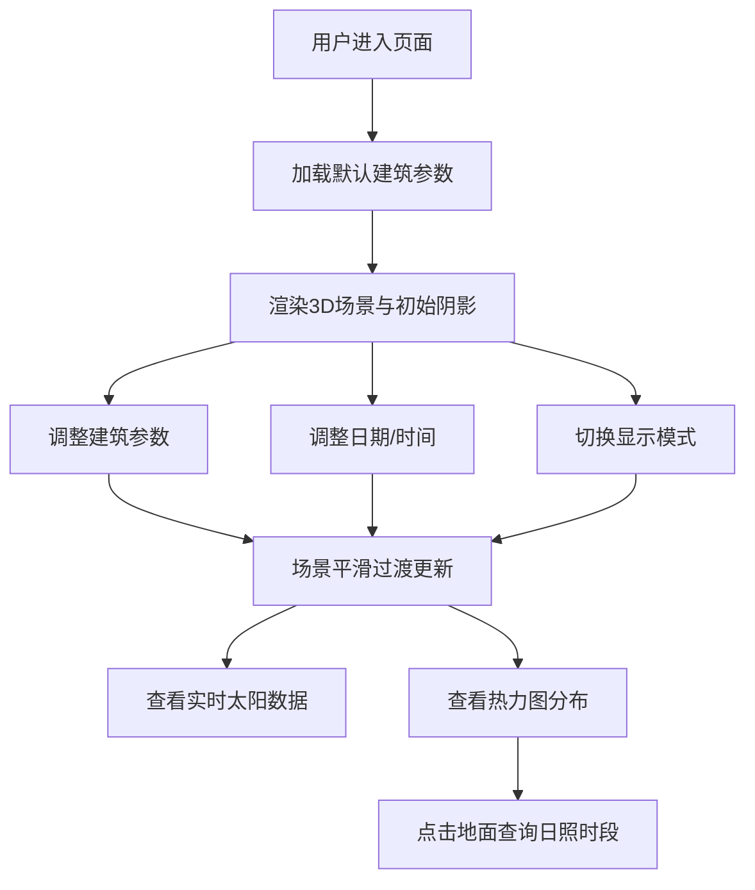

## 1. 产品概述

三维建筑日照与阴影动态分析工具，为建筑设计师和学生提供直观的日照模拟分析平台，辅助建筑采光与遮阳设计决策。

- 核心目标：通过三维可视化方式，模拟不同日期时间下的太阳位置变化与建筑阴影投射，帮助用户理解建筑与日照的关系
- 目标用户：建筑设计师、建筑学学生、城市规划师
- 市场价值：降低建筑日照分析门槛，提供直观、交互性强的教学与设计辅助工具

## 2. 核心功能

### 2.1 功能模块
1. **三维场景视图**：建筑体块渲染、太阳可视化、地面网格、阴影投射
2. **控制面板**：建筑参数设置、日期选择、时间滑块、显示模式切换
3. **分析结果区**：实时太阳数据、阴影热力图、日照时段统计、阴影轨迹线与等照时线

### 2.2 页面详情
| 页面名称 | 模块名称 | 功能描述 |
|---------|---------|---------|
| 主应用页 | 建筑参数面板 | 调整长度、宽度、层数、层高参数，实时更新建筑体块 |
| 主应用页 | 日期时间控制 | 日期选择器（全年范围）、时间滑块（6:00-18:00），平滑过渡动画 |
| 主应用页 | 显示模式勾选 | 阴影轨迹线开关、等照时线开关 |
| 主应用页 | 3D场景渲染 | 半透明玻璃质感建筑、灰色网格地面、黄色发光太阳、实时阴影 |
| 主应用页 | 实时数据面板 | 显示当前日期、时间、太阳方位角、高度角 |
| 主应用页 | 热力图叠加 | 蓝红渐变热力图表示全天阴影覆盖时长比例 |
| 主应用页 | 点击查询 | 点击地面任意位置弹窗显示该点日照时段统计 |

## 3. 核心流程

用户进入页面 → 默认建筑参数生成体块 → 调整日期/时间观察太阳与阴影变化 → 勾选显示模式查看轨迹线与等照时线 → 切换热力图查看阴影覆盖分布 → 点击地面特定位置获取详细日照统计

## 4. 用户界面设计

### 4.1 设计风格
- **主色调**：背景深灰 #1a1a2e，控件深蓝 #16213e，高亮橙色 #e94560
- **材质效果**：所有面板带毛玻璃效果 backdrop-filter: blur(10px)
- **动效**：滑块按钮 0.3s ease 过渡，场景切换 1s 平滑动画
- **布局**：桌面端左中右三栏，移动端上下堆叠 + 汉堡菜单折叠控制面板

### 4.2 页面设计概述
| 页面名称 | 模块名称 | UI 元素 |
|---------|---------|---------|
| 主应用页 | 建筑参数面板 | 毛玻璃容器、数值输入框、滑块、标签、间距 16px |
| 主应用页 | 日期时间控制 | 日期选择器（深色）、自定义范围滑块、时间刻度标记 |
| 主应用页 | 3D 场景区域 | 全屏 Canvas、OrbitControls 拖拽旋转缩放、相机平滑过渡 |
| 主应用页 | 结果显示区 | 数据卡片网格、数值高亮、标签图标 |
| 主应用页 | 弹窗组件 | 毛玻璃背景、阴影时段列表、橙色重点标记 |

### 4.3 响应式设计
- 桌面端（≥768px）：左（建筑参数，280px）- 中（3D 场景，flex-1）- 右（控制面板+结果，320px）三栏布局
- 平板/移动端（<768px）：上下堆叠，顶部汉堡菜单展开控制面板与结果区，中间 3D 场景占主
- 触控优化：支持双指旋转缩放、滑块支持触屏拖拽

### 4.4 3D 场景设计指南
- **环境**：深蓝渐变天空背景，轻微环境雾营造空间感
- **光照**：主光源为动态方向光（随太阳位置更新），配合半球光提供基础环境光
- **材质**：建筑使用 MeshPhysicalMaterial，transmission 半透明 + 蓝色 tint + 环境反射；地面使用标准灰色材质配合网格辅助线
- **相机**：PerspectiveCamera，初始位置 (40, 30, 40) 看向原点；OrbitControls 启用阻尼效果
- **阴影**：PCFSoftShadowMap 软阴影，阴影贴图分辨率 2048，阴影相机范围覆盖场景
- **后期**：轻微 Bloom 效果增强太阳发光感，色调映射使用 ACESFilmicToneMapping
