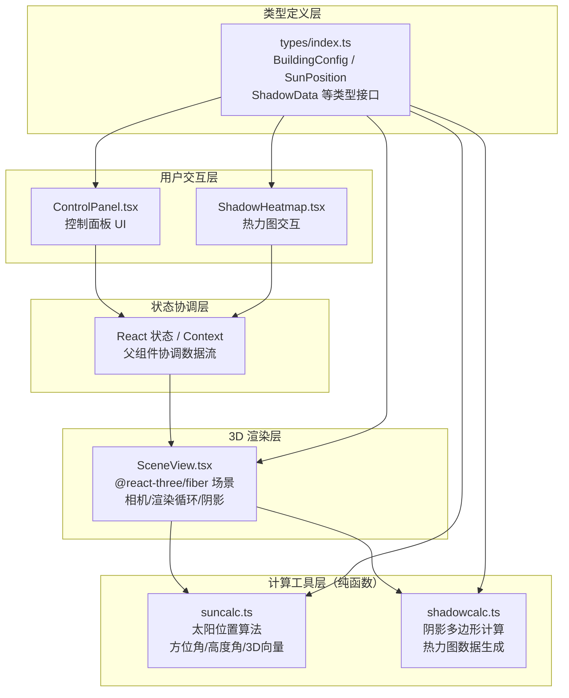

## 1. 架构设计



## 2. 技术描述

- **前端框架**：React 18 + TypeScript 5（严格模式）
- **构建工具**：Vite 5 + @vitejs/plugin-react
- **3D 渲染**：three + @react-three/fiber + @react-three/drei
- **UI 组件**：leva（控制面板）+ 自定义毛玻璃风格组件
- **状态管理**：React useState/useReducer 顶层协调，无额外状态库
- **其他依赖**：uuid

### 依赖清单
| 依赖包 | 用途 |
|-------|-----|
| react, react-dom | UI 框架 |
| three | WebGL 3D 渲染 |
| @react-three/fiber | Three.js React 封装 |
| @react-three/drei | 常用 R3F 辅助组件（OrbitControls 等） |
| leva | 可交互控制面板组件 |
| uuid | 唯一 ID 生成 |
| typescript | 类型系统 |
| vite | 构建与开发服务器 |
| @vitejs/plugin-react | Vite React 插件 |

## 3. 项目文件结构

```
src/
├── components/
│   ├── scene/
│   │   └── SceneView.tsx       # 3D 场景视图组件
│   ├── control/
│   │   └── ControlPanel.tsx    # 控制面板组件
│   └── analysis/
│       └── ShadowHeatmap.tsx   # 阴影热力图组件
├── utils/
│   ├── suncalc.ts              # 太阳位置计算
│   └── shadowcalc.ts           # 阴影与热力图计算
├── types/
│   └── index.ts                # 全局类型定义
├── App.tsx                     # 根组件：三栏布局与状态协调
├── main.tsx                    # React 入口
└── index.css                   # 全局样式（深色主题、毛玻璃、动画）
```

## 4. 数据流定义

### 4.1 核心 Props 流向
```
App.tsx (顶层状态)
  ├── buildingConfig    → ControlPanel (双向) / SceneView
  ├── currentDate       → ControlPanel (双向) / suncalc → SceneView
  ├── currentTime       → ControlPanel (双向) / suncalc → SceneView
  ├── displayOptions    → ControlPanel (双向) / SceneView / ShadowHeatmap
  ├── sunPosition       → suncalc → SceneView / ControlPanel 显示
  ├── shadowData        → shadowcalc → ShadowHeatmap
  └── onGroundClick     → ShadowHeatmap → 弹窗显示
```

### 4.2 关键类型
```typescript
// BuildingConfig: 建筑配置
// SunPosition: { azimuth, altitude, vector3 }
// ShadowData: { shadowPolygon, heatmapGrid, timeSlots }
// DisplayOptions: { showShadowTrail, showIsochron }
```

## 5. 性能优化策略

1. **阴影计算**：建筑体块使用简化几何体，阴影相机 frustum 精确裁剪
2. **热力图**：网格化计算（如 50×50 网格），使用 WebGL 着色器加速或 requestIdleCallback 计算
3. **动画过渡**：太阳位置使用 lerp 线性插值 1s 平滑过渡，避免跳变
4. **渲染**：阴影贴图分辨率控制在 2048，启用 PCF 软阴影，按需更新材质 uniforms
5. **响应时间**：目标 <500ms，复杂计算分片处理

## 6. 太阳位置算法说明

`suncalc.ts` 实现经典太阳位置算法（基于纬度、经度、日期、时间）：
- 输入：Date 对象、小时数（0-24）、纬度（默认 40°N）、经度
- 输出：
  - `azimuth`：方位角（弧度，南为 0，顺时针为正）
  - `altitude`：高度角（弧度，地平线上为正）
  - `vector3`：Three.js 三维空间方向向量（用于 DirectionalLight 位置）
- 无外部依赖，纯数学计算（基于 NOAA 太阳位置公式简化版）
