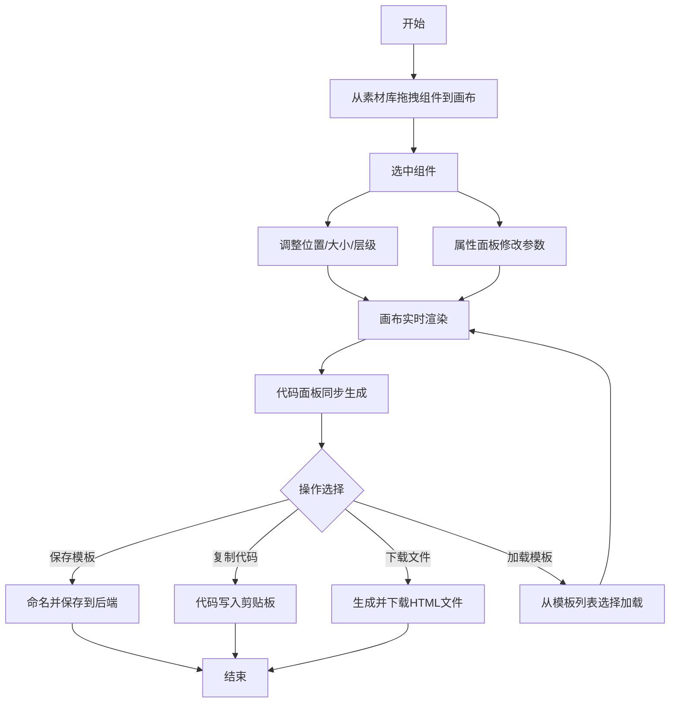

## 1. 产品概述

交互式UI组件设计稿与代码预览生成器，面向独立开发者提供轻量级的组件设计与代码导出工具，支持拖拽创建、实时预览和一键导出HTML+CSS+JS代码片段。

- 主要目的：帮助开发者快速构建和定制UI组件，生成可直接嵌入个人网站或博客的可运行代码
- 目标用户：独立开发者、前端工程师、技术博主
- 市场价值：降低UI组件设计门槛，提升原型开发效率，减少重复编码工作

## 2. 核心功能

### 2.1 用户角色

| 角色 | 注册方式 | 核心权限 |
|------|---------|---------|
| 访客用户 | 无需注册 | 创建、编辑、导出组件设计；保存/加载模板 |

### 2.2 功能模块

1. **设计画布区**：组件拖拽放置、位置调整、大小缩放、层级管理、画布平移/缩放
2. **属性编辑面板**：组件属性实时修改（颜色、尺寸、圆角、阴影、动画等）
3. **素材库面板**：预设组件库（按钮、卡片、输入框、导航栏、徽章）
4. **代码预览面板**：实时HTML+CSS+JS代码生成、语法高亮、复制/下载
5. **模板管理工具栏**：模板保存、加载、删除

### 2.3 页面详情

| 页面名称 | 模块名称 | 功能描述 |
|---------|---------|---------|
| 主设计页 | 顶部工具栏 | Logo展示、模板保存/加载管理、画布缩放指示器、汉堡菜单 |
| 主设计页 | 左侧属性面板 | 选中组件属性编辑，含颜色选择器、滑块、输入框等控件 |
| 主设计页 | 中央画布区域 | 组件拖拽放置、移动、缩放、删除、层级调整、网格背景 |
| 主设计页 | 右侧素材库面板 | 预设组件拖拽源、组件类型分类展示 |
| 主设计页 | 右下代码预览 | 实时代码生成、语法高亮、复制按钮、下载按钮 |

## 3. 核心流程

用户从素材库拖拽组件到画布 → 选中组件调整位置和大小 → 在左侧属性面板修改样式参数 → 画布实时渲染更新效果 → 代码面板同步生成对应HTML+CSS+JS → 用户复制代码或下载HTML文件 → 可选保存当前设计为模板供后续加载使用

## 4. 用户界面设计

### 4.1 设计风格
- 主色调：霓虹蓝 #00d4ff、深紫灰 #1a1a2e
- 背景：暗色主题，微弱渐变，画布区域浅灰网格线（每20px）
- 按钮风格：圆角矩形 + 图标组合，hover时背景色变为浅蓝
- 字体：UI使用现代无衬线字体，代码区域使用Fira Code等宽字体
- 布局：三栏式布局（左右各300px固定宽度，中间自适应），移动端抽屉式侧栏
- 交互效果：选中组件蓝色虚线框，拖拽平滑动画（100ms ease），悬停轻微阴影上浮

### 4.2 页面设计概述

| 页面名称 | 模块名称 | UI元素 |
|---------|---------|--------|
| 主设计页 | 顶部工具栏 | Logo文字、保存按钮、模板列表卡片、缩放指示器、汉堡菜单（移动端） |
| 主设计页 | 左侧属性面板 | 属性分类标签、颜色选择器（预设色板+HEX/RGBA输入）、滑块（带数值显示）、文本输入框、开关控件 |
| 主设计页 | 中央画布 | 浅灰网格背景、组件实例（带选中/删除按钮）、缩放/平移支持 |
| 主设计页 | 右侧素材库 | 组件类型图标卡片、拖拽预览、hover高亮效果 |
| 主设计页 | 代码预览区 | 深色代码编辑器背景（#282c34）、行号显示、语法高亮、复制/下载按钮 |

### 4.3 响应式

- 桌面端（≥900px）：三栏固定布局，左右面板各300px
- 移动端（<900px）：左右面板变为可折叠抽屉式侧栏，通过顶部汉堡菜单按钮切换显示
- 触控优化：移动端增大点击热区，支持触控拖拽和缩放
