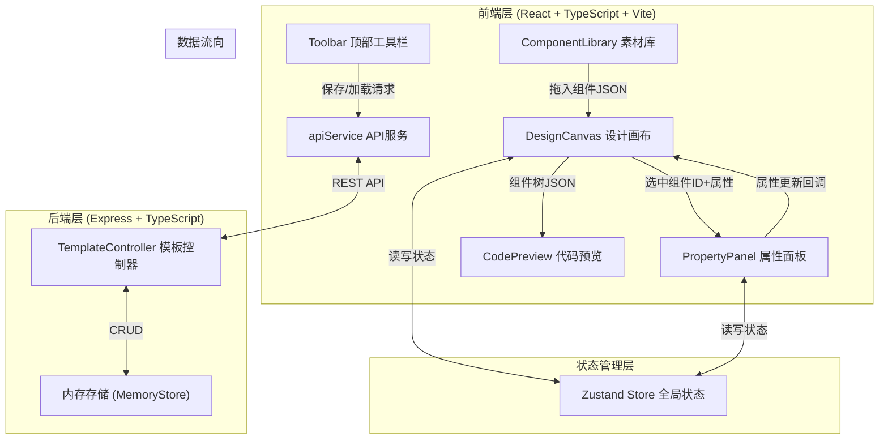
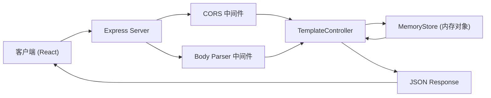
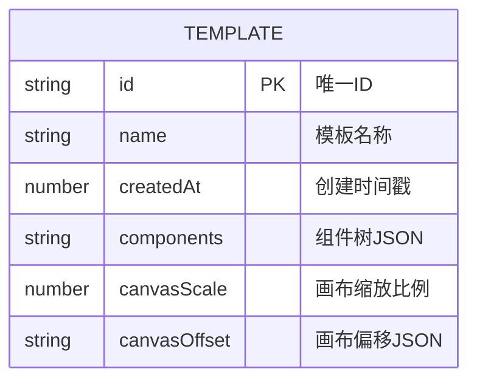

## 1. 架构设计



## 2. 技术描述

- 前端：React@18 + TypeScript + Vite + Zustand
- 初始化工具：vite-init（react-express-ts模板）
- 后端：Express@4 + TypeScript
- 数据库：内存对象存储（无需持久化数据库）
- 关键依赖：
  - `react-beautiful-dnd`：拖拽组件
  - `prismjs`：代码语法高亮
  - `micromodal`：模态对话框
  - `uuid`：生成唯一ID
  - `lucide-react`：图标库
  - `cors`：跨域支持
  - `body-parser`：请求体解析

## 3. 路由定义

| 路由 | 用途 |
|------|------|
| / | 主设计页面（单页应用） |
| GET /api/templates | 获取所有模板列表 |
| POST /api/templates | 保存新模板 |
| GET /api/templates/:id | 获取单个模板详情 |
| PUT /api/templates/:id | 更新模板 |
| DELETE /api/templates/:id | 删除模板 |

## 4. API 定义

```typescript
// 组件属性基础类型
interface ComponentBase {
  id: string;
  type: 'button' | 'card' | 'input' | 'navbar' | 'badge';
  x: number;
  y: number;
  width: number;
  height: number;
  zIndex: number;
}

// 按钮组件属性
interface ButtonComponent extends ComponentBase {
  type: 'button';
  text: string;
  backgroundColor: string;
  textColor: string;
  borderRadius: number;
  shadowOffsetX: number;
  shadowOffsetY: number;
  shadowBlur: number;
  borderStyle: string;
  borderWidth: number;
  borderColor: string;
}

// 卡片组件属性
interface CardComponent extends ComponentBase {
  type: 'card';
  title: string;
  description: string;
  imageUrl: string;
  margin: number;
  animationType: 'fadeIn' | 'slideUp' | 'none';
}

// 输入框组件属性
interface InputComponent extends ComponentBase {
  type: 'input';
  placeholder: string;
  borderColor: string;
  focusColor: string;
  disabled: boolean;
}

// 导航栏组件属性
interface NavbarComponent extends ComponentBase {
  type: 'navbar';
  brandText: string;
  links: string[];
  backgroundColor: string;
}

// 徽章组件属性
interface BadgeComponent extends ComponentBase {
  type: 'badge';
  text: string;
  backgroundColor: string;
  textColor: string;
}

type CanvasComponent = ButtonComponent | CardComponent | InputComponent | NavbarComponent | BadgeComponent;

// 模板数据结构
interface Template {
  id: string;
  name: string;
  createdAt: number;
  components: CanvasComponent[];
  canvasScale: number;
  canvasOffset: { x: number; y: number };
}

// API 响应格式
interface ApiResponse<T> {
  success: boolean;
  data?: T;
  error?: string;
}
```

## 5. 服务端架构图



## 6. 数据模型

### 6.1 数据模型定义



### 6.2 数据结构说明

- **Template（模板）**：存储用户保存的设计稿状态，包含组件树、画布缩放和偏移信息
- **Component（组件）**：每种组件类型有独立的属性集，通过type字段区分，统一存储在Template.components数组中
- 所有数据存储于服务端内存对象中，键为模板ID，值为Template对象
