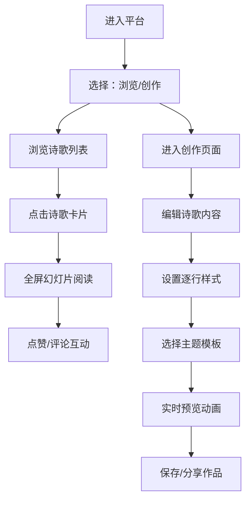

## 1. 产品概述
PoemCanvas是一个面向诗歌爱好者的在线创作与互动展示平台，提供富文本编辑、主题模板、动画效果和社交互动功能。

- 核心目标：让用户通过浏览器创作、排版和分享诗歌，以动画和音效增强阅读体验
- 目标用户：诗歌创作者、文学爱好者、普通读者
- 市场价值：打造一个有温度的诗歌创作社区，融合传统文学与现代交互设计

## 2. 核心功能

### 2.1 用户角色
| 角色 | 注册方式 | 核心权限 |
|------|---------|---------|
| 创作者 | 无需注册（访客模式） | 创作诗歌、应用主题、导出分享 |
| 读者 | 无需注册 | 浏览诗歌、点赞、评论互动 |

### 2.2 功能模块
1. **诗歌创作页面**：富文本编辑器、逐行样式设置、实时预览面板、主题选择器
2. **诗歌阅读页面**：瀑布流列表、全屏幻灯片阅读、主题动画、点赞评论互动

### 2.3 页面详情
| 页面名称 | 模块名称 | 功能描述 |
|---------|---------|---------|
| 创作页面 | 富文本编辑器 | 每行可设置字体、字号（12-48px）、颜色（色相环）、行高、对齐方式 |
| 创作页面 | 行装饰功能 | 双击行插入背景渐变或图片装饰 |
| 创作页面 | 实时预览 | 卡片式预览，悬停时逐字淡入上浮动画 |
| 创作页面 | 主题选择器 | 星空、水墨、森林、极光四种主题模板 |
| 阅读页面 | 瀑布流列表 | 卡片展示标题、作者、首句 |
| 阅读页面 | 全屏幻灯片 | 分段滚动显示，背景平滑过渡，粒子动效 |
| 阅读页面 | 互动功能 | 爱心点赞（带计数器动画）、抽屉式评论侧边栏 |

## 3. 核心流程

用户进入平台后，可选择浏览诗歌列表或开始创作。浏览时点击卡片进入全屏阅读模式，可点赞和评论。创作时在编辑器输入内容，设置样式和主题，实时预览效果。

## 4. 用户界面设计

### 4.1 设计风格
- **主色调**：米白色背景（#F8F5F0）配深灰色文字（#2C2C2C）
- **强调色**：墨绿色（#2D5A4B）用于按钮和交互元素
- **字体**：正文使用思源宋体，标题使用书法风格字体，各主题有独立字体方案
- **按钮风格**：圆角8-12px，悬浮时scale(1.05)放大，阴影加深，过渡0.2秒
- **布局风格**：左右分栏（左35%/右65%），移动端上下堆叠
- **动效风格**：fadeIn/out 0.3秒 ease-in-out，逐字淡入，背景平滑过渡

### 4.2 页面设计概述
| 页面名称 | 模块名称 | UI元素 |
|---------|---------|--------|
| 创作页面 | 编辑器面板 | 工具栏、行样式控制、色相环选择器、对齐按钮 |
| 创作页面 | 预览面板 | 卡片容器、悬停动画、装饰背景 |
| 阅读页面 | 列表区域 | 瀑布流布局、卡片悬停效果、加载动画 |
| 阅读页面 | 全屏阅读 | 分段滚动、背景过渡、粒子动效、底部操作栏 |
| 阅读页面 | 评论抽屉 | 富文本输入框、@提及功能、评论列表 |

### 4.3 响应式设计
- **桌面端**：左右分栏布局，左侧35%（创作/列表），右侧65%（预览/阅读）
- **平板端**：保持分栏，比例调整为40%/60%
- **移动端**：上下堆叠布局，编辑器全屏，预览在下方可折叠
- **触摸优化**：增大点击区域（最小44x44px），支持滑动切换段落

### 4.4 性能要求
- 全屏幻灯片滚动帧率 ≥ 50fps
- 评论侧边栏展开时间 ≤ 200ms
- 首屏加载时间 ≤ 2s
- 动画使用requestAnimationFrame优化
