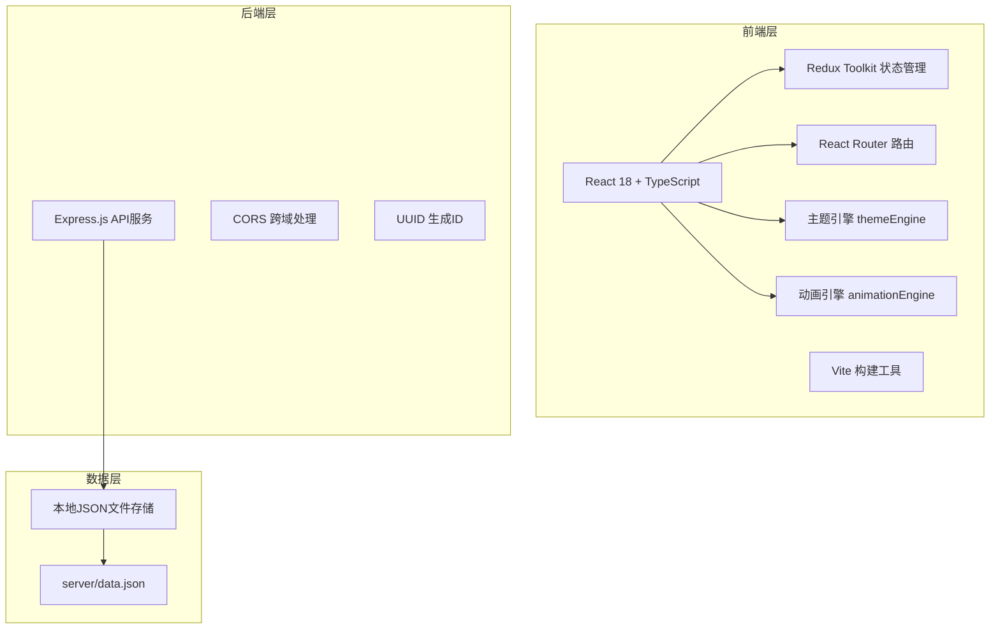
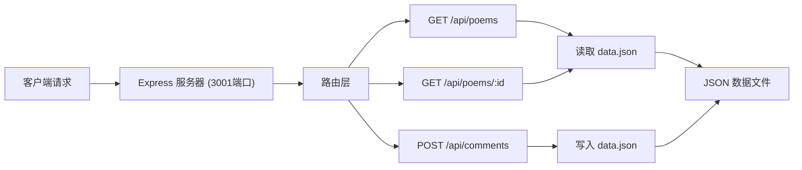

## 1. 架构设计



## 2. 技术描述
- **前端**：React 18 + TypeScript + Vite + Redux Toolkit + React Router + react-color
- **后端**：Express.js 4.x + CORS + UUID
- **数据存储**：本地JSON文件（server/data.json）
- **构建工具**：Vite 5.x
- **样式方案**：CSS Modules + CSS变量

## 3. 路由定义
| 路由 | 用途 |
|------|------|
| / | 诗歌阅读列表页面（默认） |
| /editor | 诗歌创作编辑页面 |
| /poem/:id | 诗歌全屏阅读页面 |

## 4. API 定义

```typescript
// 诗歌行样式
interface LineStyle {
  fontFamily: string;
  fontSize: number;
  color: string;
  lineHeight: number;
  textAlign: 'left' | 'center' | 'right';
  background?: string;
}

// 诗歌行
interface PoemLine {
  id: string;
  text: string;
  style: LineStyle;
}

// 诗歌段落
interface PoemParagraph {
  id: string;
  lines: PoemLine[];
}

// 诗歌
interface Poem {
  id: string;
  title: string;
  author: string;
  theme: 'default' | 'ink' | 'starry' | 'forest' | 'aurora';
  paragraphs: PoemParagraph[];
  likes: number;
  createdAt: string;
  firstLine: string;
}

// 评论
interface Comment {
  id: string;
  poemId: string;
  author: string;
  content: string;
  mentions: string[];
  createdAt: string;
}
```

### API 接口
- **GET /api/poems** - 获取诗歌列表
  - Response: `{ poems: Poem[] }`
  
- **GET /api/poems/:id** - 获取诗歌详情
  - Response: `{ poem: Poem }`
  
- **POST /api/comments** - 发表评论
  - Request: `{ poemId: string; author: string; content: string; mentions?: string[] }`
  - Response: `{ comment: Comment }`

## 5. 服务器架构图



## 6. 核心模块设计

### 6.1 主题引擎 (src/core/themeEngine.ts)
- `applyTheme(themeName: string)` - 应用主题到DOM
- `getThemeStyles(themeName: string)` - 获取主题样式配置
- 支持4种主题：default(素雅)、ink(水墨)、starry(星空)、forest(森林)、aurora(极光)

### 6.2 动画引擎 (src/core/animationEngine.ts)
- `animateLines(container: HTMLElement, options?: AnimationOptions)` - 逐字淡入动画
- `animateHeart(element: HTMLElement, count: number)` - 爱心计数器动画
- `animateBackgroundTransition(from: string, to: string, duration: number)` - 背景过渡
- 使用requestAnimationFrame优化性能

### 6.3 状态管理 (src/store/poemStore.ts)
- poems: 诗歌列表
- currentPoem: 当前编辑/阅读的诗歌
- selectedLineId: 当前选中的行
- comments: 评论列表
- theme: 当前主题
- 异步actions: fetchPoems, fetchPoemById, postComment

## 7. 项目文件结构

```
auto111/
├── package.json
├── index.html
├── tsconfig.json
├── vite.config.js
├── src/
│   ├── main.tsx
│   ├── pages/
│   │   ├── PoemEditorPage.tsx
│   │   └── PoemReaderPage.tsx
│   ├── components/
│   │   ├── PoemEditor.tsx
│   │   ├── PoemPreview.tsx
│   │   ├── ThemeSelector.tsx
│   │   ├── LineStylePanel.tsx
│   │   ├── PoemCard.tsx
│   │   ├── PoemSlideshow.tsx
│   │   ├── CommentDrawer.tsx
│   │   └── HeartButton.tsx
│   ├── core/
│   │   ├── themeEngine.ts
│   │   └── animationEngine.ts
│   ├── store/
│   │   └── poemStore.ts
│   ├── utils/
│   │   └── api.ts
│   └── types/
│       └── index.ts
└── server/
    ├── server.js
    └── data.json
```
