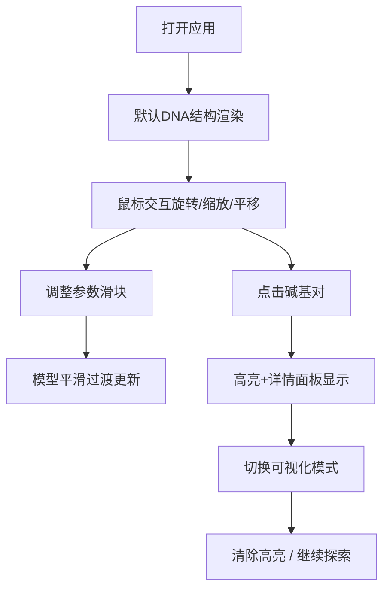

## 1. 产品概述

本产品是一款面向生物学家和教育工作者的DNA双螺旋分子三维结构交互式探索工具，解决传统教学材料缺乏动态交互和立体感知的问题。通过浏览器即可实现任意角度观察、参数实时调整、碱基对交互选中及多种教学可视化模式切换。

- 目标用户：生物学教师、学生、科研人员
- 核心价值：将抽象的分子结构具象化，通过沉浸式交互增强理解与记忆

## 2. 核心功能

### 2.1 用户角色

| 角色 | 注册方式 | 核心权限 |
|------|----------|----------|
| 访客用户 | 无需注册 | 完整使用所有探索与交互功能 |

### 2.2 功能模块

1. **三维场景主界面**：DNA双螺旋模型渲染、轨道相机控制、深空渐变背景与星点
2. **左侧控制面板**：螺旋参数滑块（圈数、碱基对间距、主链宽度）、可视化模式切换按钮、清除高亮按钮
3. **右侧详情面板**：被选中碱基对的类型、编号、相对位置信息展示
4. **视角小地图**：右下角缩略图，标示当前视角中心在整体结构中的方位

### 2.3 页面详情

| 页面名称 | 模块名称 | 功能描述 |
|----------|----------|----------|
| 主探索页 | 三维DNA模型 | 半透明管状主链（蓝/红）、彩色碱基对（绿/黄）、氢键虚线、鼠标交互 |
| 主探索页 | 控制面板 | 参数滑块实时驱动模型变化（300ms过渡动画）、模式切换（正常/仅主链/教学标注） |
| 主探索页 | 详情面板 | 显示选中碱基对的类型、编号、大沟/小沟位置 |
| 主探索页 | 小地图 | 右下角缩略球标示视角中心方位 |

## 3. 核心流程

用户打开应用 → 观察默认DNA双螺旋结构 → 鼠标拖拽旋转/滚轮缩放/右键平移 → 拖动滑块调整参数（模型平滑过渡） → 点击碱基对高亮并查看详情 → 切换可视化模式辅助教学 → 清除高亮或继续探索。

## 4. 用户界面设计

### 4.1 设计风格

- **主色调**：深空靛蓝 `#0a1628` → `#000000` 渐变背景
- **主链色**：靛蓝 `#3b82f6`（蓝链）、绯红 `#ef4444`（红链），半透明
- **碱基对色**：翠绿 `#10b981`（A-T）、暖黄 `#f59e0b`（G-C）
- **文字色**：白色 `#ffffff` 85% 透明度，带阴影
- **按钮风格**：圆角 8px，悬停 scale 1.05 + 变色，200ms 过渡
- **字体**：使用现代无衬线字体（如 Poppins / Noto Sans SC），标题 700，正文 400
- **布局风格**：三栏式布局（左250px / 主场景flex / 右300px），移动端折叠为汉堡菜单+底部抽屉

### 4.2 页面设计概览

| 页面名称 | 模块名称 | UI 元素 |
|----------|----------|----------|
| 主探索页 | 三维场景 | 深空渐变背景、闪烁星点、发光DNA结构、平滑交互动画 |
| 主探索页 | 左侧控制面板 | 玻璃拟态半透明面板、参数滑块（带数值显示）、模式切换按钮组 |
| 主探索页 | 右侧详情面板 | 玻璃拟态半透明面板、键值对信息展示、清除高亮按钮 |
| 主探索页 | 右下角小地图 | 圆形缩略图、透明小球标记视角位置 |

### 4.3 响应式设计

- Desktop-first，桌面端三栏并列
- 窗口宽度 < 900px：左侧面板折叠为顶部汉堡菜单，右侧面板折叠为底部抽屉
- 触摸设备支持双指缩放与单指旋转

### 4.4 3D 场景指引

- **环境**：深空渐变（深蓝→黑），程序化星点粒子微弱闪烁
- **光照**：两盏方向光 + 柔和环境光，主链使用半透明材质带发光
- **相机**：PerspectiveCamera，初始距离适中，OrbitControls 支持阻尼
- **构图**：DNA 结构居中垂直延伸，两侧留出面板空间
- **交互**：点击碱基对时淡蓝色光晕 + 1.2 倍放大，300ms 过渡
- **后期**：Bloom 发光效果增强沉浸感
- **性能预算**：30fps+，参数变化无卡顿，使用 TubeGeometry + InstancedMesh 优化
