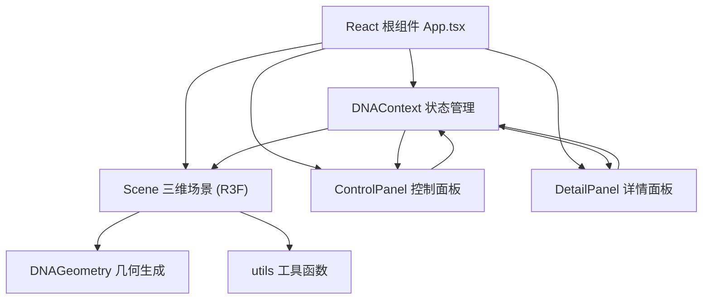

## 1. 架构设计



## 2. 技术描述

- **前端框架**：React@18 + TypeScript
- **构建工具**：Vite@5 + @vitejs/plugin-react
- **三维渲染**：three + @react-three/fiber + @react-three/drei
- **类型定义**：@types/three
- **辅助库**：uuid（碱基对唯一标识）、babel-plugin-macros
- **状态管理**：React Context（UI 与 3D 场景间参数同步）
- **CSS 方案**：原生 CSS + CSS Variables，玻璃拟态面板
- **后端**：无，纯前端应用

## 3. 路由定义

| 路由 | 用途 |
|------|------|
| / | 主探索页（单页应用，无其他路由） |

## 4. 数据模型

### 4.1 DNA 参数状态（Context）

```typescript
interface DNAContextType {
  params: {
    turns: number;          // 螺旋圈数 5-15
    basePairSpacing: number; // 碱基对间距 0.5-2.0
    backboneWidth: number;  // 主链宽度 0.1-0.5
  };
  visualMode: 'full' | 'backbone' | 'teaching';
  highlightedBasePairId: string | null;
  setParams: (p: Partial<DNAContextType['params']>) => void;
  setVisualMode: (m: DNAContextType['visualMode']) => void;
  setHighlightedBasePairId: (id: string | null) => void;
}
```

### 4.2 碱基对数据结构

```typescript
interface BasePairData {
  id: string;
  type: 'AT' | 'GC';
  index: number;           // 从顶部起始编号 1
  position: 'major' | 'minor'; // 大沟/小沟
  center: [number, number, number];
  rotation: [number, number, number];
  pointA: [number, number, number];
  pointB: [number, number, number];
}

interface DNAGeometryResult {
  backbone1Points: THREE.Vector3[]; // 蓝链路径点
  backbone2Points: THREE.Vector3[]; // 红链路径点
  basePairs: BasePairData[];
  totalHeight: number;
}
```

## 5. 项目文件结构

```
auto112/
├── index.html
├── package.json
├── vite.config.js
├── tsconfig.json
└── src/
    ├── main.tsx
    ├── App.tsx                  # 根组件，集成三维场景与面板
    ├── context/
    │   └── DNAContext.tsx       # React Context 状态管理
    ├── components/
    │   ├── Scene.tsx            # R3F Canvas + DNA模型渲染
    │   ├── ControlPanel.tsx     # 左侧参数与模式控制面板
    │   ├── DetailPanel.tsx      # 右侧碱基对详情面板
    │   ├── Minimap.tsx          # 右下角视角小地图
    │   ├── DNAHelix.tsx         # DNA双螺旋3D组件
    │   ├── BasePair.tsx         # 单个碱基对3D组件（含点击高亮）
    │   └── Starfield.tsx        # 深空星点背景
    ├── lib/
    │   ├── DNAGeometry.ts       # 几何数据生成（纯函数）
    │   └── utils.ts             # 通用工具（颜色、缓动、向量）
    └── styles/
        └── global.css           # 全局样式与CSS变量
```

## 6. 关键技术决策

1. **几何生成**：使用螺旋参数方程生成两条主链 CatmullRom 曲线路径，再通过 TubeGeometry 生成管状网格；碱基对使用 CylinderGeometry 连接两个主链点。
2. **动画过渡**：使用 drei 的 `useTransition` 或自写 lerp 实现 300ms 参数平滑过渡，避免模型突变。
3. **交互拾取**：R3F 的 `useThree` + `Raycaster`/`onClick` 事件实现碱基对点击检测。
4. **性能优化**：碱基对使用 InstancedMesh 批量渲染；参数变化时复用几何而非全量重建。
5. **教学标注模式**：使用 drei 的 `Html` 或 `Text` 组件渲染始终面向相机的字母标签；方向箭头使用 ConeGeometry 沿主链切线方向放置。
6. **小地图**：独立 Canvas 渲染缩小视角的 DNA 缩略球，通过同步相机目标位置标示观察点。
