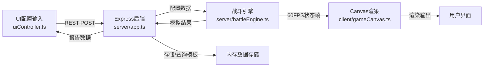

## 1. 产品概述

星际资源争夺战是一款太空背景的战斗模拟与AI行为分析工具，帮助游戏开发者快速配置舰队阵容、调整AI策略倾向，并通过实时可视化模拟来验证游戏平衡性。系统以俯视2D视角展现舰队移动、交火和资源采集过程，生成包含战损比、资源曲线和AI决策热点的综合报告。

**目标用户**：游戏设计师、平衡性调整人员、AI策略开发者
**核心价值**：大幅提升太空策略游戏初期平衡性调整效率，提供直观的AI行为可视化分析

---

## 2. 核心功能

### 2.1 用户角色

| 角色 | 登录方式 | 核心权限 |
|------|----------|----------|
| 普通用户 | 无需登录 | 配置舰队、运行模拟、保存/加载模板、查看报告 |

### 2.2 功能模块

1. **舰队配置模块**：蓝方/红方阵容编辑，战舰类型选择，AI策略配置
2. **实时模拟模块**：60FPS战斗演算，Canvas渲染，视角控制
3. **结果报告模块**：战损对比、资源曲线、AI热点图分析
4. **模板管理模块**：配置保存、加载、列表管理

### 2.3 页面详情

| 页面名称 | 模块名称 | 功能描述 |
|----------|----------|----------|
| 主界面 | 配置面板 | 双面板卡片式布局，支持战舰类型选择和AI策略配置 |
| 主界面 | Canvas主区域 | 4000x4000星空地图，实时渲染战舰、资源点、弹道、粒子特效 |
| 主界面 | 模拟控制栏 | 开始/暂停/加速按钮，FPS实时显示 |
| 主界面 | 结果报告面板 | 三栏布局展示战损统计、资源曲线、AI热点图 |
| 主界面 | 模板管理区 | 模板保存对话框，下拉列表快速加载 |

---

## 3. 核心流程

### 用户操作流程

用户配置双方舰队阵容（每方最多8艘战舰，可选侦察舰/主力舰/航母，AI选择均衡/激进/龟缩策略）→ 可选保存为模板 → 启动模拟 → Canvas实时渲染60FPS战斗过程（支持拖拽平移、滚轮缩放视角）→ 模拟结束或用户中断 → 弹出三栏结果报告面板 → 可重新配置或加载模板再次模拟

### 数据流向图

---

## 4. 用户界面设计

### 4.1 设计风格

**深空科技风格**
- **主背景色**：#0b0e17（深邃宇宙黑）
- **强调色**：银河蓝 #4a7dff、星云紫 #8b5cf6
- **战舰配色**：蓝方 #4a7dff、红方 #ef4444
- **资源点**：金色 #fbbf24 六边形图标
- **毛玻璃面板**：backdrop-filter: blur(10px)，白色边框透明度0.2
- **字体**：JetBrains Mono 等宽字体，营造科技感
- **按钮**：圆角矩形 border-radius: 8px，深色填充默认，悬停紫蓝色渐变 + 上移3px

### 4.2 页面设计概述

| 页面名称 | 模块名称 | UI元素 |
|----------|----------|--------|
| 主界面 | 配置面板 | 卡片式战舰选择，不同战舰类型颜色区分，选中边框发光动画，AI策略单选按钮 |
| 主界面 | Canvas区域 | 深蓝色渐变背景 + 闪烁星点，金色六边形资源点脉动光晕，战舰拖尾粒子，弹道轨迹，爆炸特效 |
| 主界面 | 模拟控制 | 顶部FPS计数器（白色→红色闪烁<30FPS），开始/暂停/速度控制按钮 |
| 主界面 | 结果报告 | 全屏半透明蒙层，中心向四周展开动画，三栏布局，关闭按钮悬停放大反馈 |
| 主界面 | 模板管理 | 下拉列表缩进分组，保存命名对话框 |

### 4.3 响应式设计

- **桌面端**（≥900px）：左右双配置面板 + 中央Canvas的三栏布局
- **移动端**（<900px）：配置面板折叠为可切换侧边抽屉菜单，Canvas占满屏幕
- **触摸优化**：支持双指缩放、单指拖拽平移地图

### 4.4 动画与特效

- **战舰移动**：尾部拖尾粒子特效，颜色与阵营一致
- **交火效果**：直线弹道 + 目标点爆炸粒子
- **资源采集**：数字飘字向上浮动消失
- **面板过渡**：结果面板中心向四周缩放展开动画
- **按钮反馈**：悬停渐变 + 上移3px + 阴影加深
- **星点背景**：随机位置、随机大小、随机闪烁频率

---

## 5. 性能约束

- **模拟帧率**：≥45FPS（1000艘单位 + 50个资源点 + 全量弹道场景）
- **报告生成**：≤2秒（10分钟模拟数据）
- **地图尺寸**：4000x4000单位
- **模拟帧率**：60FPS固定逻辑帧
