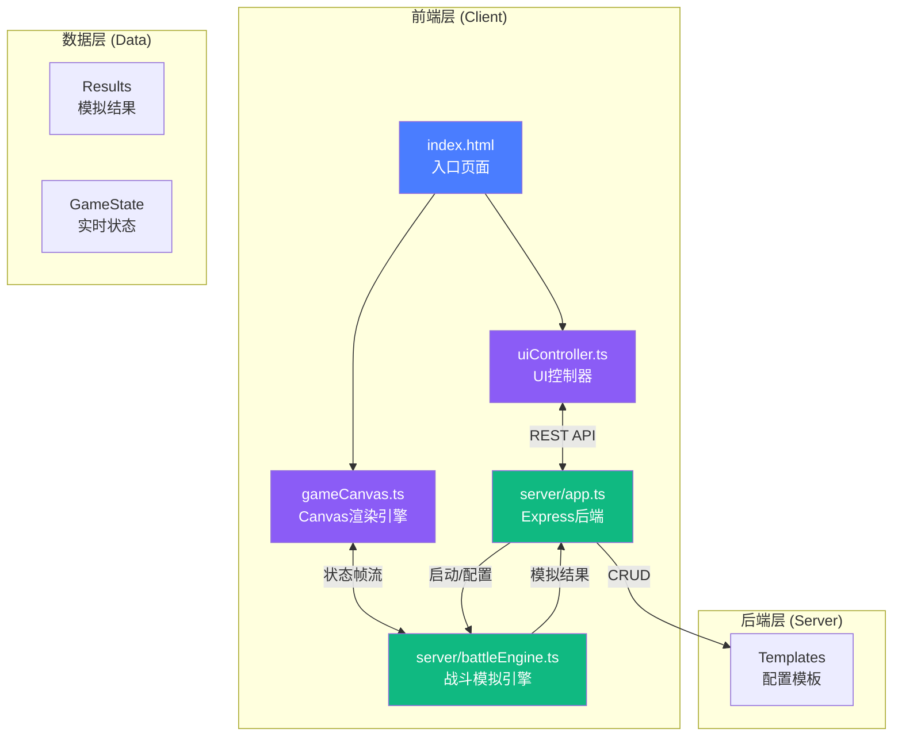
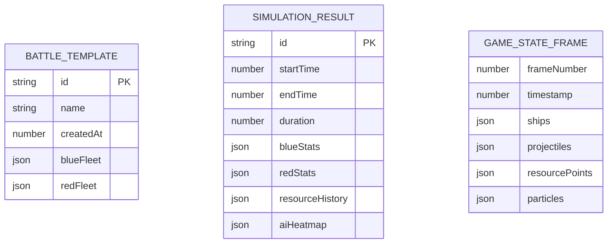
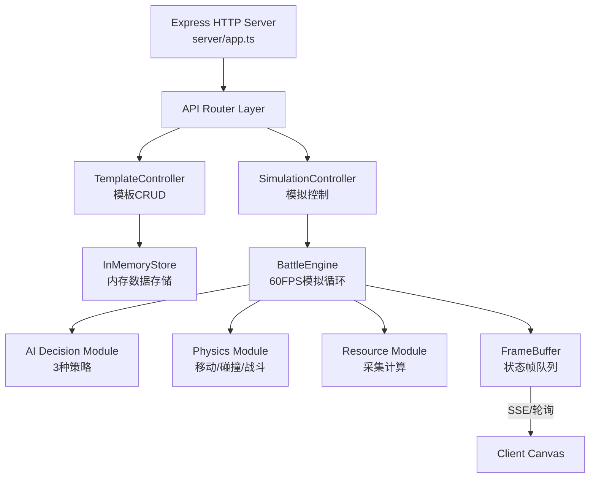
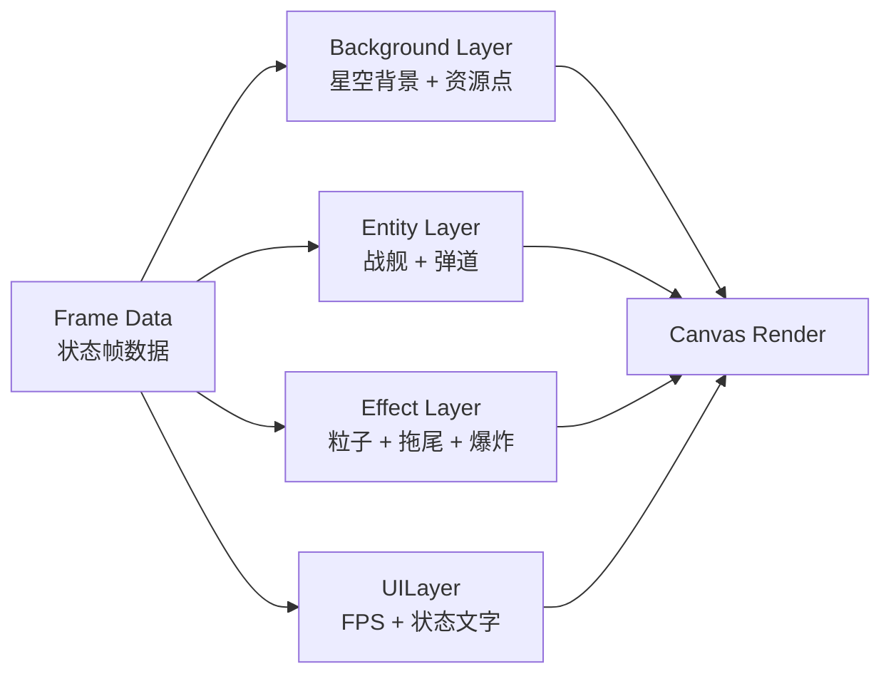

## 1. 系统架构设计



---

## 2. 技术栈说明

### 前端技术
- **TypeScript**：类型安全的核心语言
- **原生 Canvas API**：高性能2D渲染，无需额外游戏引擎
- **Vite**：构建工具与开发服务器
- **WebSocket/SSE**：实时状态帧推送（优先轮询降级）
- **Chart.js**（可选）：资源曲线图渲染，亦可原生Canvas实现

### 后端技术
- **Node.js + Express@4**：HTTP API服务器
- **TypeScript + ts-node**：后端类型安全
- **uuid**：唯一ID生成
- **cors + body-parser**：跨域与请求解析

### 构建配置
- **package.json**：express, uuid, cors, body-parser, typescript, ts-node, @types/express, @types/uuid, @types/cors
- **启动脚本**：`npm run dev` 同时启动前后端

---

## 3. 文件结构与调用关系

```
auto113/
├── package.json              # 项目依赖与脚本
├── vite.config.js           # Vite配置（TS支持、公共路径）
├── tsconfig.json            # TypeScript严格模式配置
├── index.html               # 入口页面（Canvas容器+UI资源）
├── shared/                  # 前后端共享类型定义
│   └── types.ts            # 战舰、舰队、AI策略、游戏状态接口
├── server/
│   ├── app.ts              # Express入口 → 调用battleEngine
│   └── battleEngine.ts      # 战斗模拟核心 → 推送状态帧到前端
├── client/
│   ├── gameCanvas.ts        # Canvas渲染引擎 ← 接收battleEngine状态帧
│   └── uiController.ts      # UI控制器 ↔ HTTP请求server
└── .trae/
    └── documents/
        ├── PRD-*.md
        └── TECH-*.md
```

### 调用关系说明

| 模块 | 调用者 | 被调用者 | 数据流向 |
|------|--------|----------|----------|
| `uiController.ts` | 用户交互 | `server/app.ts` | 舰队配置 → REST POST → 后端 |
| `server/app.ts` | uiController | `battleEngine.ts` | 启动配置 → 模拟引擎 |
| `battleEngine.ts` | app.ts | `gameCanvas.ts` | 60FPS状态帧 → 推送/轮询 → Canvas渲染 |
| `gameCanvas.ts` | battleEngine | DOM Canvas | 渲染输出 → 用户界面 |
| `battleEngine.ts` | 模拟结束 | `server/app.ts` | 结果数据 → 后端存储 |
| `server/app.ts` | battleEngine | `uiController.ts` | 报告数据 → REST GET → UI展示 |

---

## 4. API 接口定义

### TypeScript 类型定义

```typescript
// shared/types.ts
export type ShipType = 'scout' | 'capital' | 'carrier';
export type AIStrategy = 'balanced' | 'aggressive' | 'defensive';
export type Faction = 'blue' | 'red';

export interface ShipConfig {
  id: string;
  type: ShipType;
  faction: Faction;
  name: string;
}

export interface FleetConfig {
  faction: Faction;
  ships: ShipConfig[];
  aiStrategy?: AIStrategy;
}

export interface BattleTemplate {
  id: string;
  name: string;
  createdAt: number;
  blueFleet: FleetConfig;
  redFleet: FleetConfig;
}

export interface ShipStats {
  speed: number;
  shield: number;
  damage: number;
  gatherRate: number;
  range: number;
}

export const SHIP_STATS: Record<ShipType, ShipStats> = {
  scout: { speed: 120, shield: 50, damage: 8, gatherRate: 5, range: 150 },
  capital: { speed: 60, shield: 200, damage: 25, gatherRate: 2, range: 250 },
  carrier: { speed: 40, shield: 150, damage: 15, gatherRate: 8, range: 200 },
};
```

### REST API 定义

| 方法 | 路径 | 用途 | 请求体 | 响应体 |
|------|------|------|--------|--------|
| GET | `/api/templates` | 获取所有模板列表 | - | `BattleTemplate[]` |
| POST | `/api/templates` | 保存新模板 | `{ name: string, blueFleet, redFleet }` | `BattleTemplate` |
| GET | `/api/templates/:id` | 获取单个模板 | - | `BattleTemplate` |
| DELETE | `/api/templates/:id` | 删除模板 | - | `{ success: boolean }` |
| POST | `/api/simulation/start` | 启动模拟 | `{ blueFleet, redFleet }` | `{ simulationId: string }` |
| GET | `/api/simulation/:id/frame` | 获取当前帧状态 | - | `GameStateFrame` |
| POST | `/api/simulation/:id/pause` | 暂停模拟 | - | `{ paused: boolean }` |
| POST | `/api/simulation/:id/resume` | 恢复模拟 | - | `{ paused: boolean }` |
| POST | `/api/simulation/:id/stop` | 停止模拟 | - | `SimulationResult` |
| GET | `/api/simulation/:id/result` | 获取最终结果 | - | `SimulationResult` |

---

## 5. 数据模型

### 5.1 实体关系图



### 5.2 核心数据结构

```typescript
// 游戏状态帧
interface GameStateFrame {
  frameNumber: number;
  timestamp: number;
  ships: ShipState[];
  projectiles: Projectile[];
  resourcePoints: ResourcePoint[];
  particles: Particle[];
}

// 战舰运行时状态
interface ShipState {
  id: string;
  type: ShipType;
  faction: Faction;
  x: number;
  y: number;
  angle: number;
  shield: number;
  maxShield: number;
  targetId: string | null;
  gatheringFrom: string | null;
}

// 弹道
interface Projectile {
  id: string;
  x: number;
  y: number;
  vx: number;
  vy: number;
  damage: number;
  faction: Faction;
  targetId: string;
}

// 资源点
interface ResourcePoint {
  id: string;
  x: number;
  y: number;
  resourceAmount: number;
  maxResource: number;
  beingGatheredBy: string[];
}

// 粒子特效
interface Particle {
  id: string;
  x: number;
  y: number;
  vx: number;
  vy: number;
  life: number;
  maxLife: number;
  color: string;
  size: number;
}

// 模拟结果
interface SimulationResult {
  simulationId: string;
  startTime: number;
  endTime: number;
  duration: number;
  winner: Faction | 'draw';
  blueStats: {
    survived: number;
    totalShips: number;
    totalDamage: number;
    resourcesGathered: number;
  };
  redStats: {
    survived: number;
    totalShips: number;
    totalDamage: number;
    resourcesGathered: number;
  };
  resourceHistory: { time: number; blue: number; red: number }[];
  aiHeatmap: { x: number; y: number; intensity: number }[];
}
```

---

## 6. 后端架构



### 后端模块职责

| 模块 | 职责 | 关键实现 |
|------|------|----------|
| `TemplateController` | 模板的创建、查询、删除 | CRUD操作，内存存储 |
| `SimulationController` | 模拟生命周期管理 | 启动/暂停/停止/状态查询 |
| `BattleEngine` | 核心模拟循环 | `setInterval` 60FPS固定帧率 |
| `AI Decision Module` | AI决策逻辑 | 三种策略行为树 |
| `Physics Module` | 移动和战斗计算 | 向量运算、距离检测 |
| `Resource Module` | 资源采集逻辑 | 采集速率计算、扣减 |
| `FrameBuffer` | 状态帧缓冲 | 环形队列，保存最近N帧 |

---

## 7. 前端架构

### Canvas 渲染管线



### 核心模块说明

#### `client/gameCanvas.ts` - Canvas渲染引擎
- **视口管理**：相机位置、缩放级别、拖拽平移、滚轮缩放
- **图层渲染**：背景层→实体层→特效层→UI层的顺序渲染
- **粒子系统**：对象池管理，避免频繁GC
- **性能优化**：视口剔除，只渲染可见区域

#### `client/uiController.ts` - UI控制器
- **配置面板**：双面板卡片布局，战舰选择，AI策略配置
- **模拟控制**：开始/暂停/加速/停止按钮
- **结果报告**：三栏布局，战损表格、资源曲线、AI热点图
- **模板管理**：保存对话框、下拉列表加载
- **响应式布局**：<900px时切换为抽屉菜单

---

## 8. 性能优化策略

### 前端优化
1. **对象池模式**：粒子、弹道等高频创建销毁对象复用
2. **视口剔除**：只渲染Canvas可见区域内的实体
3. **离屏Canvas**：星空背景预渲染为静态图
4. **requestAnimationFrame**：渲染与浏览器刷新率同步
5. **增量更新**：只更新变化的UI元素

### 后端优化
1. **固定时间步长**：60FPS逻辑帧，与渲染分离
2. **空间分区**：网格/四叉树优化碰撞检测
3. **高效数据结构**：TypedArray存储大量实体状态
4. **流式结果输出**：资源历史增量推送，不一次性全量发送
5. **内存限制**：状态帧环形缓冲，控制内存占用
