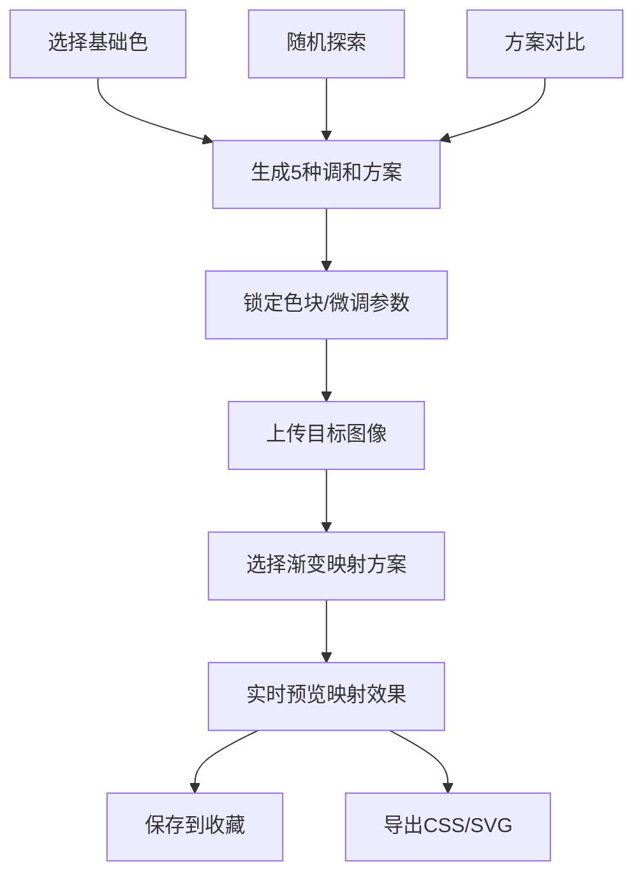

## 1. 产品概述

面向插画师和动漫爱好者的在线交互式配色方案调和与渐变映射生成器，帮助用户直观地创建、对比和导出专业配色方案，并可实时预览在图像上的渐变映射效果。

- 核心价值：解决插画师和动漫创作者在配色方案设计、对比和应用预览上的痛点，提供从选色到导出的一站式专业工具
- 目标用户：插画师、动漫创作者、平面设计师、色彩爱好者

## 2. 核心功能

### 2.1 用户角色

| 角色 | 注册方式 | 核心权限 |
|------|----------|----------|
| 普通用户 | 无需注册，本地存储 | 使用全部配色功能，本地收藏和导出方案 |

### 2.2 功能模块

1. **主工作台**：色环选色区、调和方案预览、微调面板、渐变映射预览
2. **收藏管理侧边栏**：方案收藏卡片列表、删除/清空操作
3. **导出功能面板**：CSS变量代码生成、SVG色卡图导出
4. **方案对比模态窗**：5种调和方案的全屏网格对比视图

### 2.3 页面详情

| 页面名称 | 模块名称 | 功能描述 |
|---------|---------|----------|
| 主工作台 | 色环选择器 | 360度HSL色环，饱和度从中心向外递增，支持点击/拖动选色，显示内外圈刻度和悬停tooltip |
| 主工作台 | 调和方案色块条 | 自动生成5种方案（单色、互补、邻近、三分相、四分相），支持锁定/解锁色块，选中高亮 |
| 主工作台 | 微调面板 | 亮度/饱和度滑块、随机探索按钮，实时更新配色 |
| 主工作台 | 渐变映射预览区 | 支持拖拽/选择上传图像，并排显示原图与映射效果，色阶数量可调 |
| 侧边栏 | 收藏列表 | 卡片式展示收藏方案，支持应用、删除、清空，悬停动效 |
| 模态窗 | 方案对比视图 | 2x3网格展示各方案的插画模拟效果，快速对比整体视觉 |
| 导出面板 | 导出功能 | 生成CSS变量代码块和SVG色卡图，支持一键复制 |

## 3. 核心流程

用户在色环上点击选择基础色 → 系统自动生成5种调和方案并以色块条展示 → 用户可锁定特定色块或调整亮度/饱和度 → 上传图像并选择方案应用渐变映射 → 将满意的方案保存到收藏 → 导出CSS代码或SVG色卡。

## 4. 用户界面设计

### 4.1 设计风格

- **主色调**：背景 #1a1a2e，卡片/面板 #16213e，强调色 #0f3460，文本 #eaeaea，高亮金色 #ffd700
- **按钮风格**：圆角设计，hover时从#0f3460变为#1a5276，点击时scale 0.95按压反馈
- **字体**：搭配展示字体与正文字体，提升专业感和可读性
- **布局风格**：卡片式布局，色环居左上方，右侧依次为色块条、微调面板、预览区，左下为可折叠侧边栏
- **动效风格**：0.3秒ease过渡，悬停放大1.05倍+box-shadow，所有动画维持60fps

### 4.2 页面设计概述

| 页面名称 | 模块名称 | UI元素 |
|---------|---------|--------|
| 主工作台 | 色环选择器 | Canvas渲染，高DPI适配，内外圈刻度，悬停tooltip，鼠标光标跟随 |
| 主工作台 | 调和方案色块条 | 圆角卡片，色块间隙2px，选中金色边框，锁定图标，对比按钮 |
| 主工作台 | 微调面板 | 滑块控件带数值显示，随机探索按钮带图标 |
| 主工作台 | 渐变映射预览区 | 双Canvas并排对比，裁剪框适配图像比例，下方色阶条 |
| 侧边栏 | 收藏列表 | 缩略卡片含5个色块+名称+时间，悬停放大阴影，删除按钮 |
| 模态窗 | 方案对比 | 暗色背景遮罩，2x3网格，每格含SVG插画示例，关闭按钮 |

### 4.3 响应式设计

- **桌面端**（>768px）：多列布局，色环尺寸400x400px
- **移动端**（<768px）：单列堆叠布局，色环缩小为300x300px，控件尺寸自适应
- **触摸优化**：增大点击区域，支持触摸拖动选色

### 4.4 性能要求

- 色环渲染响应 < 200ms
- 800x600图像渐变映射计算 < 300ms
- 所有动画帧率 60fps
- 使用 React.memo 和 useMemo 避免不必要重渲染
