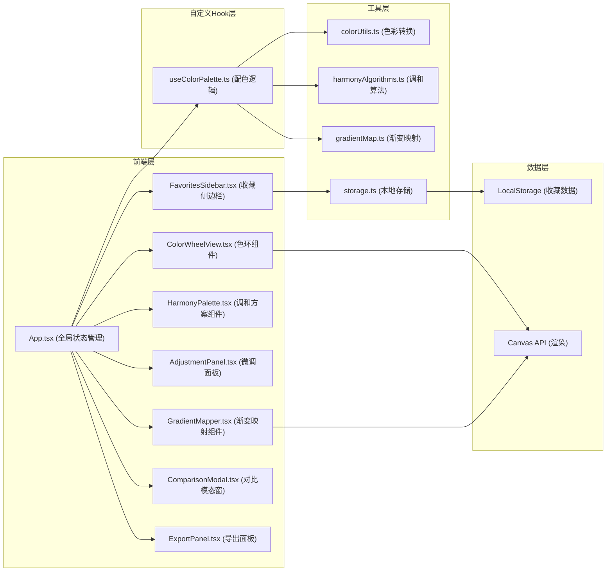
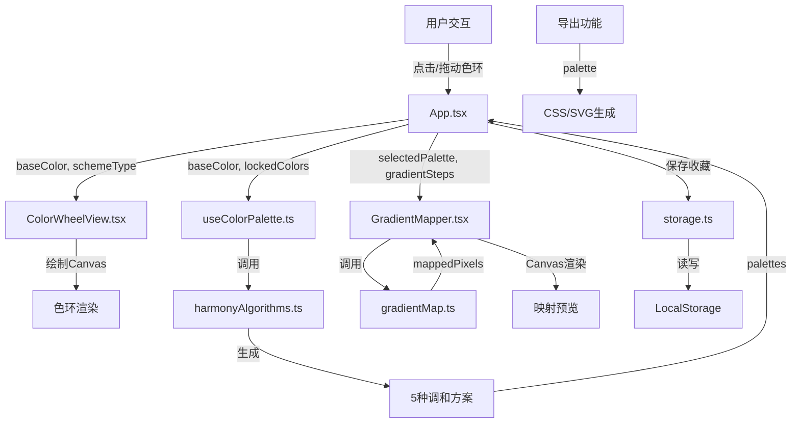

## 1. 架构设计



## 2. 技术描述

- **前端框架**：React 18 + TypeScript 5
- **构建工具**：Vite 5 + @vitejs/plugin-react
- **样式方案**：TailwindCSS 3 + CSS变量
- **状态管理**：React useState/useReducer + 自定义Hook（useColorPalette）
- **色彩处理**：hsluv（人类感知均匀色彩空间）
- **唯一ID**：uuid
- **画布渲染**：HTML5 Canvas API（高DPI适配）
- **数据持久化**：LocalStorage

## 3. 数据流向



## 4. 文件结构与职责

```
src/
├── App.tsx                      # 主应用组件，全局状态管理，事件分发
├── main.tsx                     # 应用入口
├── index.css                    # 全局样式 + TailwindCSS
├── types/
│   └── color.ts                 # 色彩相关TypeScript类型定义
├── hooks/
│   └── useColorPalette.ts       # 配色核心逻辑Hook
├── components/
│   ├── ColorWheelView.tsx       # 色环选择与渲染组件
│   ├── GradientMapper.tsx       # 渐变映射预览组件
│   ├── HarmonyPalette.tsx       # 调和方案色块条组件
│   ├── AdjustmentPanel.tsx      # 亮度/饱和度微调面板
│   ├── FavoritesSidebar.tsx     # 收藏列表侧边栏
│   ├── ComparisonModal.tsx      # 方案对比模态窗口
│   ├── ExportPanel.tsx          # CSS/SVG导出面板
│   └── Tooltip.tsx              # 通用Tooltip组件
└── utils/
    ├── colorUtils.ts            # HSL/RGB/HSLuv色彩转换
    ├── harmonyAlgorithms.ts     # 色彩调和算法（互补/邻近/三分相等）
    ├── gradientMap.ts           # 渐变映射像素级计算
    ├── exportUtils.ts           # CSS变量和SVG生成
    └── storage.ts               # LocalStorage封装
```

## 5. 核心数据模型

### 5.1 类型定义

```typescript
// 色彩表示
interface HSLColor {
  h: number;      // 色相 0-360
  s: number;      // 饱和度 0-100
  l: number;      // 亮度 0-100
}

interface RGBColor {
  r: number;      // 0-255
  g: number;      // 0-255
  b: number;      // 0-255
}

// 调和方案类型
type HarmonyType = 'monochromatic' | 'complementary' | 'analogous' | 'triadic' | 'tetradic';

// 调色板
interface Palette {
  id: string;
  name: string;
  type: HarmonyType;
  colors: HSLColor[];
  locked: boolean[];
  createdAt: number;
}

// 收藏项
interface FavoriteItem {
  id: string;
  name: string;
  palette: Palette;
  createdAt: number;
}

// 应用状态
interface AppState {
  baseColor: HSLColor;
  palettes: Record<HarmonyType, Palette>;
  selectedPaletteType: HarmonyType;
  gradientSteps: number;
  uploadedImage: HTMLImageElement | null;
  favorites: FavoriteItem[];
  showComparison: boolean;
  sidebarCollapsed: boolean;
}
```

### 5.2 组件间调用关系

| 组件 | 输入Props | 输出回调 | 依赖 |
|------|----------|----------|------|
| App.tsx | - | - | useColorPalette, 所有子组件 |
| ColorWheelView | baseColor, size | onColorSelect | colorUtils |
| HarmonyPalette | palette, selected | onLockToggle, onSelect, onCompare | - |
| AdjustmentPanel | baseColor | onBrightnessChange, onSaturationChange, onRandom | - |
| GradientMapper | palette, steps, image | - | gradientMap |
| FavoritesSidebar | favorites, collapsed | onApply, onDelete, onClear, onToggle | storage |
| ComparisonModal | palettes, visible | onClose | - |
| ExportPanel | palette | onCopyCSS, onCopySVG | exportUtils |

## 6. 性能优化策略

1. **React.memo**：所有纯展示组件使用memo包装，避免不必要重渲染
2. **useMemo**：色彩计算、调和方案生成、渐变映射结果使用useMemo缓存
3. **useCallback**：事件处理函数使用useCallback稳定引用
4. **Canvas离屏渲染**：色环基础图层预渲染，选色时仅更新指示器
5. **requestAnimationFrame**：渐变映射计算分片执行，避免阻塞主线程
6. **防抖节流**：滑块调整使用防抖，图像缩放使用节流
7. **Web Worker**：大尺寸图像渐变映射计算移至Worker线程（可选优化）
