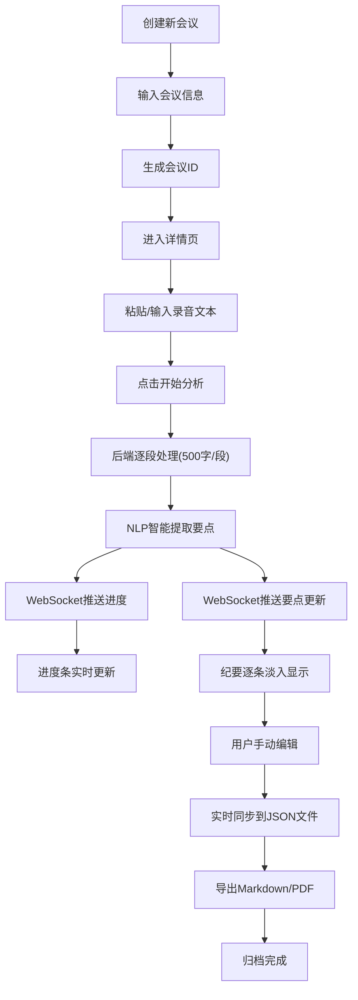

## 1. 产品概述

在线会议纪要自动生成与协作归档系统，实现从实时录音转文字、智能提取会议要点（议题、决策、待办事项）到生成结构化文档并分发给参会人员的完整工作流。

- 主要用途：帮助企业和团队高效记录会议内容，自动提取关键信息，生成结构化会议纪要
- 解决问题：传统人工记录效率低、易遗漏、整理耗时，无法实时协作
- 目标用户：企业会议组织者、项目管理人员、团队负责人
- 产品价值：提升会议效率80%，减少纪要整理时间，确保决策和待办事项可追溯

## 2. 核心功能

### 2.1 用户角色

| 角色 | 注册方式 | 核心权限 |
|------|----------|----------|
| 普通用户 | 无需注册，本地使用 | 创建会议、上传录音文本、查看和编辑纪要、导出文档 |

### 2.2 功能模块

1. **会议列表页**：卡片网格展示所有会议、搜索过滤、日期筛选、快速操作
2. **会议详情页**：三栏布局（原始文本区、纪要编辑区、分析图表区）、实时转写进度、待办管理、导出功能

### 2.3 页面详情

| 页面名称 | 模块名称 | 功能描述 |
|---------|----------|----------|
| 会议列表页 | 顶部导航 | 应用标题、创建新会议按钮、搜索框 |
| 会议列表页 | 筛选区域 | 日期范围筛选、关键词搜索（250ms防抖） |
| 会议列表页 | 卡片网格 | 会议卡片（名称、日期、要点摘要数、操作按钮）、悬停动画 |
| 会议列表页 | 创建会议弹窗 | 输入会议名称、参会人员、预计时长 |
| 会议详情页 | 左栏录音文本 | 原始文本实时滚动显示、粘贴/输入区域、开始分析按钮 |
| 会议详情页 | 中栏纪要编辑 | 标题、议题、决策、待办列表、逐条淡入动画、手动编辑 |
| 会议详情页 | 右栏分析区 | 参与度环形图、导出PDF/Markdown按钮、一键复制 |
| 会议详情页 | WebSocket进度条 | 渐变色填充、百分比显示、实时推送 |

## 3. 核心流程

### 主工作流程
用户创建新会议 → 进入详情页 → 粘贴或输入录音文本 → 点击开始分析 → 后端逐段处理 → WebSocket推送进度和要点 → 前端实时渲染纪要 → 用户手动编辑修正 → 导出Markdown/PDF → 归档存储。

## 4. 用户界面设计

### 4.1 设计风格
- **主色调**：深蓝色(#1a237e) - 专业、稳重
- **背景色**：灰白色(#f5f5f5) - 简洁、舒适
- **强调色**：浅蓝色(#42a5f5) - 按钮、链接、交互元素
- **按钮风格**：圆角矩形，hover时颜色加深，点击有微缩反馈
- **字体**：系统字体栈，标题加粗，正文适中
- **布局风格**：简洁卡片式布局，清晰的视觉层次
- **动画风格**：平滑过渡，微交互，0.2-0.3s ease缓动

### 4.2 页面设计概述

| 页面名称 | 模块名称 | UI元素 |
|---------|----------|--------|
| 会议列表页 | 顶部导航 | 深蓝色背景，白色标题文字，右侧创建按钮 |
| 会议列表页 | 搜索筛选 | 输入框带搜索图标，日期选择器，卡片悬停上浮8px |
| 会议列表页 | 卡片网格 | 白色卡片，圆角8px，阴影适中，悬停动画0.3s ease |
| 会议详情页 | 三栏布局 | flex布局，等宽分配，间隙24px |
| 会议详情页 | 原始文本区 | 白色背景，等宽字体，最大高度80vh，滚动条美化 |
| 会议详情页 | 纪要编辑区 | 逐条淡入动画，待办复选框带对勾动画 |
| 会议详情页 | 分析图表区 | 环形图渐变色，导出按钮组 |

### 4.3 响应式设计
- **桌面端**（≥900px）：三栏横向布局
- **平板/移动端**（<900px）：单栏纵向排列，手风琴式展开/收起动画
- 触摸优化：按钮最小高度44px，合理的触摸间距

### 4.4 动画规范
- 卡片悬停：上浮8px，阴影加深，0.3s ease
- 列表项添加：淡入效果，0.2s ease
- 待办完成：对勾动画，绿色高亮点亮
- 手风琴展开/收起：高度过渡，0.3s ease
- 进度条：渐变色从左到右填充
