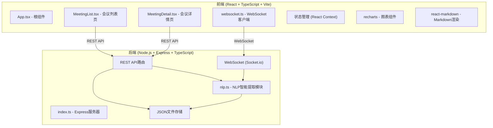
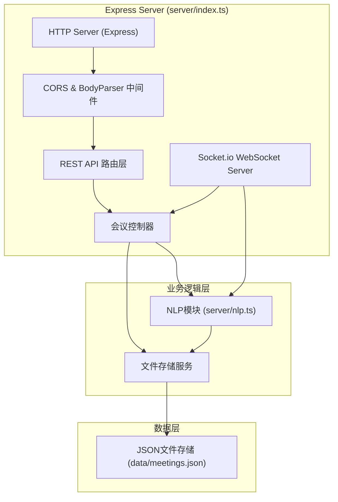
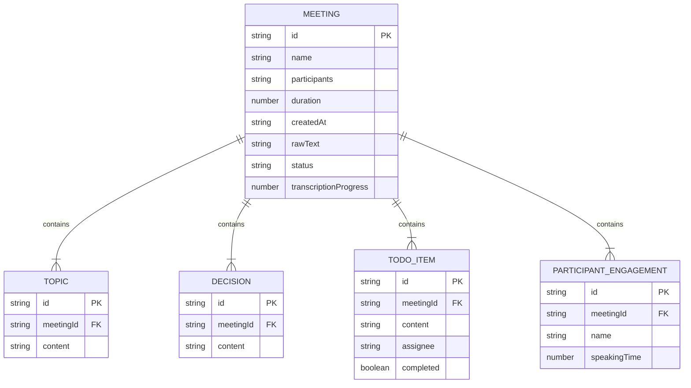

## 1. 架构设计



## 2. 技术描述

- **前端**：React@18 + TypeScript + Vite@5
- **后端**：Express@4 + TypeScript + Socket.io@4
- **构建工具**：Vite（React插件 @vitejs/plugin-react）
- **HTTP客户端**：原生 Fetch API
- **实时通信**：Socket.io (服务端) + socket.io-client (客户端)
- **图表库**：recharts@2
- **Markdown渲染**：react-markdown@9
- **唯一ID**：uuid@9
- **跨域处理**：cors@2
- **请求解析**：body-parser@1
- **数据存储**：本地JSON文件 (server/data/meetings.json)

## 3. 路由定义

| 路由 | 页面/用途 |
|------|----------|
| / | 会议列表页 - 展示所有会议卡片，支持搜索筛选 |
| /meeting/:id | 会议详情页 - 三栏布局，实时转写和纪要编辑 |
| POST /api/meetings | 创建新会议（REST API） |
| GET /api/meetings | 获取所有会议列表（REST API） |
| GET /api/meetings/:id | 获取会议详情含纪要（REST API） |
| POST /api/meetings/:id/transcribe | 提交录音文本进行分析（REST API） |
| PUT /api/meetings/:id | 更新会议内容（REST API） |

## 4. API 定义

### 4.1 TypeScript 类型定义

```typescript
// 会议基础信息
interface Meeting {
  id: string;
  name: string;
  participants: string[];
  duration: number; // 预计时长（分钟）
  createdAt: string;
  rawText: string;
  summary: MeetingSummary;
  transcriptionProgress: number;
  status: 'pending' | 'processing' | 'completed';
}

// 会议纪要摘要
interface MeetingSummary {
  title: string;
  topics: Topic[];
  decisions: Decision[];
  todos: TodoItem[];
  participantEngagement: ParticipantEngagement[];
}

// 议题
interface Topic {
  id: string;
  content: string;
}

// 决策
interface Decision {
  id: string;
  content: string;
}

// 待办事项
interface TodoItem {
  id: string;
  content: string;
  assignee: string;
  completed: boolean;
}

// 参与度分析
interface ParticipantEngagement {
  name: string;
  speakingTime: number; // 发言时间占比（百分比）
}

// WebSocket事件
interface TranscribeProgressEvent {
  type: 'transcribe_progress';
  meetingId: string;
  currentSegment: number;
  totalSegments: number;
  percentage: number;
}

interface SummaryUpdateEvent {
  type: 'summary_update';
  meetingId: string;
  summary: MeetingSummary;
  isIncremental: boolean;
}
```

### 4.2 请求/响应 Schema

**创建会议 POST /api/meetings**
```typescript
// Request
{
  name: string;
  participants: string[];
  duration: number;
}

// Response
{
  success: boolean;
  data: Meeting;
}
```

**提交录音文本 POST /api/meetings/:id/transcribe**
```typescript
// Request
{
  rawText: string;
}

// Response
{
  success: boolean;
  message: string;
}
```

## 5. 服务器架构图



## 6. 数据模型

### 6.1 数据模型定义



### 6.2 JSON 存储格式

```json
{
  "meetings": [
    {
      "id": "uuid-string",
      "name": "Q3产品规划会议",
      "participants": ["张三", "李四", "王五"],
      "duration": 60,
      "createdAt": "2026-06-20T10:00:00.000Z",
      "rawText": "今天讨论Q3的产品规划...",
      "status": "completed",
      "transcriptionProgress": 100,
      "summary": {
        "title": "Q3产品规划会议纪要",
        "topics": [
          {"id": "t1", "content": "Q3产品路线图规划"}
        ],
        "decisions": [
          {"id": "d1", "content": "决定优先开发移动端适配功能"}
        ],
        "todos": [
          {"id": "td1", "content": "完成移动端设计稿", "assignee": "张三", "completed": false}
        ],
        "participantEngagement": [
          {"name": "张三", "speakingTime": 40},
          {"name": "李四", "speakingTime": 35},
          {"name": "王五", "speakingTime": 25}
        ]
      }
    }
  ]
}
```
