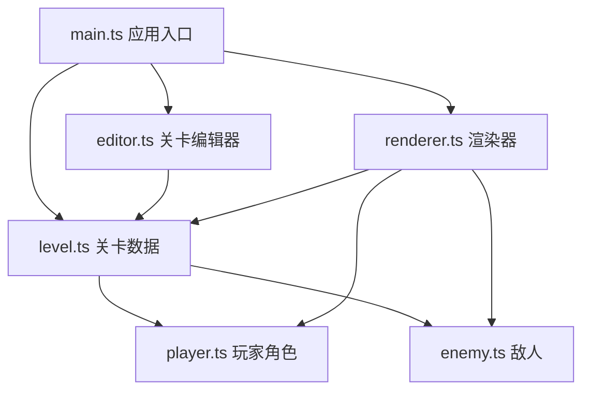

## 1. 架构设计

纯前端Canvas应用，采用模块化分层架构。主应用协调编辑器模式和游戏模式的切换，各模块职责单一、数据通过关卡对象共享。



## 2. 技术选型

- **语言**：TypeScript（严格模式，target ES2020）
- **渲染**：原生HTML5 Canvas 2D API
- **构建工具**：Vite
- **无第三方游戏引擎/框架**：纯原生实现

## 3. 模块职责与文件结构

```
package.json
vite.config.js
tsconfig.json
index.html
src/
├── main.ts          应用入口，模式切换，模块协调
├── editor.ts        编辑器：鼠标事件、放置/删除/移动元素、预览绘制
├── player.ts        玩家：输入、物理、碰撞、粒子、绘制
├── enemy.ts         敌人：巡逻/跳跃AI、碰撞、绘制
├── level.ts         关卡数据模型：元素集合、碰撞检测方法
└── renderer.ts      渲染器：画布管理、摄像机、FPS统计、调试面板
```

## 4. 核心数据模型

### 4.1 关卡元素类型
```typescript
type ElementType = 'ground' | 'platform' | 'spike' | 'flag' | 'enemy-patrol' | 'enemy-jump';

interface LevelElement {
  id: string;
  type: ElementType;
  x: number;
  y: number;
  width: number;
  height: number;
}

interface LevelData {
  grounds: LevelElement[];
  platforms: LevelElement[];
  spikes: LevelElement[];
  flags: LevelElement[];
  enemies: (LevelElement & { enemyType: 'patrol' | 'jump' })[];
}
```

### 4.2 玩家状态
```typescript
interface PlayerState {
  x: number;
  y: number;
  vx: number;
  vy: number;
  width: number;
  height: number;
  onGround: boolean;
  jumpsLeft: number;
}
```

## 5. 核心算法

### 5.1 AABB碰撞检测
使用轴对齐包围盒检测，分水平和垂直方向分别处理，防止穿墙。

### 5.2 摄像机平滑跟随
使用线性插值（lerp）：`cameraX += (targetX - cameraX) * 0.1`

### 5.3 FPS统计
通过 requestAnimationFrame 时间戳差计算每秒帧数，取最近60帧平均值。

### 5.4 编辑器网格吸附
鼠标坐标对32取整：`Math.floor(mouseX / 32) * 32`

## 6. 性能指标

- 编辑器操作响应延迟 < 100ms
- 测试模式 FPS 稳定在 55-60
- 画布尺寸固定 1024x768
