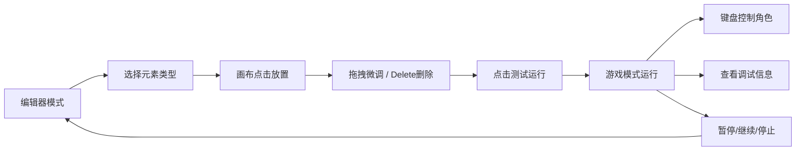

## 1. 产品概述

面向独立游戏开发者的2D平台游戏关卡编辑器与实时测试工具，解决手动搭建关卡和反复运行游戏调试效率低下的痛点。通过可视化拖拽方式快速构建关卡场景，并能即时切换到游戏模式测试物理、碰撞和敌人AI表现。

## 2. 核心功能

### 2.1 功能模块
1. **关卡编辑器**：1024x768像素画布，支持放置/删除/拖拽调整地面、平台、尖刺、旗帜、敌人
2. **实时游戏测试**：角色移动、二段跳、重力物理、碰撞检测、粒子特效、摄像机平滑跟随
3. **调试信息面板**：实时显示坐标、速度、FPS、着地状态、运行时间
4. **测试控制**：暂停/继续、停止测试返回编辑器

### 2.2 功能详情
| 功能模块 | 子功能 | 详细描述 |
|-----------|-------------|---------------------|
| 关卡编辑器 | 工具栏 | 元素选择按钮：地面、平台、尖刺、旗帜、巡逻敌人、跳跃敌人 |
| 关卡编辑器 | 属性面板 | 选中元素后可调整宽高（平台）、拖拽移动位置、Delete键删除 |
| 关卡编辑器 | 画布交互 | 半透明预览、网格吸附（32px）、鼠标点击放置、拖拽选中移动 |
| 游戏测试 | 角色控制 | 左右箭头移动、空格跳跃（二段跳）、蓝色圆形玩家 |
| 游戏测试 | 物理系统 | 重力加速度、AABB碰撞检测、着地判定 |
| 游戏测试 | 敌人AI | 巡逻型左右移动、跳跃型上下弹跳 |
| 游戏测试 | 游戏逻辑 | 尖刺/敌人碰撞判负、旗帜判胜、粒子特效 |
| 游戏测试 | 摄像机 | 平滑跟随角色移动 |
| 调试面板 | 实时信息 | X/Y坐标、水平/垂直速度、FPS、着地状态、已过时间 |
| 测试控制 | 操作按钮 | 右下角暂停/继续、停止测试按钮 |

## 3. 核心流程

用户选择工具栏元素 → 鼠标在画布上点击放置（半透明预览）→ 选中元素后拖拽微调或按Delete删除 → 点击"测试运行"按钮进入游戏模式 → 键盘控制角色移动跳跃 → 观察调试面板数据 → 点击暂停/停止 → 返回编辑器继续调整

## 4. 用户界面设计

### 4.1 设计风格
- **主题**：深色主题
- **主背景色**：深灰色 #2a2a2a
- **画布背景色**：浅灰色 #e0e0e0，带32px间距半透明网格线
- **元素配色**：地面棕色、草坪绿色、尖刺红色、旗帜金色、玩家蓝色
- **按钮样式**：圆角矩形卡片，hover放大效果、按压回弹动画
- **面板样式**：统一卡片式工具栏和属性面板

### 4.2 页面布局
| 区域 | 位置 | 内容 |
|-----------|-------------|-------------|
| 工具栏 | 顶部 | 元素选择按钮（地面、平台、尖刺、旗帜、巡逻敌人、跳跃敌人）、测试运行按钮 |
| 主画布 | 中央 | 1024x768像素编辑/游戏画布 |
| 属性面板 | 右侧 | 选中元素的属性编辑（宽高调整） |
| 调试信息 | 游戏模式左上角 | 坐标、速度、FPS、着地状态、时间 |
| 控制按钮 | 游戏模式右下角 | 暂停/继续、停止测试 |

### 4.3 动画与交互
- 按钮hover：放大1.05倍，过渡0.2s
- 按钮按压：回弹至0.95倍，过渡0.1s
- 元素预览：半透明50%透明度
- 碰撞框：半透明边框显示
- 摄像机跟随：lerp线性插值平滑移动
- 着地粒子：简单圆形粒子扩散淡出效果
