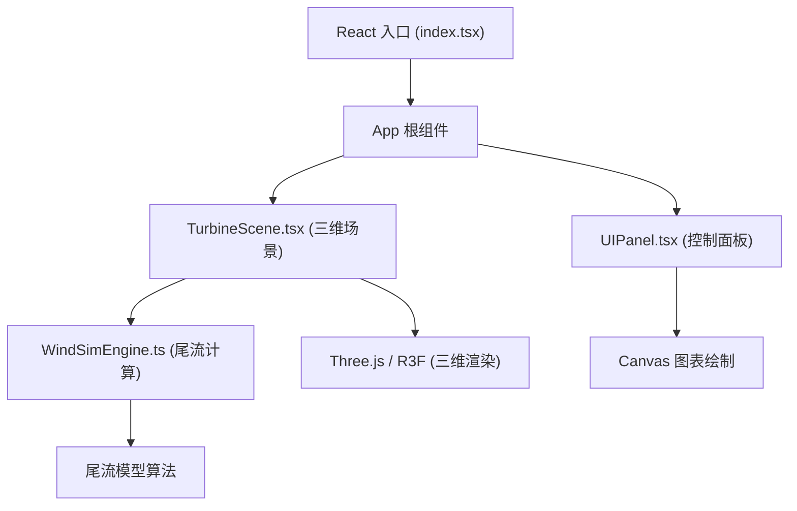

## 1. 架构设计



## 2. 技术栈描述

- **前端框架**：React 18 + TypeScript 5
- **构建工具**：Vite 5 + @vitejs/plugin-react
- **三维渲染**：Three.js 0.160 + @react-three/fiber 8.15 + @react-three/drei 9.92
- **状态管理**：React useState/useRef（组件内状态）+ Props 传递
- **图表绘制**：原生 Canvas API
- **性能监控**：stats.js
- **唯一标识**：uuid

## 3. 文件结构定义

| 文件路径 | 用途 |
|---------|------|
| `package.json` | 项目依赖和脚本配置 |
| `vite.config.js` | Vite 构建配置 |
| `tsconfig.json` | TypeScript 编译配置 |
| `index.html` | 入口 HTML 文件 |
| `src/index.tsx` | React 应用入口 |
| `src/App.tsx` | 根组件，组合场景和控制面板 |
| `src/TurbineScene.tsx` | Three.js 三维场景核心，地形生成、涡轮机管理 |
| `src/WindSimEngine.ts` | 尾流模型计算引擎 |
| `src/UIPanel.tsx` | React 控制面板组件，滑块和图表 |
| `src/Turbine.tsx` | 单个涡轮机组件（可选拆分） |
| `src/Terrain.tsx` | 地形生成组件（可选拆分） |

## 4. 核心数据模型

### 4.1 涡轮机数据结构

```typescript
interface Turbine {
  id: string;
  position: [number, number, number];
  powerLevel: 1 | 2 | 3;
  rotorDiameter: number;
  hubHeight: number;
  ratedPower: number;
  rotationSpeed: number;
}

interface TurbineState {
  turbine: Turbine;
  effectiveWindSpeed: number;
  powerOutput: number;
  wakeInfluence: number;
  powerPercentage: number;
}
```

### 4.2 风场参数

```typescript
interface WindParams {
  direction: number; // 0-360 degrees
  speed: number; // 3-20 m/s
}

interface SimulationResult {
  turbineStates: TurbineState[];
  totalPower: number; // MW
  timestamp: number;
}
```

## 5. 尾流模型算法（WindSimEngine）

采用简化的 Jensen 尾流模型：

1. 尾流半径随距离线性增加：`r(x) = r0 + k * x`
2. 风速亏损：`ΔU(x) = U0 * (1 - sqrt(1 - Ct)) / (1 + k * x / r0)²`
3. 多涡轮机尾流叠加：使用能量守恒法叠加多个上游涡轮机的尾流影响

其中：
- `r0` = 转子半径
- `k` = 尾流扩散系数（0.05-0.1）
- `Ct` = 推力系数（约 0.8）
- `x` = 沿风向的距离

## 6. 性能优化策略

1. **InstancedMesh**：使用实例化网格渲染多个涡轮机，减少 Draw Call
2. **几何体合并**：合并静态地形几何体
3. **LOD（细节层次）**：远景涡轮机使用简化模型
4. **帧率控制**：10 台以下 60 FPS，15 台时最低 30 FPS
5. **按需计算**：仅在参数变化时重新计算尾流，每帧更新动画
6. **节流渲染**：功率曲线限制更新频率（约 30 FPS）

