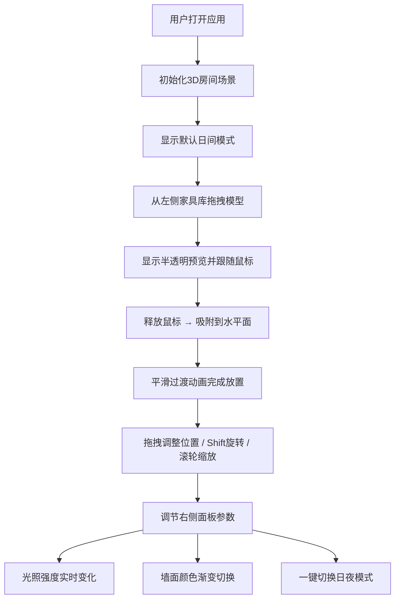

## 1. 产品概述

一款面向室内设计师与家居爱好者的浏览器端三维室内场景快速创建与漫游工具，解决传统设计软件安装复杂、操作门槛高、难以实时分享的痛点。

- 核心价值：零安装、拖拽式操作、即时可视化、实时参数调节
- 目标用户：室内设计师、家居装修从业者、空间美学爱好者

## 2. 核心功能

### 2.1 用户角色
| 角色 | 注册方式 | 核心权限 |
|------|----------|----------|
| 设计师用户 | 无需注册，直接使用 | 创建场景、放置家具、调节光照、切换主题、导出分享 |

### 2.2 功能模块
1. **三维场景主视图**：房间环境渲染、家具模型展示、第一人称漫游视角
2. **左侧家具库面板**：5大类家具（沙发、茶几、书柜、灯具、盆栽）拖拽放置
3. **右侧控制面板**：光照强度滑块、墙面颜色选择器、日夜模式切换
4. **底部状态栏**：实时帧率显示、场景模型数量统计
5. **响应式抽屉菜单**：小屏设备自动收起为顶/底部抽屉

### 2.3 页面详情
| 页面名称 | 模块名称 | 功能描述 |
|----------|----------|----------|
| 主设计界面 | 三维场景渲染 | Three.js渲染房间环境，浅灰橡木地板、浅米色墙面、柔和环境光遮蔽 |
| 主设计界面 | 家具拖拽放置 | 半透明预览→地面/桌面吸附→平滑过渡动画 |
| 主设计界面 | 模型交互 | 拖拽移动、Shift+旋转(45°步长)、滚轮缩放 |
| 主设计界面 | 漫游视角 | 鼠标右键拖动旋转视角、滚轮缩放场景 |
| 左侧面板 | 家具分类库 | 沙发/茶几/书柜/灯具/盆栽，每类含2-3种变体 |
| 左侧面板 | 拖拽预览 | 拖动时显示半透明模型预览，跟随鼠标位置 |
| 右侧面板 | 光照强度滑块 | 0.5-2.0范围，实时调节场景亮度与阴影浓度 |
| 右侧面板 | 莫兰迪色板 | 8种柔和预设色，点击后墙面颜色渐变过渡 |
| 右侧面板 | 日夜模式切换 | 日间：窗口方向平行光+软阴影；夜间：室内暖色点光源+硬阴影 |
| 底部状态栏 | 性能监控 | FPS帧率、模型数量实时更新 |

## 3. 核心流程

## 4. 用户界面设计

### 4.1 设计风格
- **主色调**：莫兰迪雾霾蓝 `#6B8E9F` → 深雾霾蓝 `#4A6B7A` 作为按钮渐变
- **辅助色**：8种莫兰迪色系墙面色（灰粉 `#C9B8B0`、豆绿 `#A8B5A0`、灰蓝 `#9FAEB8`、燕麦 `#D4C9B8`、灰紫 `#B5A8B5`、浅灰 `#C5C5C0`、灰橘 `#C9B0A0`、米白 `#E5DFD5`）
- **毛玻璃面板**：`backdrop-filter: blur(16px)` + `rgba(255,255,255,0.72)` 半透明背景
- **按钮样式**：圆角16px矩形 + 垂直微渐变 + hover时阴影提升并scale(1.05) + 点击时scale(0.95)挤压动画
- **字体**：标题用 "Noto Sans SC" 细字重呈现现代感，正文用 "PingFang SC" 保证清晰度
- **图标**：线性简约SVG图标，1.5px描边，圆角端点

### 4.2 页面设计概览
| 页面名称 | 模块名称 | UI元素描述 |
|----------|----------|------------|
| 主设计界面 | 布局 | 中央80%为3D Canvas，左右各10%面板，底部30px状态栏 |
| 主设计界面 | 左侧家具面板 | 竖向分类列表，每类展开显示家具缩略图卡片，可拖拽 |
| 主设计界面 | 右侧控制面板 | 光照滑块带刻度+数值显示，色块网格8宫格，日夜切换大按钮 |
| 主设计界面 | 交互反馈 | 拖拽目标高亮、放置波纹效果、颜色切换渐变过渡、操作toast提示 |

### 4.3 响应式适配
- **桌面端**（≥1024px）：标准三栏布局，左右面板常驻展开
- **平板端**（768-1023px）：左侧面板收起为顶部抽屉（点击展开），右侧面板收起为底部抽屉
- **移动端**（<768px）：全屏3D视图 + 悬浮圆形按钮触发上下抽屉，触控优化拖拽精度

### 4.4 3D场景指引
- **环境光**：AmbientLight强度0.6 + HemisphereLight天空/地面色
- **日间光源**：DirectionalLight从+X方向（模拟窗户）入射，soft shadow map 2048²，PCFSoftShadowMap
- **夜间光源**：天花板PointLight暖黄色(3000K) + 桌面台灯PointLight，阴影半径缩小为硬阴影
- **相机**：PerspectiveCamera 60° FOV，初始位置(6, 5, 8)看向原点，OrbitControls限制俯仰角15°-85°
- **地面材质**：MeshStandardMaterial + Canvas程序化橡木纹理（2×2平铺），roughness 0.85，metalness 0.05
- **家具材质**：MeshPhysicalMaterial，clearcoat 0.15，根据主题色自动生成HSL偏移的和谐配色
- **后处理**：Bloom泛光（强度0.4）+ 轻微Vignette暗角 + FXAA抗锯齿
- **性能预算**：单模型面数≤500三角面，场景总面数≤15,000，Draw Call≤40
