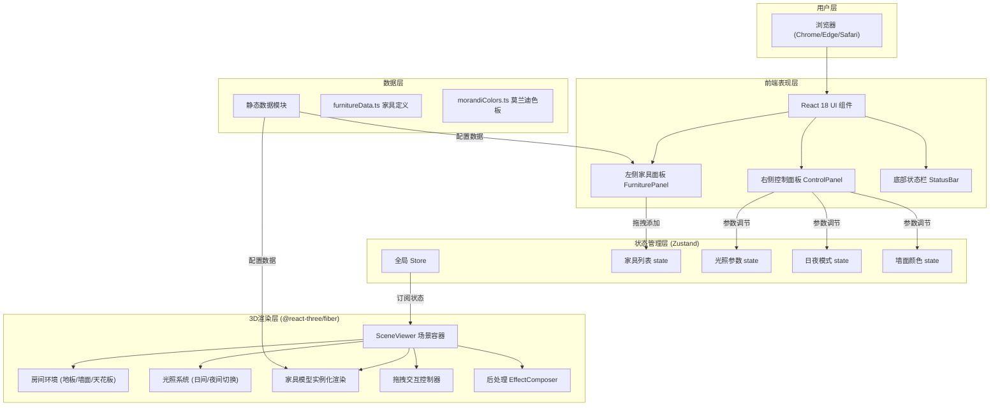

## 1. 架构设计



## 2. 技术选型说明

| 层级 | 技术方案 | 版本 | 选型理由 |
|------|----------|------|----------|
| 构建工具 | Vite | ^5.0 | 极速冷启动，HMR毫秒级，原生ESM支持 |
| 前端框架 | React | ^18.2 | Fiber并发特性，生态成熟，与R3F完美集成 |
| 类型系统 | TypeScript | ^5.3 | strict模式，编译期类型安全，IDE智能提示 |
| 3D渲染引擎 | Three.js | ^0.160 | WebGL封装，社区活跃，API完善 |
| React-3D桥接 | @react-three/fiber | ^8.15 | 声明式Three.js，组件化思维，状态驱动渲染 |
| 3D工具库 | @react-three/drei | ^9.92 | OrbitControls/Shadow/Environment等开箱即用组件 |
| 状态管理 | Zustand | ^4.47 | 极简API，无Provider嵌套，memo友好，包体小 |
| 唯一ID | uuid | ^9.0 | 生成家具实例唯一标识 |
| CSS方案 | 原生CSS + CSS变量 | - | 无需额外依赖，毛玻璃和动画原生支持最佳 |

## 3. 路由定义

本应用为单页工具型应用，无多路由需求，仅入口路由：

| 路由 | 页面组件 | 用途 |
|------|----------|------|
| `/` | App.tsx | 主设计界面，包含全部功能模块 |

## 4. 核心数据模型与类型定义

```typescript
// src/models/types.ts

export interface FurnitureGeometry {
  type: 'box' | 'cylinder' | 'sphere' | 'cone';
  position: [number, number, number];
  rotation?: [number, number, number];
  scale?: [number, number, number];
  color?: string;
  roughness?: number;
  metalness?: number;
}

export interface FurnitureDefinition {
  id: string;
  name: string;
  category: 'sofa' | 'table' | 'bookshelf' | 'lamp' | 'plant';
  icon: string;
  defaultSize: [number, number, number];
  geometries: FurnitureGeometry[];
  defaultMaterial: {
    color: string;
    roughness: number;
    clearcoat: number;
  };
}

export interface FurnitureInstance {
  instanceId: string;
  definitionId: string;
  position: [number, number, number];
  rotationY: number;
  scale: number;
  themeColorIndex: number;
}

export type DayNightMode = 'day' | 'night';

export interface AppState {
  furnitureInstances: FurnitureInstance[];
  lightIntensity: number;
  wallColor: string;
  mode: DayNightMode;
  isDraggingNew: string | null;
  selectedInstanceId: string | null;
  
  addFurniture: (defId: string, pos: [number, number, number]) => void;
  removeFurniture: (instanceId: string) => void;
  updateFurniture: (instanceId: string, patch: Partial<FurnitureInstance>) => void;
  setLightIntensity: (v: number) => void;
  setWallColor: (c: string) => void;
  toggleDayNight: () => void;
  setDraggingNew: (id: string | null) => void;
  selectInstance: (id: string | null) => void;
}
```

## 5. 文件结构树

```
auto121/
├── index.html
├── package.json
├── vite.config.ts
├── tsconfig.json
├── tsconfig.node.json
└── src/
    ├── main.tsx                    # React入口，挂载App
    ├── App.tsx                     # 主导航布局，组合三维+UI
    ├── index.css                   # 全局样式、毛玻璃、CSS变量
    ├── store/
    │   └── useAppStore.ts          # Zustand全局状态
    ├── models/
    │   ├── types.ts                # 类型定义
    │   ├── furnitureData.ts        # 家具几何体定义
    │   └── morandiColors.ts        # 莫兰迪色板常量
    ├── components/
    │   ├── SceneViewer.tsx         # R3F场景主容器
    │   ├── Room.tsx                # 房间环境（地板/墙面）
    │   ├── LightingSystem.tsx      # 日夜光照系统
    │   ├── FurnitureItem.tsx       # 单个家具模型组件
    │   ├── DragPreview.tsx         # 半透明拖拽预览
    │   ├── InteractionControls.tsx # 拖拽/旋转/缩放交互
    │   ├── FurniturePanel.tsx      # 左侧家具库面板
    │   ├── ControlPanel.tsx        # 右侧控制面板
    │   └── StatusBar.tsx           # 底部状态栏
    └── utils/
        ├── colorUtils.ts           # HSL颜色偏移计算
        └── perfMonitor.ts          # FPS性能监控Hook
```

## 6. 性能优化策略

| 优化点 | 实施方案 |
|--------|----------|
| 渲染性能 | 共享几何体(BufferGeometry复用) + 材质实例化(MeshPhysicalMaterial单例) |
| 阴影质量 | PCFSoftShadowMap + shadowMapSize=1024基础，可按需切换 |
| 交互响应 | 拖拽使用raycaster.setFromCamera+平面求交，避免每帧遍历所有mesh |
| 状态更新 | Zustand selectors精确订阅，避免无关节器重渲染 |
| 动画平滑 | @react-three/drei的useTransition实现位置/旋转插值 |
| 内存管理 | 家具移除时dispose几何体和材质，避免WebGL上下文泄漏 |
| 响应式断点 | matchMedia监听，一次订阅全局共享，不重复注册监听器 |
