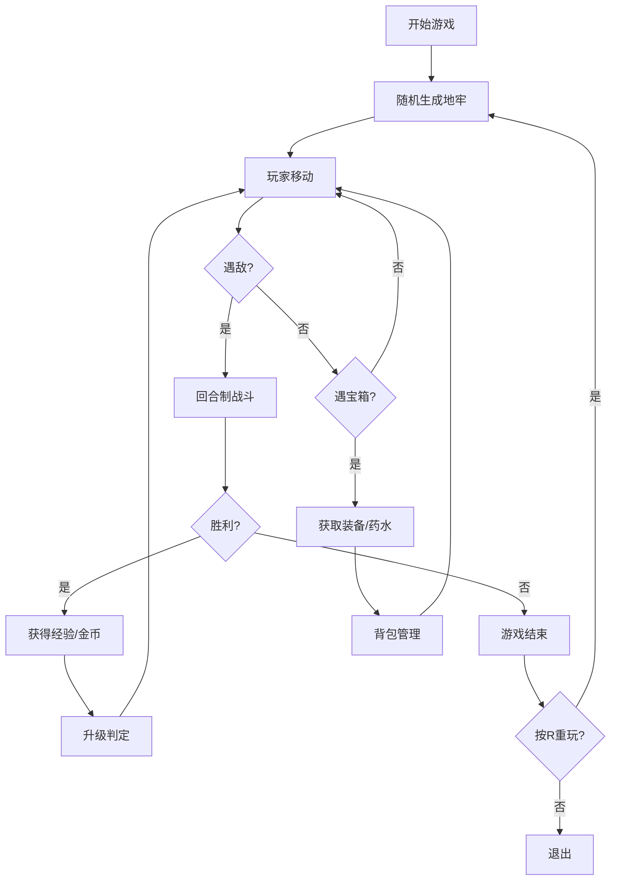

## 1. 产品概述
基于文本的Roguelike地牢探险游戏，玩家在随机生成的迷宫中探索、战斗并收集装备。
- 核心玩法：探索随机地牢、回合制战斗、装备收集与角色成长
- 目标用户：喜欢地牢探险、Roguelike类型游戏的玩家
- 产品价值：提供可重玩性高的休闲游戏体验，每次游玩都有全新地图和挑战

## 2. 核心功能

### 2.1 用户角色
| 角色 | 注册方式 | 核心权限 |
|------|----------|----------|
| 玩家 | 无需注册，直接开始 | 完整游戏体验 |

### 2.2 功能模块
1. **主游戏界面**：地牢地图渲染、玩家状态面板、战斗日志面板
2. **随机地图生成**：房间生成、走廊连接、敌人与宝箱放置
3. **玩家控制系统**：移动、战斗、背包管理、等级提升
4. **战斗系统**：回合制自动战斗、伤害计算、战斗日志记录
5. **背包与装备系统**：物品拾取、装备穿戴、属性加成
6. **游戏结束与重玩**：死亡判定、分数计算、重新开始

### 2.3 页面详情
| 页面名称 | 模块名称 | 功能描述 |
|----------|----------|----------|
| 主游戏界面 | 地图区域 | 20x20网格地牢，CSS Grid渲染，包含墙壁、地板、玩家、敌人、宝箱 |
| 主游戏界面 | 左侧状态面板 | 生命值条形图、等级、攻击力、防御力、金币显示 |
| 主游戏界面 | 右侧战斗日志 | 最多10条滚动显示战斗信息 |
| 背包面板 | 物品格子 | 10格背包，显示装备名称、品质、属性 |
| 背包面板 | 装备槽位 | 武器、防具、饰品各一槽位，点击装备穿戴 |
| 游戏结束界面 | 结算面板 | 显示Game Over、最终得分、按R重玩 |

## 3. 核心流程
玩家进入游戏 → 随机生成地牢 → 玩家使用WASD/方向键移动 → 遇敌自动进入回合制战斗 → 击败敌人获得经验和金币 → 探索宝箱获取装备 → 按I键打开背包管理装备 → 生命值归零游戏结束 → 按R键重新开始

## 4. 用户界面设计

### 4.1 设计风格
- 暗黑奇幻风格，整体色调偏暗
- 主背景色：#1a1a2e
- 墙壁：#16213e（深灰）
- 地板：#0f3460（浅蓝灰）
- 玩家：#e94560（金色/红色@字符）
- 敌人：史莱姆#2ecc71（绿）、骷髅#bdc3c7（灰）、蝙蝠#9b59b6（紫）
- 宝箱：#f1c40f（黄色B字符）
- 字体：monospace等宽字体
- 动画：平滑色块过渡0.2s，移动高亮，战斗闪烁

### 4.2 页面设计概述
| 页面名称 | 模块名称 | UI元素 |
|----------|----------|--------|
| 主游戏界面 | 中央地图 | 20x20 CSS Grid网格，暗色背景，各元素颜色区分 |
| 主游戏界面 | 左侧状态 | 生命值条形图（红色渐变），属性文字（白色） |
| 主游戏界面 | 右侧日志 | 滚动列表，战斗信息彩色显示 |
| 背包面板 | 半透明覆盖 | 背景rgba(0,0,0,0.8)，边框圆角，装备品质颜色边框 |
| 游戏结束 | 居中面板 | 大号Game Over文字，分数显示，重玩提示 |

### 4.3 响应式
- 桌面端优先，固定布局设计
- 主游戏区域居中，左右边栏固定宽度
- 背包面板居中覆盖，适配主游戏区域大小

### 4.4 动画效果
- 移动时当前格短暂高亮（0.2s）
- 战斗时目标格闪烁红色
- 背包打开/关闭淡入淡出
- 所有hover效果平滑过渡0.2s
- 生命值变化动画过渡
