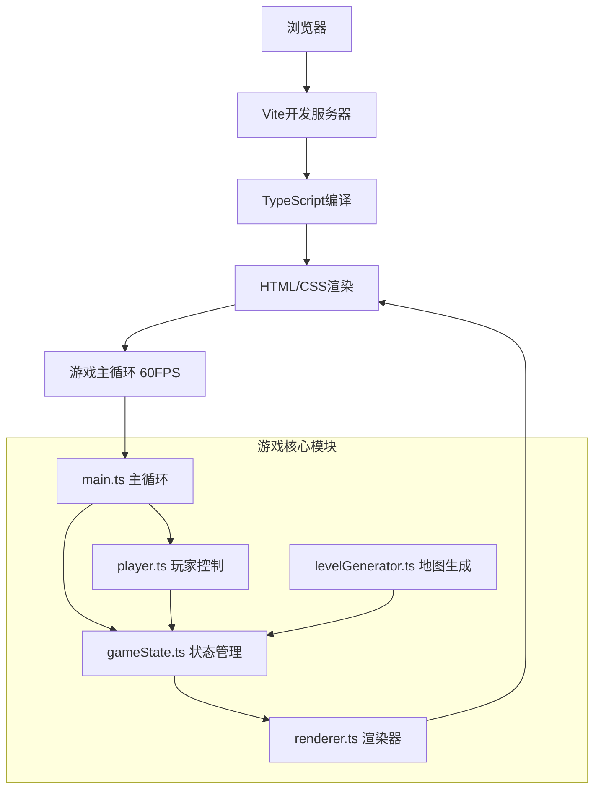

## 1. 架构设计



## 2. 技术描述
- **前端**: TypeScript + 原生HTML/CSS + Vite
- **构建工具**: Vite 5.x
- **语言**: TypeScript 5.x（严格模式）
- **后端**: 无，纯前端实现
- **数据存储**: 内存存储，游戏状态由GameState类管理

## 3. 核心文件结构
| 文件路径 | 用途 |
|----------|------|
| /package.json | 项目依赖和脚本 |
| /vite.config.js | Vite构建配置 |
| /tsconfig.json | TypeScript配置（严格模式） |
| /index.html | 入口HTML页面 |
| /src/main.ts | 游戏主循环、初始化、键盘事件绑定 |
| /src/gameState.ts | 游戏状态管理，玩家/地图/物品数据结构 |
| /src/levelGenerator.ts | 随机地牢生成器（房间、走廊、敌人刷新） |
| /src/player.ts | 玩家行为（移动、战斗、背包、等级） |
| /src/renderer.ts | HTML/CSS渲染，地图绘制，UI更新 |

## 4. 核心数据结构

### 4.1 类型定义

```typescript
// 位置坐标
interface Position {
  x: number;
  y: number;
}

// 地图格子类型
type TileType = 'wall' | 'floor';

// 敌人类型
type EnemyType = 'slime' | 'skeleton' | 'bat';

// 物品类型
type ItemType = 'weapon' | 'armor' | 'accessory' | 'potion';

// 物品品质
type ItemQuality = 'common' | 'rare' | 'legendary';

// 物品
interface Item {
  id: string;
  name: string;
  type: ItemType;
  quality: ItemQuality;
  attackBonus: number;
  defenseBonus: number;
  healthBonus?: number;
}

// 敌人
interface Enemy {
  id: string;
  type: EnemyType;
  name: string;
  position: Position;
  maxHealth: number;
  health: number;
  attack: number;
  defense: number;
  expReward: number;
}

// 宝箱
interface Chest {
  id: string;
  position: Position;
  item: Item;
}

// 玩家
interface Player {
  position: Position;
  maxHealth: number;
  health: number;
  baseAttack: number;
  baseDefense: number;
  level: number;
  exp: number;
  expToNextLevel: number;
  gold: number;
  kills: number;
  inventory: Item[];
  inventoryCapacity: number;
  equipped: {
    weapon: Item | null;
    armor: Item | null;
    accessory: Item | null;
  };
}

// 游戏状态
interface GameStateData {
  map: TileType[][];
  player: Player;
  enemies: Enemy[];
  chests: Chest[];
  combatLog: string[];
  isGameOver: boolean;
  showInventory: boolean;
  score: number;
  mapWidth: number;
  mapHeight: number;
}
```

## 5. 核心算法

### 5.1 地牢生成算法
1. 创建20x20地图，全部初始化为墙壁
2. 随机生成3-5个房间（大小3-6格），确保不重叠
3. 使用Bresenham直线算法连接房间中心生成走廊
4. 在房间内随机放置2-4个敌人
5. 在房间内随机放置1-2个宝箱

### 5.2 战斗系统
- 回合制，玩家先手
- 伤害 = max(1, 攻击力 - 对方防御力)
- 击败敌人：经验值 += expReward，金币 += 随机1-5，击杀数+1
- 升级判定：exp >= expToNextLevel时升级，maxHealth+5，baseAttack+2

### 5.3 性能优化
- 主循环requestAnimationFrame 60FPS
- 仅在状态变化时重渲染
- 使用CSS Grid硬件加速
- 地图生成使用Fisher-Yates洗牌保证随机性且性能<50ms
