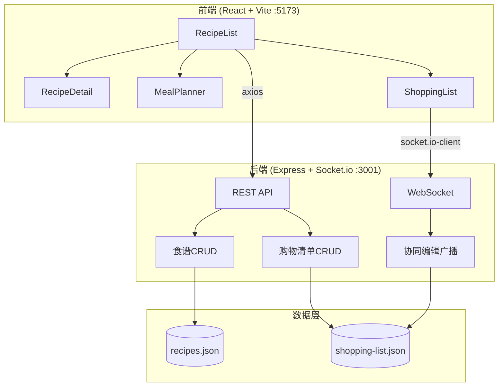
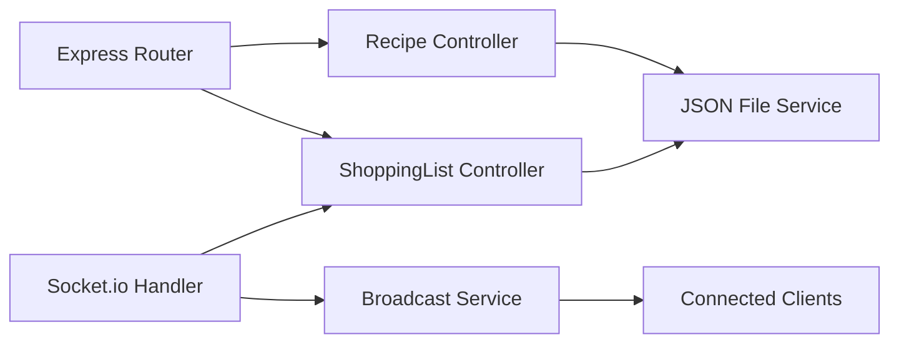
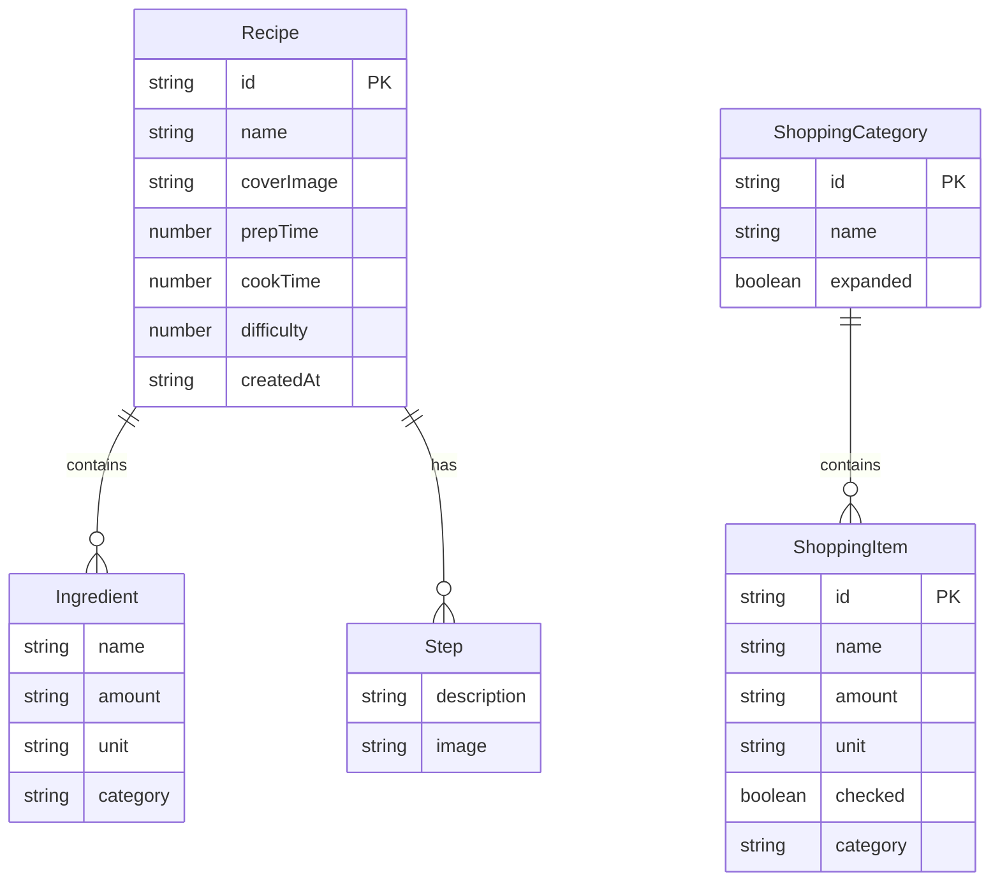

## 1. 架构设计



## 2. 技术说明
- 前端：React@18 + TypeScript + Vite + Tailwind CSS
- 初始化工具：vite-init (react-express-ts模板)
- 后端：Express@4 + Socket.io（WebSocket实时协作）
- 数据库：本地JSON文件存储（recipes.json、shopping-list.json）
- 状态管理：Zustand
- 路由：react-router-dom

## 3. 路由定义
| 路由 | 用途 |
|------|------|
| / | 食谱列表页，网格卡片展示，搜索筛选 |
| /recipe/:id | 食谱详情页，步骤动画展示 |
| /planner | 配餐页，输入食材智能匹配推荐 |
| /shopping | 购物清单页，多人协作编辑 |

## 4. API定义

### 4.1 食谱相关API
| 方法 | 路径 | 描述 | 请求体 | 响应 |
|------|------|------|--------|------|
| GET | /api/recipes | 获取所有食谱 | - | Recipe[] |
| GET | /api/recipes/:id | 获取单个食谱 | - | Recipe |
| POST | /api/recipes | 创建食谱 | Recipe | Recipe |
| PUT | /api/recipes/:id | 更新食谱 | Recipe | Recipe |
| DELETE | /api/recipes/:id | 删除食谱 | - | { success: boolean } |

### 4.2 购物清单相关API
| 方法 | 路径 | 描述 | 请求体 | 响应 |
|------|------|------|--------|------|
| GET | /api/shopping-list | 获取购物清单 | - | ShoppingCategory[] |
| POST | /api/shopping-list/item | 添加食材项 | { category, item } | ShoppingItem |
| PUT | /api/shopping-list/item/:id | 更新食材项（勾选等） | ShoppingItem | ShoppingItem |
| DELETE | /api/shopping-list/item/:id | 删除食材项 | - | { success: boolean } |

### 4.3 TypeScript类型定义
```typescript
interface Recipe {
  id: string;
  name: string;
  coverImage?: string;
  gradientColors?: [string, string];
  prepTime: number;
  cookTime: number;
  difficulty: number;
  ingredients: Ingredient[];
  steps: Step[];
  createdAt: string;
}

interface Ingredient {
  name: string;
  amount: string;
  unit: string;
  category?: string;
}

interface Step {
  description: string;
  image?: string;
}

interface ShoppingCategory {
  id: string;
  name: string;
  items: ShoppingItem[];
  expanded: boolean;
}

interface ShoppingItem {
  id: string;
  name: string;
  amount: string;
  unit: string;
  checked: boolean;
  category: string;
}

interface MatchResult {
  recipe: Recipe;
  matchType: 'full' | 'partial' | 'substitute';
  matchScore: number;
  missingIngredients: Ingredient[];
  matchedIngredients: Ingredient[];
}
```

### 4.4 WebSocket事件
| 事件名 | 方向 | 数据 | 描述 |
|--------|------|------|------|
| join-list | client→server | { listId: string } | 加入购物清单房间 |
| item-added | server→client | ShoppingItem | 食材项被添加 |
| item-updated | server→client | ShoppingItem | 食材项被更新（勾选等） |
| item-deleted | server→client | { id: string } | 食材项被删除 |
| user-joined | server→client | { userId: string } | 协作用户加入 |
| user-left | server→client | { userId: string } | 协作用户离开 |

## 5. 服务端架构图



## 6. 数据模型

### 6.1 数据模型定义



### 6.2 数据初始化
- recipes.json：预填充6-8个示例食谱，涵盖中餐家常菜，每个食谱包含完整食材列表和步骤
- shopping-list.json：预填充一个默认购物清单，包含3个分类（蔬菜、肉类、调味品），每个分类2-3个食材项
