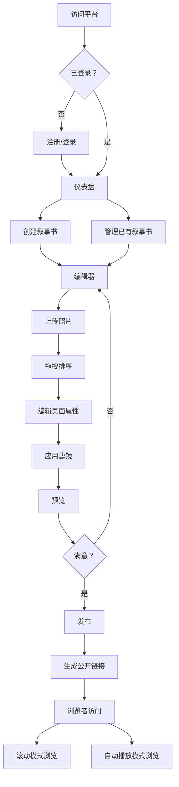

## 1. 产品概述

面向独立摄影师和摄影爱好者的在线照片叙事书创作与分享平台，支持用户上传照片、添加标题与描述、自由拖拽调整页面顺序，并应用翻页动画、背景音乐和渐变滤镜，最终生成可供他人滚动浏览或自动播放的交互式叙事书。解决摄影师将多张照片按时间线或专题故事逻辑组织成沉浸式叙事体验的痛点。

- 目标用户：独立摄影师、摄影爱好者、视觉故事讲述者
- 核心价值：将散落的照片序列转化为有叙事张力的沉浸式阅读体验

## 2. 核心功能

### 2.1 用户角色

| 角色 | 注册方式 | 核心权限 |
|------|----------|----------|
| 未登录用户 | 无需注册 | 浏览公开叙事书 |
| 普通用户 | 邮箱+密码注册 | 创建/编辑/删除叙事书、上传照片、发布分享 |

### 2.2 功能模块

1. **登录页**：邮箱密码登录表单、跳转注册链接
2. **注册页**：邮箱密码注册表单、跳转登录链接
3. **仪表盘页**：叙事书网格卡片展示、创建新叙事书入口
4. **编辑器页**：照片上传、页面排序、属性编辑、滤镜选择、预览
5. **浏览页**：滚动模式/自动播放模式、翻页动画、页码指示器

### 2.3 页面详情

| 页面名称 | 模块名称 | 功能描述 |
|----------|----------|----------|
| 登录页 | 登录表单 | 邮箱+密码登录，JWT认证，表单验证，错误提示 |
| 注册页 | 注册表单 | 邮箱+密码注册，bcrypt加密，跳转登录 |
| 仪表盘页 | 叙事书卡片网格 | 封面缩略图/渐变色占位图，悬停缩放1.05倍+编辑删除按钮，创建新叙事书按钮 |
| 仪表盘页 | 创建对话框 | 输入标题和简介，创建后进入编辑器 |
| 编辑器页 | 页面缩略图列表 | 左侧240px固定宽度，可折叠，拖拽排序，半透明跟随，平滑移位 |
| 编辑器页 | 照片上传区域 | 拖拽+点击上传，多张同时上传，5MB限制，jpg/png格式 |
| 编辑器页 | 预览面板 | 自适应宽度，实时预览当前页照片+滤镜效果 |
| 编辑器页 | 属性面板 | 标题（50字）、描述（200字）、滤镜选择（8种）、显示时长（2-10秒） |
| 浏览页 | 滚动模式 | 视差滚动，标题描述底部淡入 |
| 浏览页 | 自动播放模式 | 全屏幻灯片，按时长切换，翻页动画，悬停暂停 |
| 浏览页 | 页码指示器 | 书本风格页码，点击跳转 |

## 3. 核心流程

用户注册 → 登录 → 仪表盘 → 创建叙事书 → 编辑器（上传照片→排序→编辑属性→应用滤镜）→ 发布 → 生成公开链接 → 他人浏览（滚动/自动播放）

## 4. 用户界面设计

### 4.1 设计风格

- 整体视觉：模拟精装书质感，古典而精致
- 主色调：暖白色（#F5F0E1）背景，深褐色（#3E2C1C）文字
- 点缀色：暗金色（#C9A96E）按钮和边框
- 按钮风格：圆角6px，浅阴影，点击0.2s缩放动画
- 字体：标题使用衬线字体（Playfair Display），正文使用无衬线字体（Crimson Pro）
- 布局风格：左右分栏，左侧240px固定宽度缩略图列表，右侧自适应编辑区域
- 图标：lucide-react图标库
- 纹理：微妙的纸张纹理叠加，书脊装饰线

### 4.2 页面设计概览

| 页面名称 | 模块名称 | UI元素 |
|----------|----------|--------|
| 登录页 | 登录表单 | 居中卡片式表单，暖白背景，暗金色按钮，衬线标题字体，纸张纹理 |
| 注册页 | 注册表单 | 同登录页风格，增加密码确认 |
| 仪表盘页 | 卡片网格 | 3列网格，卡片圆角6px+浅阴影，封面图/渐变色占位，悬停缩放1.05+操作按钮浮现 |
| 仪表盘页 | 创建按钮 | 右上角暗金色按钮，"+"图标 |
| 编辑器页 | 侧栏列表 | 240px宽，深褐背景，缩略图纵向排列，拖拽手柄，折叠按钮 |
| 编辑器页 | 上传区域 | 虚线边框拖拽区域，点击上传，多文件支持 |
| 编辑器页 | 预览面板 | 居中照片预览，滤镜实时叠加，书页翻卷装饰 |
| 编辑器页 | 属性面板 | 右侧抽屉，标题/描述输入，滤镜网格选择，时长滑块 |
| 浏览页 | 滚动模式 | 全屏照片，视差滚动，底部文字淡入 |
| 浏览页 | 自动播放 | 全屏幻灯片，翻页动画，底部页码指示器 |
| 浏览页 | 页码指示器 | 书本风格圆形/方形页码，当前页暗金色高亮 |

### 4.3 响应式设计

- 桌面优先设计，平板和手机适配
- 平板/手机：导航栏折叠为汉堡菜单，编辑区从左右分栏变为上下结构
- 缩略图列表在移动端折叠为底部水平滚动条
- 触摸优化：拖拽排序支持触摸手势，按钮增大点击区域

### 4.4 滤镜预设

| 滤镜名称 | CSS效果描述 |
|----------|-------------|
| 复古 | sepia(0.6) saturate(1.2) contrast(1.1) |
| 黑白 | grayscale(1) contrast(1.1) |
| 暖阳 | sepia(0.3) saturate(1.4) brightness(1.1) |
| 冷蓝 | saturate(0.8) hue-rotate(180deg) brightness(0.95) |
| 褪色 | saturate(0.5) brightness(1.1) contrast(0.9) |
| 暗影 | brightness(0.7) contrast(1.3) saturate(0.9) |
| 柔光 | brightness(1.15) contrast(0.85) saturate(1.2) |
| 鲜艳 | saturate(1.8) contrast(1.15) brightness(1.05) |
