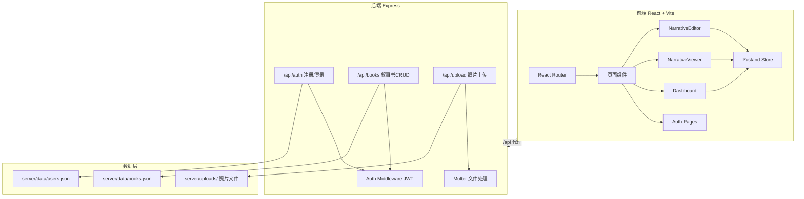
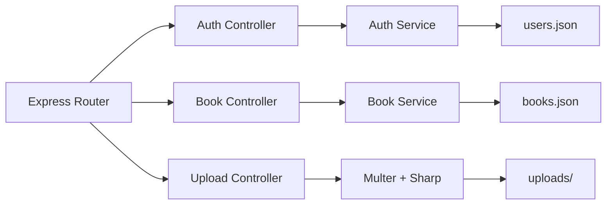
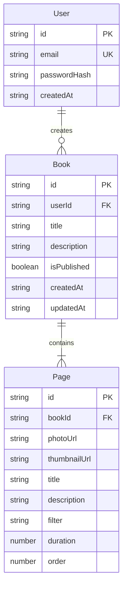

## 1. 架构设计



## 2. 技术说明

- 前端：React@18 + TypeScript + TailwindCSS + Vite
- 初始化工具：vite-init（react-express-ts模板）
- 后端：Express@4 + TypeScript（ESM格式）
- 数据库：本地JSON文件存储（server/data/目录）
- 状态管理：Zustand
- 路由：react-router-dom
- 图标：lucide-react
- 认证：bcryptjs + jsonwebtoken
- 文件上传：multer（Express中间件）
- 缩略图生成：sharp

## 3. 路由定义

| 路由 | 用途 |
|------|------|
| /login | 登录页面 |
| /register | 注册页面 |
| /dashboard | 仪表盘，展示用户叙事书列表 |
| /book/:id/edit | 叙事书编辑器 |
| /book/:id/view | 叙事书浏览页（公开可访问） |
| / | 重定向至/dashboard或登录页 |

## 4. API定义

### 4.1 认证相关

```typescript
interface RegisterRequest {
  email: string;
  password: string;
}

interface LoginRequest {
  email: string;
  password: string;
}

interface AuthResponse {
  token: string;
  user: { id: string; email: string };
}

// POST /api/auth/register
// POST /api/auth/login
```

### 4.2 叙事书相关

```typescript
interface Book {
  id: string;
  userId: string;
  title: string;
  description: string;
  isPublished: boolean;
  createdAt: string;
  updatedAt: string;
  pages: Page[];
}

interface Page {
  id: string;
  photoUrl: string;
  thumbnailUrl: string;
  title: string;
  description: string;
  filter: string;
  duration: number;
  order: number;
}

interface CreateBookRequest {
  title: string;
  description: string;
}

interface UpdateBookRequest {
  title?: string;
  description?: string;
  isPublished?: boolean;
  pages?: Page[];
}

// GET    /api/books          - 获取当前用户的叙事书列表
// POST   /api/books          - 创建新叙事书
// GET    /api/books/:id      - 获取单个叙事书（公开或自己的）
// PUT    /api/books/:id      - 更新叙事书
// DELETE /api/books/:id      - 删除叙事书
```

### 4.3 照片上传

```typescript
interface UploadResponse {
  url: string;
  thumbnailUrl: string;
}

// POST /api/upload - multipart/form-data, field: "photos"
// 返回上传照片的URL和缩略图URL
```

## 5. 服务端架构图



## 6. 数据模型

### 6.1 数据模型定义



### 6.2 数据存储

- `server/data/users.json`：用户数据数组
- `server/data/books.json`：叙事书数据数组（含嵌套pages）
- `server/uploads/`：上传的照片原图
- `server/uploads/thumbnails/`：生成的缩略图（200x200）

## 7. 文件结构与调用关系

```
project/
├── package.json                    # 依赖与脚本，前后端代理配置
├── vite.config.ts                  # Vite构建，/api代理至Express
├── tsconfig.json                   # TypeScript严格模式配置
├── index.html                      # SPA入口，挂载React根节点
├── server/
│   ├── index.ts                    # Express主服务（认证/CRUD/上传）
│   └── data/                       # JSON数据存储目录
│       ├── users.json
│       └── books.json
├── src/
│   ├── main.tsx                    # React入口，渲染根组件+路由
│   ├── App.tsx                     # 路由配置（/login,/register,/dashboard,/book/:id/edit,/book/:id/view）
│   ├── store.ts                    # Zustand全局状态管理
│   ├── components/
│   │   ├── NarrativeEditor.tsx     # 编辑器核心（上传/排序/属性/预览）
│   │   └── NarrativeViewer.tsx     # 浏览器（滚动/自动播放/页码）
│   ├── pages/
│   │   ├── LoginPage.tsx           # 登录页
│   │   ├── RegisterPage.tsx        # 注册页
│   │   ├── DashboardPage.tsx       # 仪表盘页
│   │   ├── EditorPage.tsx          # 编辑器页容器
│   │   └── ViewerPage.tsx          # 浏览页容器
│   ├── hooks/
│   │   └── useAuth.ts              # 认证Hook（登录/注册/Token管理）
│   └── utils/
│       ├── api.ts                  # API请求封装（fetch+JWT头）
│       └── filters.ts              # 滤镜预设定义
```

**数据流向：**
- 用户交互 → React组件更新Zustand状态 → 调用api.ts发请求 → Vite代理至Express → JWT中间件验证 → Controller处理 → 读写JSON文件 → 返回JSON响应 → Zustand更新 → UI重渲染
