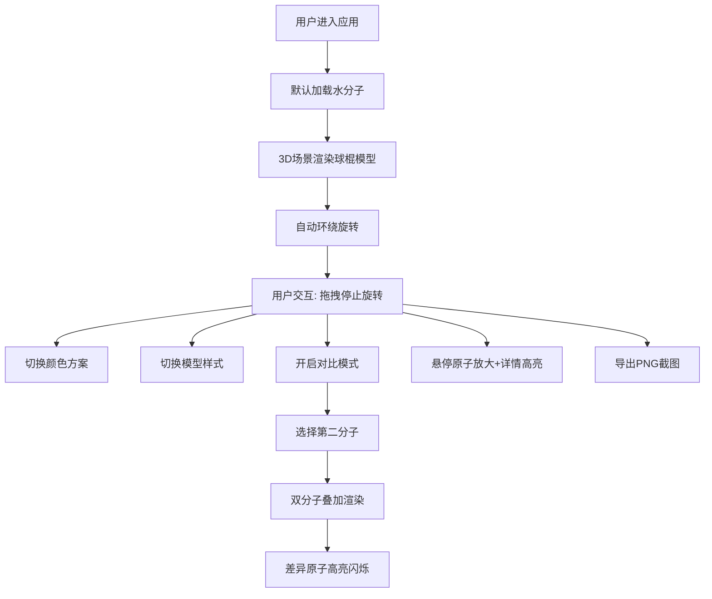

## 1. 产品概述

三维分子结构交互式可视化与对比分析工具，面向化学研究人员和学生，提供浏览器端的分子模型加载、操作与结构对比功能。支持多分子叠加展示、结构差异高亮、实时交互操作，帮助用户直观理解分子空间结构。

## 2. 核心功能

### 2.1 用户角色
| 角色 | 使用方式 | 核心权限 |
|------|----------|----------|
| 化学研究人员 | 浏览器直接访问 | 加载分子、3D交互、对比分析、导出截图 |
| 学生用户 | 浏览器直接访问 | 学习分子结构、切换视图模式 |

### 2.2 功能模块
1. **分子3D可视化**：球棍模型/空间填充模型渲染，支持旋转、缩放、平移交互
2. **控制面板**：分子选择、颜色方案切换、模型样式切换、对比模式开关
3. **对比叠加**：双分子叠加显示、半透明渲染、差异原子高亮警示
4. **分子详情**：原子数、键数、分子式、分子量、原子坐标列表
5. **截图导出**：1920x1080 PNG格式高清导出

### 2.3 页面详情
| 页面名称 | 模块名称 | 功能描述 |
|----------|----------|----------|
| 主应用页面 | 3D场景区 | 分子模型渲染、鼠标交互、自动环绕旋转 |
| 主应用页面 | 左侧控制面板 | 分子选择下拉、颜色方案切换、模型切换、对比模式、截图导出 |
| 主应用页面 | 右侧详情面板 | 分子基本信息、原子坐标列表、悬停高亮联动 |
| 主应用页面 | 对比模式 | 第二分子半透明叠加、差异原子闪烁警示 |

## 3. 核心流程

用户进入应用 → 默认加载水分子 → 可通过下拉菜单切换分子 → 3D场景实时渲染分子模型 → 用户可拖拽旋转/滚轮缩放 → 开启对比模式 → 选择第二个分子 → 叠加显示并高亮差异 → 查看详情面板 → 导出截图

## 4. 用户界面设计

### 4.1 设计风格
- **主题**：深色科技风，适合科学研究场景
- **主色调**：背景 #1a1a2e，面板 #16213e，文字 #e0e0e0
- **强调色**：#0f3460（深蓝）、#e94560（红粉）
- **按钮风格**：圆角矩形，悬停变色，点击缩放0.95微动画
- **字体**：现代无衬线字体，清晰易读
- **布局**：三栏式布局，左右面板固定宽度280px，中间主场景自适应

### 4.2 页面设计概述
| 页面名称 | 模块名称 | UI元素 |
|----------|----------|--------|
| 主应用 | 3D场景 | 深色背景、分子球棍模型、自动旋转、光晕效果 |
| 主应用 | 左侧控制面板 | 折叠/展开按钮、下拉选择器、切换按钮组、导出按钮 |
| 主应用 | 右侧详情面板 | 折叠/展开按钮、信息卡片、可滚动原子列表 |
| 主应用 | 对比模式 | 半透明第二分子、红色闪烁警示球、差异文字说明 |

### 4.3 响应式
- **桌面端**（≥768px）：三栏式布局，左右面板固定280px宽度
- **移动端**（<768px）：左右面板变为底部/顶部可滑动抽屉，主场景全屏显示
- 触摸操作优化：双指缩放、单指旋转

### 4.4 3D场景指导
- **环境**：深色渐变背景，营造深邃科学感
- **光照**：环境光 + 方向光 + 点光源，确保分子各面清晰可见
- **相机**：透视相机，默认距离适中，可自动环绕旋转
- **交互**：OrbitControls 支持旋转、缩放、平移
- **原子材质**：MeshStandardMaterial，金属感+粗糙度适中，球体高光自然
- **化学键**：半透明灰色圆柱体，连接处平滑过渡
- **后处理**：抗锯齿，悬停原子发光效果
