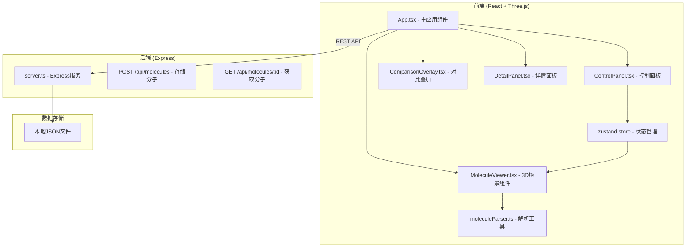
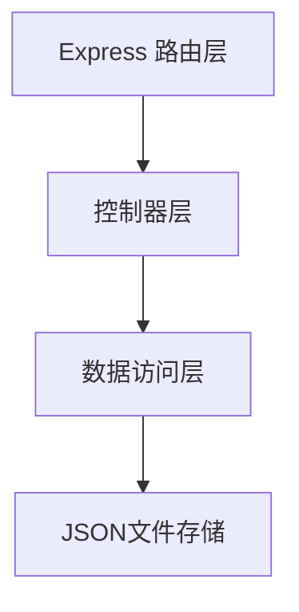
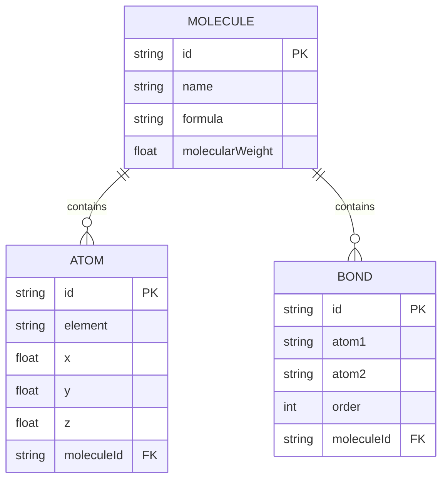

## 1. 架构设计



## 2. 技术描述

- **前端框架**：React 18 + TypeScript
- **3D渲染**：Three.js + @react-three/fiber + @react-three/drei
- **状态管理**：Zustand
- **构建工具**：Vite
- **后端**：Express 4 + TypeScript
- **数据存储**：本地JSON文件
- **样式方案**：CSS Modules / 内联样式 (配合主题变量)
- **HTTP通信**：Fetch API + CORS

## 3. 路由定义

| 路由 | 用途 |
|------|------|
| / | 主应用页面（分子3D可视化） |

## 4. API 定义

### 4.1 分子数据类型定义

```typescript
interface Atom {
  id: string;
  element: string;
  x: number;
  y: number;
  z: number;
}

interface Bond {
  id: string;
  atom1: string;
  atom2: string;
  order: number;
}

interface Molecule {
  id: string;
  name: string;
  formula: string;
  molecularWeight: number;
  atoms: Atom[];
  bonds: Bond[];
}
```

### 4.2 API 接口

**POST /api/molecules**
- 请求体：`Molecule` 对象
- 响应：`{ success: boolean; id: string }`
- 功能：存储分子数据到本地JSON文件

**GET /api/molecules/:id**
- 路径参数：`id` - 分子ID
- 响应：`Molecule` 对象
- 功能：根据ID获取分子数据

**GET /api/molecules**
- 响应：`Molecule[]`
- 功能：获取所有预置分子列表

## 5. 服务端架构



## 6. 数据模型

### 6.1 数据模型定义



### 6.2 预置分子数据

预置水分子(H2O)、甲烷(CH4)、咖啡因(C8H10N4O2)、苯环(C6H6)四个分子的原子坐标和键连接数据。

## 7. 前端组件结构

```
src/client/
├── App.tsx                    # 主应用组件
├── components/
│   ├── MoleculeViewer.tsx     # 3D场景主组件
│   ├── ControlPanel.tsx       # 左侧控制面板
│   ├── DetailPanel.tsx        # 右侧详情面板
│   ├── ComparisonOverlay.tsx  # 对比叠加组件
│   └── Sphere.tsx             # 原子球体组件
├── store/
│   └── useMoleculeStore.ts    # Zustand状态管理
├── utils/
│   └── moleculeParser.ts      # 分子数据解析工具
└── types/
    └── molecule.ts            # 类型定义
```

## 8. 性能优化策略

- **InstancedMesh**：同类型原子使用实例化网格渲染
- **几何体复用**：球体、圆柱体几何体缓存复用
- **材质复用**：相同元素原子共享材质
- **按需渲染**：仅在交互时触发重渲染
- **LOD**：远距离原子简化渲染（可选）
- **内存管理**：组件卸载时清理Three.js资源
