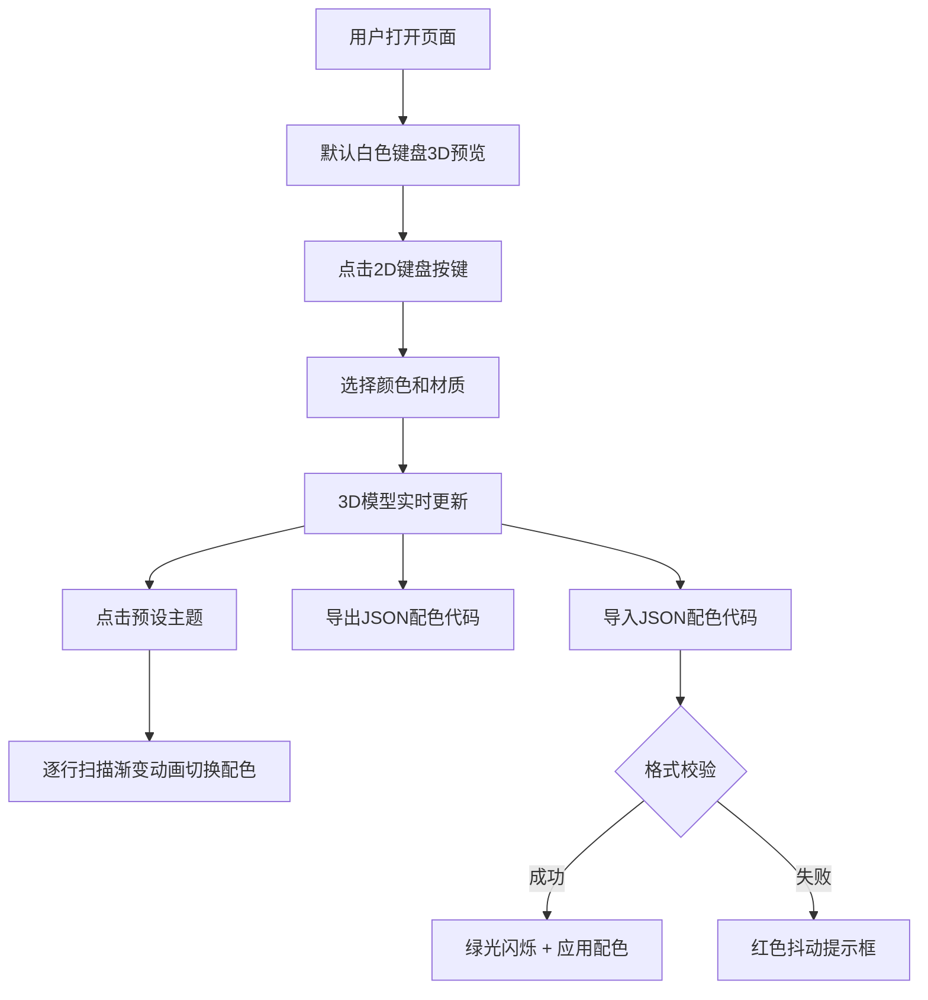

## 1. 产品概述

机械键盘键帽配色定制工具，面向机械键盘爱好者，提供可视化3D实时预览、逐键自定义配色与材质、主题预设、配色方案导入导出等功能。

- 主要目的：让用户在浏览器中直观预览键盘键帽配色效果，生成个性化键帽套装方案并分享
- 目标用户：机械键盘爱好者、外设玩家、DIY发烧友
- 市场价值：填补在线键帽配色可视化预览工具的空白，降低用户试错成本

## 2. 核心功能

### 2.1 功能模块

1. **主界面**：2D键盘布局选择区 + 3D实时预览区 + 底部配色控制栏
2. **逐键配色模块**：点击2D键盘上任意按键，弹出颜色选择器和材质选项，实时同步到3D模型
3. **主题预设模块**：提供复古灰白、赛博朋克霓虹、马卡龙粉蓝、森林绿棕等预设方案，切换时带逐行扫描渐变动画
4. **导入导出模块**：支持JSON格式配色代码的导入导出，导入时校验格式并给出视觉反馈
5. **响应式适配模块**：桌面端鼠标拖拽旋转，移动端单指旋转、双指捏合缩放

### 2.2 页面详情

| 页面名称 | 模块名称 | 功能描述 |
|-----------|-------------|---------------------|
| 主页面 | 2D键盘布局区 | Canvas绘制标准键盘布局，支持按键点击选中，高亮当前选中按键 |
| 主页面 | 3D预览区 | Three.js渲染可交互键盘模型，支持拖拽旋转（带阻尼）、颜色和材质实时更新 |
| 主页面 | 配色控制面板 | 颜色选择器、材质切换（哑光/亮光/磨砂）、预设主题按钮、导入导出按钮 |
| 主页面 | 提示反馈层 | 导入成功绿光闪烁、导入失败红色抖动动画提示框 |

## 3. 核心流程

用户打开页面 → 查看默认白色键盘3D预览 → 点击2D布局上的目标按键 → 在右侧面板选择颜色和材质 → 实时查看3D模型更新 → （可选）点击预设主题应用整体配色 → （可选）导出JSON配色代码分享 / 导入他人配色代码 → 获得视觉反馈

## 4. 用户界面设计

### 4.1 设计风格

- **主色调**：深蓝灰背景（#1a1f2e），浅蓝文字（#c5d8ff）
- **键盘底座**：浅灰色（#E8E8E8），按键默认白色（#FFFFFF），按键间黑色细缝分隔
- **右侧面板**：磨砂玻璃效果半透明背景（backdrop-filter: blur(12px)）
- **按钮/选择器**：悬浮发光边框效果（box-shadow发光），点击涟漪动画
- **排版**：现代无衬线字体，标题粗体、正文常规、辅助信息小号浅色
- **图标**：简洁线性图标，配色与主题一致

### 4.2 页面设计概述

| 页面名称 | 模块名称 | UI元素 |
|-----------|-------------|-------------|
| 主页面 | 2D键盘布局区 | Canvas画布，按键网格，选中高亮边框，鼠标指针反馈 |
| 主页面 | 3D预览区 | Three.js Canvas，环境光照，微倾斜人体工学角度，拖拽旋转阻尼 |
| 主页面 | 配色控制面板 | 颜色拾色器、材质切换胶囊按钮、预设主题卡片、导入导出圆角按钮 |
| 主页面 | 提示反馈层 | 居中浮动提示框，成功绿光边框闪烁，失败红色抖动 |

### 4.3 响应式设计

- **桌面端（≥1024px）**：左右两栏布局，左侧2D键盘占45%，右侧3D预览占55%，底部控制栏全宽
- **平板端（768px-1023px）**：上下堆叠布局，2D键盘在上，3D预览在下，控制栏底部
- **移动端（<768px）**：紧凑键盘布局，3D预览区缩小，支持单指拖拽旋转、双指捏合缩放，控制栏改为底部抽屉式

### 4.4 3D场景指导

- **环境**：柔和环境光 + 方向光，营造真实键帽质感
- **光照**：AmbientLight（0.6强度）+ DirectionalLight（0.8强度，带阴影）+ HemisphereLight（天空/地面反射）
- **相机**：PerspectiveCamera，初始位置倾斜俯视（约25度角），焦距适配键盘整体
- **材质**：MeshStandardMaterial，支持roughness和metalness参数切换哑光/亮光/磨砂
- **动画**：逐行扫描换色使用颜色线性插值（lerp），0.8秒完成，每行延迟递增
- **性能**：按键几何体复用（InstancedMesh优化），60FPS稳定运行，批量颜色更新≤200ms
