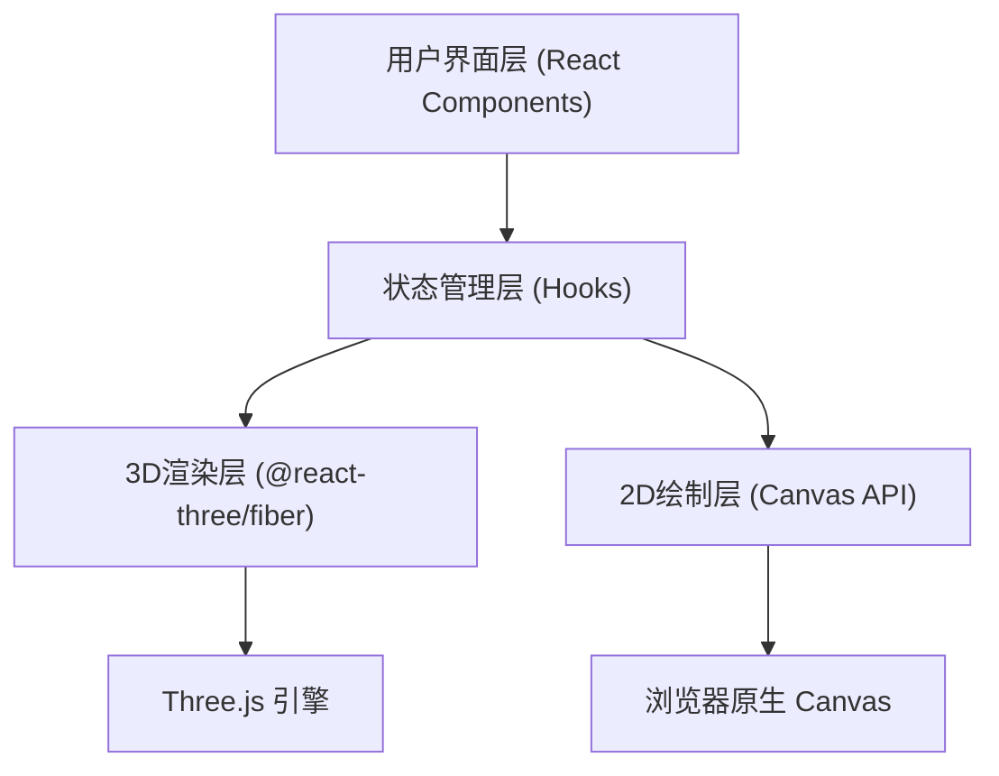

## 1. 架构设计



## 2. 技术描述

- **前端框架**：React@18 + TypeScript@5
- **构建工具**：Vite@5 + @vitejs/plugin-react
- **3D渲染**：three@0.160 + @react-three/fiber@8 + @react-three/drei@9
- **2D绘制**：原生 HTML5 Canvas API
- **状态管理**：React Hooks（useState/useReducer/useCallback）+ 自定义Hook封装
- **样式方案**：原生CSS + CSS Modules（内联样式处理动态值）

## 3. 文件结构

```
d:\Pro\tasks\auto126
├── index.html                  # 入口HTML
├── package.json                # 依赖与脚本
├── vite.config.js              # Vite配置
├── tsconfig.json               # TypeScript配置
└── src
    ├── main.tsx               # React应用入口
    ├── App.tsx                # 主布局组件（全局状态管理）
    ├── components
    │   ├── KeyboardMap.tsx    # 2D键盘布局（Canvas绘制 + 点击事件）
    │   └── Keyboard3DPreview.tsx  # 3D键盘预览（R3F + 动画）
    └── hooks
        └── useThemeColors.ts  # 配色管理Hook（主题/导入导出）
```

## 4. 数据模型

### 4.1 核心类型定义

```typescript
// 材质类型
type KeyMaterial = 'matte' | 'glossy' | 'satin';

// 单个按键配色
interface KeyColor {
  id: string;
  color: string;      // HEX颜色值，如 "#FFFFFF"
  material: KeyMaterial;
}

// 完整配色方案
interface ColorScheme {
  version: string;
  name: string;
  keys: Record<string, KeyColor>;  // keyId -> KeyColor
}

// 预设主题
interface PresetTheme {
  id: string;
  name: string;
  description: string;
  scheme: ColorScheme;
}
```

### 4.2 按键布局定义

标准104键布局，每个按键包含：id、行号row、列号col、宽度width、标签label。
按键尺寸基于1U标准单位（约40px），如Enter键为2.25U，空格为6.25U。

## 5. 关键技术实现点

### 5.1 2D键盘布局（KeyboardMap.tsx）
- Canvas绘制按键矩形、文字标签、选中高亮
- 点击事件：将鼠标坐标映射到按键网格，命中检测使用矩形包含判断
- 响应式：根据容器宽度动态计算U单位像素值

### 5.2 3D键盘渲染（Keyboard3DPreview.tsx）
- 底座：浅灰色BoxGeometry，顶部微倾斜（rotation.x ≈ -0.15）
- 按键：每个按键独立Mesh，高度略高于底座，按键间0.5U间隙
- 材质映射：matte→roughness=0.8/metalness=0.1，glossy→roughness=0.2/metalness=0.3，satin→roughness=0.5/metalness=0.15
- 旋转控制：OrbitControls（drei），enableDamping=true，dampingFactor=0.08
- 逐行动画：按row分组，每组delay=rowIndex*0.08s，使用useFrame + THREE.Color.lerp做颜色插值

### 5.3 配色管理Hook（useThemeColors.ts）
- 内置4个预设主题：vintage-retro / cyberpunk-neon / macaron-pinkblue / forest-greenbrown
- exportScheme：将ColorScheme序列化为JSON字符串并触发下载
- importScheme：解析JSON，校验version和keys字段，失败返回错误信息
- applyThemeAnimation：触发逐行扫描动画状态

### 5.4 性能优化
- 3D按键使用共享Geometry，仅Material实例不同
- 颜色更新通过material.color.set()直接修改，避免重建Mesh
- 批量更新使用requestAnimationFrame合并到下一帧
- Canvas 2D绘制缓存离屏画布，仅重绘受影响按键区域

### 5.5 交互反馈动效
- 按钮hover：CSS transition + box-shadow发光扩散
- 按钮click：CSS伪元素实现涟漪扩散动画
- 导入成功：CSS keyframes绿光脉冲闪烁
- 导入失败：CSS keyframes左右抖动 + 红色边框高亮
