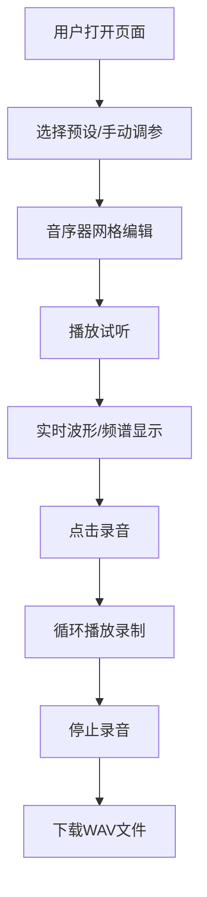

## 1. 产品概述

赛博朋克风格的在线虚拟乐器合成器与实时波形可视化工具，为音乐制作爱好者提供浏览器内的电子音色创作与演奏体验。用户可通过组合多种波形和ADSR包络创造独特音色，实时查看波形与频谱变化，录制并导出为WAV音频文件。

- 核心价值：无需安装专业软件，在浏览器中即可完成从音色设计、乐句编辑、音频录制的完整音乐创作闭环，为电子音乐爱好者提供轻量化的创作工具。

## 2. 核心功能

### 2.1 用户角色

| 角色 | 注册方式 | 核心权限 |
|------|-----------|----------|
| 音乐爱好者 | 无需注册 | 使用所有合成器、音序器、可视化和录音功能 |

### 2.2 功能模块

1. **合成器面板模块**：四个独立振荡器模块，波形选择、音高与音量控制，ADSR包络控制
2. **音色预设模块**：八种经典电子音色预设，一键加载并预览
3. **钢琴卷帘音序器模块**：16步音序器，网格点击编辑，循环播放
4. **实时可视化模块**：波形图与频谱图实时渲染
5. **录音导出模块**：录制音序器播放，导出16位44.1kHz WAV文件

### 2.3 页面详情

| 页面名称 | 模块名称 | 功能描述 |
|-----------|-----------|----------|
| 主界面 | 合成器面板 | 四个振荡器（波形下拉、音高滑块、音量滑块）、ADSR包络控制（四个滑块） |
| 主界面 | 音色预设区 | 八种预设卡片，点击加载参数并播放C大调音阶预览 |
| 主界面 | 钢琴卷帘音序器 | 16x12网格点击编辑、BPM控制、播放/停止控制、节拍光标 |
| 主界面 | 波形可视化 | 2D波形图（250FPS）、频谱图（30+FPS） |
| 主界面 | 录音工具栏 | 录音按钮、时间显示、WAV导出 |

## 3. 核心流程

用户打开页面 → 选择预设音色或手动调整合成器参数 → 在音序器网格上点击编辑乐句 → 点击播放试听 → 观察波形与频谱实时变化 → 点击录音按钮 → 播放完成后停止录音 → 下载WAV文件

## 4. 用户界面设计

### 4.1 设计风格

- **主色调**：深蓝紫渐变背景（从#1a1a2e到#16213e），青色（#00f5ff）与品红（#ff00ff）强调色，白色（#ffffff）文字
- **按钮风格**：圆角卡片，磨砂玻璃半透明效果，选中时蓝紫色发光边框动画
- **字体**：现代无衬线字体，标题使用Orbitron或类似科技感字体，正文使用Roboto Mono等宽字体
- **布局风格**：桌面端三列布局（左侧合成器、中央音序器、右侧可视化），移动端单列垂直滚动
- **视觉效果**：细霓虹发光效果、渐变色彩、微妙的动画过渡

### 4.2 页面设计概览

| 页面名称 | 模块名称 | UI元素 |
|-----------|-----------|---------|
| 主界面 | 合成器面板 | 四个振荡器模块卡片、波形下拉菜单、线性滑块、ADSR滑块组 |
| 主界面 | 预设区 | 八个圆角预设卡片、悬停发光效果、选中色相循环动画 |
| 主界面 | 音序器 | 钢琴卷帘网格、渐变色激活格子、白色虚线网格、垂直节拍光标、BPM滑块、播放控制按钮 |
| 主界面 | 可视化 | 波形Canvas（深灰背景、青到洋红渐变线条、发光效果）、频谱Canvas（蓝到红热力图、对数刻度） |
| 主界面 | 录音工具栏 | 红色圆形录音按钮、脉冲动画、MM:SS时间显示 |

### 4.3 响应式设计

- **桌面端（≥1366x768）**：三列平铺布局，左侧合成器30%、中央音序器40%、右侧可视化30%
- **平板端（1024-1366）**：两列布局，合成器与音序器上下排列，可视化占右侧
- **移动端（<1024）**：单列垂直滚动布局，所有模块垂直堆叠
- **触摸优化**：滑块支持触摸拖拽，按钮点击区域≥44x44像素，触摸反馈

### 4.4 动画与交互

- **波形刷新率**：波形图250FPS，频谱图30+FPS，光标移动60+FPS
- **预设按钮**：悬停时亮度提升，选中时蓝紫色色相循环发光动画
- **音序器格子**：点击时缩放动画，激活格子黄到红渐变
- **录音按钮**：录制时红色脉冲呼吸动画
- **参数调整**：滑块值变化时参数实时更新，响应延迟≤50ms
