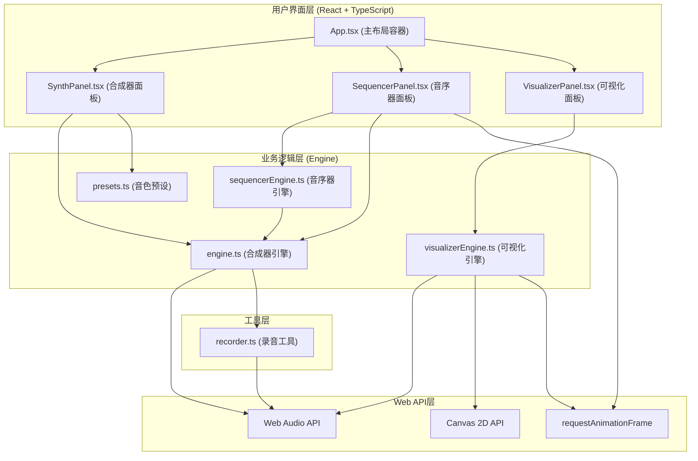

## 1. 架构设计



## 2. 技术描述

- **前端框架**：React 18 + TypeScript 5
- **构建工具**：Vite 5 + @vitejs/plugin-react
- **音频处理**：Web Audio API（AudioContext、OscillatorNode、GainNode、AnalyserNode）
- **可视化**：Canvas 2D API（波形图、频谱图）
- **状态管理**：React useState/useReducer（局部状态）+ 自定义Hooks
- **样式方案**：CSS Modules + CSS Variables（赛博朋克主题）
- **性能优化**：requestAnimationFrame调度、Web Audio API内部处理、Canvas分层绘制

## 3. 项目目录结构

```
auto129/
├── package.json
├── vite.config.js
├── tsconfig.json
├── index.html
└── src/
    ├── App.tsx                    # 主应用组件，三列布局容器
    ├── index.css                  # 全局样式与CSS变量
    ├── main.tsx                   # React入口
    ├── synthesizer/
    │   ├── engine.ts              # 合成器引擎：AudioContext、振荡器、ADSR
    │   ├── presets.ts             # 八种预设音色参数
    │   └── SynthPanel.tsx         # 合成器UI面板
    ├── sequencer/
    │   ├── sequencerEngine.ts     # 音序器状态与播放逻辑
    │   └── SequencerPanel.tsx     # 钢琴卷帘UI
    ├── visualizer/
    │   ├── visualizerEngine.ts    # 分析器节点与数据获取
    │   └── VisualizerPanel.tsx    # Canvas波形与频谱渲染
    └── utils/
        └── recorder.ts            # WAV录音与导出
```

## 4. 核心类型定义

### 4.1 合成器相关类型

```typescript
// 波形类型
type WaveformType = 'sine' | 'sawtooth' | 'square' | 'triangle';

// 振荡器配置
interface OscillatorConfig {
  waveform: WaveformType;
  pitch: number;      // 0-24半音，对应C4-C6
  volume: number;     // 0-100
  enabled: boolean;
}

// ADSR包络参数
interface ADSRParams {
  attack: number;     // 0-2秒，步进0.01
  decay: number;      // 0-2秒
  sustain: number;    // 0-1
  release: number;    // 0-3秒
}

// 合成器完整状态
interface SynthState {
  oscillators: OscillatorConfig[];
  adsr: ADSRParams;
}

// 活跃音符追踪
interface ActiveNote {
  id: string;
  frequency: number;
  oscillators: OscillatorNode[];
  gainNodes: GainNode[];
  masterGain: GainNode;
  startTime: number;
}
```

### 4.2 音序器相关类型

```typescript
// 音序器网格状态（16步 x 12半音）
type SequenceGrid = boolean[][]; // [step][noteIndex]

// 音序器状态
interface SequencerState {
  bpm: number;           // 60-180
  grid: SequenceGrid;    // 16x12
  isPlaying: boolean;
  currentStep: number;   // 0-15
  stepProgress: number;  // 0-1，用于平滑光标
}

// 音高映射（12个半音，从C4开始）
const NOTE_NAMES = ['C4', 'C#4', 'D4', 'D#4', 'E4', 'F4', 'F#4', 'G4', 'G#4', 'A4', 'A#4', 'B4'];
```

### 4.3 可视化相关类型

```typescript
// 可视化数据
interface VisualizerData {
  timeDomainData: Float32Array;  // 波形数据
  frequencyData: Uint8Array;     // 频谱数据
}

// 预设类型
type PresetName = 'piano' | 'organ' | 'bass' | 'lead' | 'pad' | 'pluck' | 'fx' | 'sub';
```

## 5. 核心模块设计

### 5.1 合成器引擎 (engine.ts)

```typescript
// 核心方法
class SynthesizerEngine {
  constructor(): 初始化AudioContext、主输出节点、分析器节点
  getAudioContext(): 获取AudioContext实例
  getAnalyserNode(): 获取分析器节点用于可视化
  getMasterGain(): 获取主增益节点用于录音
  setOscillatorConfig(index, config): 更新单个振荡器配置
  setADSRParams(params): 更新ADSR参数
  triggerNote(frequency): 触发音符，创建振荡器和包络
  releaseNote(noteId): 释放音符，触发release阶段
  stopAllNotes(): 停止所有活跃音符
  playScale(noteNames, interval): 播放音阶用于预设预览
}
```

**关键技术点**：
- 每个音符为4个振荡器的混合输出
- ADSR包络使用GainNode的exponentialRampToValueAtTime实现
- 使用Map<string, ActiveNote>追踪活跃音符
- 所有振荡器连接到统一的主增益节点，再连接到分析器和输出

### 5.2 音序器引擎 (sequencerEngine.ts)

```typescript
// 核心方法
class SequencerEngine {
  constructor(synthEngine, onStepChange, onProgressChange)
  setBPM(bpm): 设置BPM
  toggleCell(step, noteIndex): 切换网格单元
  clearGrid(): 清空网格
  start(): 开始播放（requestAnimationFrame循环）
  stop(): 停止播放
  getState(): 获取当前状态
  subscribe(callback): 订阅状态变化
}
```

**关键技术点**：
- 使用requestAnimationFrame驱动高精度播放时钟
- 根据BPM计算每步时长：60000 / BPM / 4 毫秒（十六分音符）
- 使用performance.now()实现精确的时间追踪
- stepProgress用于光标的平滑移动插值

### 5.3 可视化引擎 (visualizerEngine.ts)

```typescript
// 核心方法
class VisualizerEngine {
  constructor(audioContext, analyserNode)
  start(callback): 开始数据采集，每帧调用callback
  stop(): 停止采集
  getTimeDomainData(): 获取时域波形数据
  getFrequencyData(): 获取频域频谱数据
}
```

**关键技术点**：
- AnalyserNode配置：fftSize=2048，smoothingTimeConstant=0.8
- 使用getFloatTimeDomainData和getByteFrequencyData获取数据
- requestAnimationFrame实现高刷新率绘制
- 波形图每4ms更新（250FPS），频谱图每33ms更新（30FPS）

### 5.4 录音工具 (recorder.ts)

```typescript
// 核心方法
class AudioRecorder {
  constructor(audioContext, sourceNode): 创建MediaStreamDestination
  start(): 开始录制
  stop(): 停止录制，返回Promise<Blob>
  getDuration(): 获取已录制时长（秒）
  downloadWAV(blob, filename): 触发WAV文件下载
}

// WAV编码函数
function encodeWAV(audioBuffers, sampleRate=44100, bitDepth=16): Blob
```

**关键技术点**：
- 使用MediaStreamDestination和MediaRecorder API
- 或使用ScriptProcessorNode手动采集PCM数据
- WAV文件头构建：RIFF格式、16位PCM、44.1kHz、立体声/单声道
- 录音过程中参数调整不中断音频流

## 6. 性能优化策略

### 6.1 合成器性能
- 复用振荡器节点，而非频繁创建销毁
- 音符释放后延迟清理，避免频繁GC
- 最多同时支持64个音符，超出时自动释放最早的音符
- 所有音频处理在Web Audio引擎线程中完成，不阻塞主线程

### 6.2 可视化性能
- Canvas使用imageData或路径批量绘制，减少draw调用
- 波形图使用渐变描边，发光效果使用shadowBlur
- 频谱图使用对数频率映射，减少高频数据点
- 使用requestAnimationFrame调度，避免页面不可见时绘制

### 6.3 音序器性能
- 采用requestAnimationFrame而非setInterval确保帧率稳定
- 预先计算每步触发时间，避免重复计算
- 状态更新使用批处理，减少React重渲染
- 光标移动使用CSS transform或Canvas绘制，确保60FPS

### 6.4 内存管理
- 主动清理完成的音符资源
- 移除事件监听器和动画帧请求
- Canvas尺寸自适应但限制最大尺寸
- 录音数据使用流式处理，避免内存占用过大

## 7. 构建配置

### 7.1 vite.config.js
```javascript
import { defineConfig } from 'vite';
import react from '@vitejs/plugin-react';

export default defineConfig({
  plugins: [react()],
  server: {
    port: 5173,
    open: true
  },
  build: {
    target: 'es2020',
    sourcemap: true
  }
});
```

### 7.2 tsconfig.json
```json
{
  "compilerOptions": {
    "target": "ES2020",
    "module": "ESNext",
    "strict": true,
    "esModuleInterop": true,
    "skipLibCheck": true,
    "forceConsistentCasingInFileNames": true,
    "jsx": "react-jsx",
    "moduleResolution": "bundler",
    "resolveJsonModule": true,
    "isolatedModules": true,
    "noEmit": true
  },
  "include": ["src"]
}
```

## 8. 预设音色参数

| 预设名 | 振荡器1 | 振荡器2 | 振荡器3 | 振荡器4 | ADSR |
|--------|---------|---------|---------|---------|------|
| 钢琴 | 正弦+12音分 | 三角-3音分 | 关闭 | 关闭 | A:0.01 D:0.3 S:0.4 R:1.2 |
| 电子风琴 | 锯齿+0 | 方波+7 | 正弦+12 | 三角+19 | A:0.05 D:0.1 S:0.8 R:0.3 |
| 贝斯 | 锯齿-12 | 正弦-0 | 关闭 | 关闭 | A:0.01 D:0.2 S:0.6 R:0.5 |
| 主音Lead | 锯齿+0 | 方波+7 | 关闭 | 关闭 | A:0.02 D:0.15 S:0.7 R:0.4 |
| Pad铺垫 | 正弦+0 | 三角+7 | 正弦+12 | 锯齿+19 | A:1.5 D:0.5 S:0.8 R:2.5 |
| 拨弦Pluck | 三角+0 | 正弦+3 | 关闭 | 关闭 | A:0.001 D:0.3 S:0.0 R:0.8 |
| 效果音FX | 方波+0 | 锯齿+5 | 三角+12 | 正弦+24 | A:0.1 D:0.2 S:0.3 R:1.5 |
| 低音Sub | 正弦-12 | 正弦-0 | 关闭 | 关闭 | A:0.05 D:0.3 S:0.6 R:0.8 |
