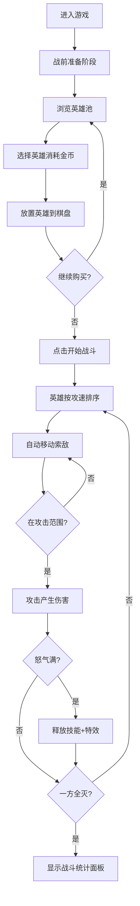

## 1. 产品概述

回合制自走棋对战模拟器——一款纯前端的战术策略游戏，玩家从英雄池中选择并配置阵容，英雄在8x8棋盘上自动移动、攻击和释放技能，最终决出胜负。目标用户为策略游戏爱好者，核心价值在于无需后端即可体验完整的自走棋战斗模拟。

## 2. 核心功能

### 2.1 功能模块

1. **战前准备阶段**：英雄池浏览、英雄选择与放置、羁绊系统、金币管理
2. **战斗阶段**：自动移动与索敌、攻击与伤害计算、怒气系统与技能释放、特效渲染
3. **战斗结算阶段**：战斗统计面板、伤害百分比柱状图

### 2.2 页面详情

| 页面区域 | 模块名称 | 功能描述 |
|---------|---------|---------|
| 棋盘区域 | 8x8网格棋盘 | 英雄放置、移动路径显示、战斗渲染 |
| 英雄池 | 英雄卡片网格 | 12+种英雄浏览、费用显示、悬停详情、选择放置 |
| 顶部UI | 金币与回合信息 | 金币数量、回合数、连胜/连败提示 |
| 右侧信息栏 | 羁绊与战斗信息 | 当前阵容羁绊激活状态、实时战斗日志 |
| 战斗统计面板 | 结算数据展示 | 存活数、总输出、承伤、治疗、击杀、伤害柱状图 |

## 3. 核心流程

玩家进入游戏后，首先进入战前准备阶段：浏览英雄池、花费金币购买英雄、将英雄拖放至棋盘格子，系统实时计算并展示羁绊加成。准备就绪后点击"开始战斗"，英雄按攻击速度排序自动行动——向最近敌方移动、进入攻击范围后攻击、怒气满时释放技能。战斗期间所有动画、特效、伤害数字实时渲染。一方英雄全灭后战斗结束，弹出战斗统计面板。

## 4. 用户界面设计

### 4.1 设计风格

- **主题**：深色科幻风（深蓝#0a1628背景，亮蓝#00d4ff界面元素）
- **棋盘格子**：浅灰#2a3a5c底色，悬浮高亮#1e90ff半透明边框
- **英雄血条**：绿→黄→红渐变（#00ff88 → #ffcc00 → #ff3344）
- **羁绊标签**：高饱和度颜色（战士金色#ffd700、法师紫色#9b59b6、刺客红色#e74c3c、射手绿色#2ecc71、坦克蓝色#3498db、辅助粉色#e91e8c）
- **按钮风格**：圆角8px，深蓝底色+亮蓝边框，悬停加深+0.2s过渡
- **字体**：Rajdhani（标题/数字）+ Source Sans 3（正文/UI）
- **布局**：三栏式（左英雄池窄栏 / 中棋盘 / 右信息栏）

### 4.2 页面设计概览

| 页面区域 | 模块名称 | UI元素 |
|---------|---------|--------|
| 棋盘区域 | 8x8网格 | 深色背景、浅灰格子、悬浮高亮、英雄单位（圆形头像+血条+怒气条） |
| 英雄池 | 英雄卡片 | 缩略卡片（头像+名称+费用+职业标签）、悬停放大+详情面板 |
| 顶部UI | 状态栏 | 金币图标+数字、回合数、连胜/连败徽章 |
| 右侧信息栏 | 羁绊面板 | 激活羁绊高亮+属性加成数值 |
| 战斗统计面板 | 结算面板 | 渐隐弹出动画、存活数、伤害柱状图（填充动画） |

### 4.3 响应式适配

- **桌面端（≥768px）**：三栏并排布局，棋盘居中最大区域
- **窄屏（<768px）**：英雄池和战斗信息栏变为折叠式，点击按钮展开/收起，棋盘占满屏幕宽度
- 触屏支持：点击选择英雄→点击棋盘格子放置，长按出售

### 4.4 动画与特效

- 英雄拖拽：半透明影子跟随鼠标
- 放置动画：弹簧弹跳效果
- 攻击特效：打击闪光+伤害数字飘字（向上飘散+渐隐）
- 技能特效：全屏震屏+粒子效果（火焰/冰晶/闪电）
- 血条更新：平滑过渡，颜色绿→红渐变
- 战斗结算面板：渐隐弹出+柱状图填充动画
