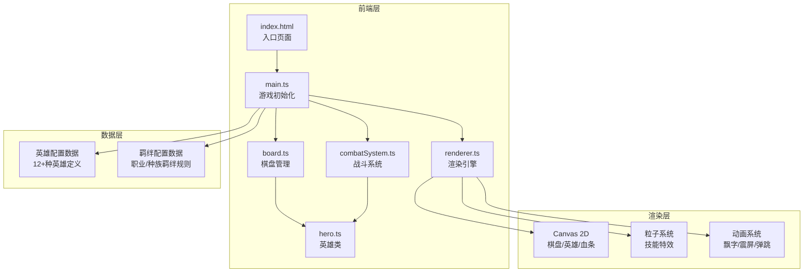
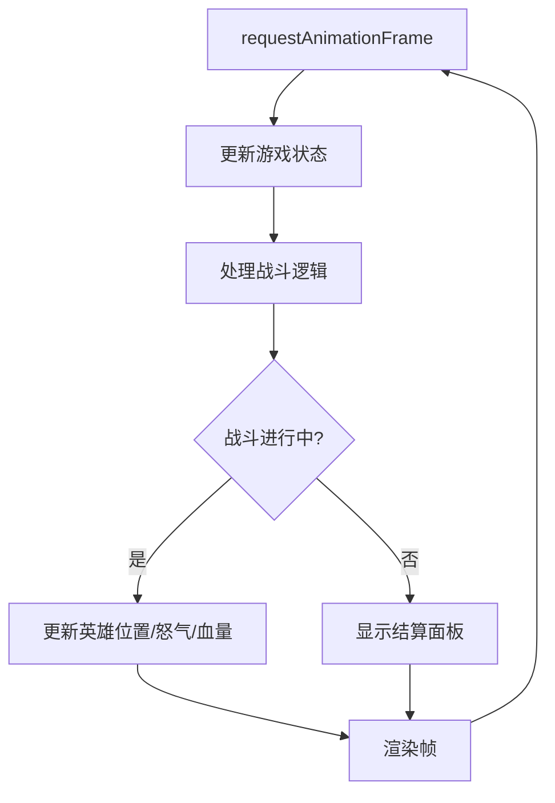

## 1. 架构设计



## 2. 技术说明

- **前端**：TypeScript + 原生Canvas 2D + Vite
- **初始化工具**：npm init vite（vanilla-ts模板）
- **后端**：无
- **数据库**：无（纯前端状态管理）
- **构建工具**：Vite
- **包管理器**：npm

## 3. 文件结构定义

| 文件路径 | 用途 |
|---------|------|
| package.json | 项目依赖（typescript, vite）与启动脚本 |
| vite.config.js | Vite构建配置 |
| tsconfig.json | TypeScript严格模式配置（esModuleInterop） |
| index.html | 入口页面，包含Canvas和UI容器 |
| src/main.ts | 游戏初始化，创建画布、加载配置、启动主循环 |
| src/hero.ts | 英雄类，包含属性、移动逻辑、技能释放 |
| src/board.ts | 棋盘管理，处理英雄放置、碰撞检测、自动索敌 |
| src/combatSystem.ts | 战斗系统，处理攻击、伤害计算、技能效果 |
| src/renderer.ts | 渲染引擎，绘制棋盘、英雄、血条、技能特效 |

## 4. 核心类设计

### 4.1 Hero类

```typescript
class Hero {
  id: string
  name: string
  cost: number
  role: string          // 职业：战士/法师/刺客/射手/坦克/辅助
  race: string          // 种族：人族/兽族/精灵/亡灵/龙族/机械
  maxHp: number
  hp: number
  attack: number
  attackSpeed: number   // 攻击间隔(ms)
  attackRange: number   // 攻击范围(格)
  moveSpeed: number     // 移动速度
  skill: Skill
  rage: number          // 怒气值0-100
  x: number             // 棋盘坐标
  y: number
  team: 'blue' | 'red'
  isAlive: boolean
  // 战斗统计
  damageDealt: number
  damageTaken: number
  healingDone: number
  kills: number
}
```

### 4.2 Skill类

```typescript
class Skill {
  name: string
  type: 'aoe' | 'heal' | 'shield' | 'single'
  damage?: number
  healAmount?: number
  shieldAmount?: number
  range: number
  rageCost: number
  particleType: 'fire' | 'ice' | 'lightning' | 'heal' | 'shield'
}
```

### 4.3 Board类

```typescript
class Board {
  grid: (Hero | null)[][]  // 8x8网格
  blueHeroes: Hero[]
  redHeroes: Hero[]
  placeHero(hero: Hero, x: number, y: number): boolean
  removeHero(x: number, y: number): Hero | null
  findNearestEnemy(hero: Hero): Hero | null
  getDistance(h1: Hero, h2: Hero): number
}
```

### 4.4 CombatSystem类

```typescript
class CombatSystem {
  heroes: Hero[]
  currentTurnIndex: number
  processTurn(): TurnResult
  calculateDamage(attacker: Hero, defender: Hero): number
  activateSkill(hero: Hero): SkillResult
  checkBattleEnd(): 'blue' | 'red' | 'ongoing'
}
```

## 5. 游戏主循环



### 帧更新策略

1. 每帧计算deltaTime
2. 按攻击速度排序的英雄队列逐个处理
3. 每个英雄：检查怒气→满则释放技能，否则移动/攻击
4. 移动：向最近敌方移动一格（受moveSpeed限制）
5. 攻击：在攻击范围内则攻击，生成飘字和特效
6. 更新所有动画和粒子
7. 渲染整个画面

## 6. 羁绊系统设计

| 羁绊名称 | 类型 | 激活条件 | 效果 |
|---------|------|---------|------|
| 战士 | 职业 | 2/4个战士 | +15%/+30%护甲 |
| 法师 | 职业 | 2/4个法师 | +20%/+40%法强 |
| 刺客 | 职业 | 2/3个刺客 | +20%/+40%暴击率 |
| 射手 | 职业 | 2/4个射手 | +15%/+30%攻击距离 |
| 坦克 | 职业 | 2/4个坦克 | +200/+400额外生命 |
| 辅助 | 职业 | 2/3个辅助 | +15%/+30%治疗效果 |
| 人族 | 种族 | 2/4个人族 | +10%/+20%攻击力 |
| 兽族 | 种族 | 2/4个兽族 | +200/+400额外生命 |
| 精灵 | 种族 | 2/3个精灵 | +15%/+30%闪避率 |
| 亡灵 | 种族 | 2/3个亡灵 | 敌方-10%/-20%护甲 |
| 龙族 | 种族 | 2个龙族 | 开局怒气+50 |
| 机械 | 种族 | 2/3个机械 | +15%/+30%攻击速度 |

## 7. 英雄列表（12种）

| 名称 | 费用 | 职业 | 种族 | 技能 | 技能类型 |
|------|------|------|------|------|---------|
| 剑盾卫士 | 1 | 战士 | 人族 | 旋风斩 | 范围伤害 |
| 魔法学徒 | 1 | 法师 | 人族 | 火球术 | 单体伤害 |
| 暗影刺客 | 2 | 刺客 | 精灵 | 暗影突袭 | 单体伤害 |
| 神射手 | 2 | 射手 | 人族 | 穿云箭 | 范围伤害 |
| 铁壁守卫 | 2 | 坦克 | 兽族 | 坚固护盾 | 护盾 |
| 圣光牧师 | 3 | 辅助 | 人族 | 治愈之光 | 治疗 |
| 雷霆法师 | 3 | 法师 | 龙族 | 闪电链 | 范围伤害 |
| 狂战之斧 | 3 | 战士 | 兽族 | 狂暴打击 | 单体伤害 |
| 幽冥巫师 | 4 | 法师 | 亡灵 | 灵魂汲取 | 单体伤害+治疗 |
| 龙骑将军 | 4 | 战士 | 龙族 | 龙息吐息 | 范围伤害 |
| 机械战甲 | 4 | 坦克 | 机械 | 自爆机器人 | 范围伤害 |
| 虚空领主 | 5 | 法师 | 亡灵 | 虚空裂隙 | 范围伤害 |

## 8. 性能优化策略

- 对象池管理粒子和飘字，避免频繁GC
- 脏标记渲染：仅重绘发生变化区域
- requestAnimationFrame驱动主循环，deltaTime保证帧率无关
- 10个英雄单位同时战斗时目标30fps+
