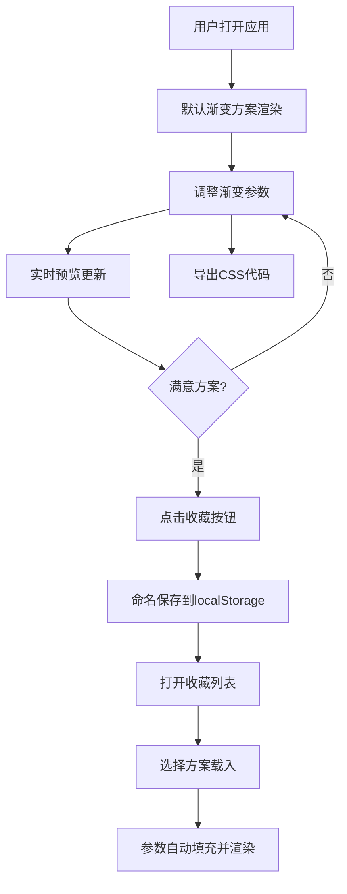

## 1. 产品概述

CSS渐变背景图案生成与收藏工具，为前端开发者和设计师提供可视化的渐变创作体验。用户可像调色盘一样自由组合色标、调整渐变参数，实时预览效果，并收藏导出满意的方案。

- 核心价值：降低CSS渐变编写门槛，提供直观的可视化创作体验
- 目标用户：前端开发者、UI设计师、创意工作者
- 市场定位：专业、高效、易用的渐变设计辅助工具

## 2. 核心特性

### 2.1 功能模块

1. **渐变控制面板**：类型切换、色标管理、参数调节
2. **实时预览画布**：大尺寸预览、交互拖拽、平滑过渡
3. **收藏管理系统**：本地存储、方案载入、编辑删除
4. **代码导出功能**：生成标准CSS代码

### 2.3 页面详情

| 页面名称 | 模块名称 | 功能描述 |
|-----------|-------------|---------------------|
| 主页面 | 顶部工具栏 | 收藏按钮、收藏列表入口、代码导出 |
| 主页面 | 左侧操作面板 | 渐变类型切换、色标添加/删除、颜色选择、位置滑块 |
| 主页面 | 右侧预览画布 | 大尺寸渐变预览、鼠标拖拽调整方向/中心点 |
| 主页面 | 收藏列表面板 | 卡片网格展示、缩略图预览、载入/删除/重命名 |

## 3. 核心流程

## 4. 用户界面设计

### 4.1 设计风格

- **主色调**：深色主题，背景#1a1a2e，卡片#16213e，强调色#0f3460
- **点缀色**：#e94560（文字和控件亮色）
- **按钮样式**：圆角按钮，hover时1.05倍缩放，0.2s ease-out过渡
- **字体**：现代无衬线字体，清晰的层级对比
- **布局风格**：左右分栏，卡片式设计，精致阴影
- **动效**：200ms平滑过渡，收藏面板底部滑入，卡片悬停上浮

### 4.2 页面设计概览

| 页面名称 | 模块名称 | UI元素 |
|-----------|-------------|-------------|
| 主页面 | 顶部工具栏 | 星形收藏按钮、收藏列表按钮、导出按钮 |
| 主页面 | 操作面板 | 三个类型切换按钮（线性/径向/锥形）、色标圆形选择器、位置滑块、添加/删除按钮 |
| 主页面 | 预览画布 | 600x400px+大尺寸、可拖拽辅助线、十字准星光标、渐变箭头指示 |
| 主页面 | 收藏面板 | 卡片网格、缩略图、标题（可双击编辑）、删除按钮、滑入动画 |

### 4.3 响应式设计

- **桌面端（≥768px）**：左右分栏布局，操作面板固定宽度
- **移动端（<768px）**：操作面板折叠为左侧滑出抽屉，预览画布全屏
- **触摸优化**：色标滑块支持触摸拖拽，触控目标≥44x44px

### 4.4 性能要求

- 渐变渲染延迟 ≤50ms
- 预览更新过渡动画 200ms
- 拖拽操作帧率 ≥60fps
