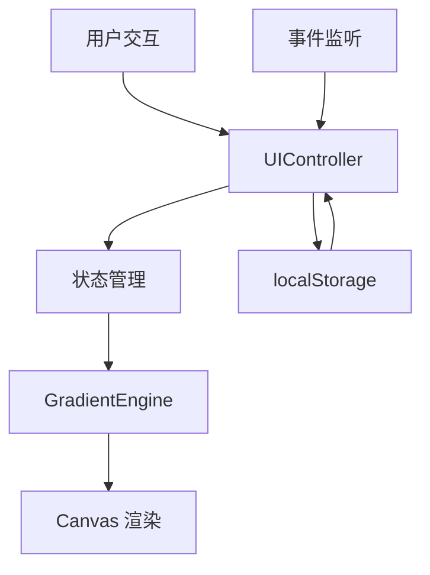

## 1. 架构设计



## 2. 技术描述

- **前端**：TypeScript + 原生HTML/CSS + Vite
- **构建工具**：Vite 5.x
- **状态管理**：原生对象状态（无框架）
- **数据存储**：localStorage
- **渲染技术**：Canvas 2D API

## 3. 文件结构

| 文件路径 | 职责 |
|-------|-----|
| `package.json` | 项目依赖与脚本配置 |
| `vite.config.js` | Vite构建配置 |
| `tsconfig.json` | TypeScript严格模式配置 |
| `index.html` | 入口页面，应用挂载点 |
| `src/main.ts` | 应用入口，初始化UI和渲染 |
| `src/gradientEngine.ts` | 核心渐变运算模块，Canvas渲染 |
| `src/uiController.ts` | DOM事件、状态同步、收藏管理 |
| `src/style.css` | 全局样式、主题变量、动画 |

## 4. 核心数据模型

### 4.1 类型定义

```typescript
interface ColorStop {
  id: string;
  color: string;
  position: number;
}

interface GradientConfig {
  id: string;
  name: string;
  type: 'linear' | 'radial' | 'conic';
  angle: number;
  centerX: number;
  centerY: number;
  radiusX: number;
  radiusY: number;
  colorStops: ColorStop[];
  createdAt: number;
}

interface AppState {
  currentConfig: GradientConfig;
  favorites: GradientConfig[];
  isDragging: boolean;
  activeHandle: string | null;
}
```

### 4.2 数据流

1. 用户操作DOM → UIController捕获事件
2. 更新AppState.currentConfig
3. 调用GradientEngine.renderGradient(config)
4. GradientEngine计算并绘制到Canvas
5. 收藏操作触发localStorage读写
6. 载入收藏时反向同步到状态和UI

## 5. 核心模块说明

### GradientEngine
- `renderGradient(ctx: CanvasRenderingContext2D, config: GradientConfig, width: number, height: number): void`
- 线性渐变：根据角度计算起止点，创建LinearGradient
- 径向渐变：根据中心点和半径创建RadialGradient
- 锥形渐变：根据旋转角度创建ConicGradient

### UIController
- 事件绑定：类型切换、色标增删、颜色拾取、滑块调节
- 拖拽交互：线性渐变方向线、径向渐变中心/半径、锥形渐变旋转
- 收藏CRUD：saveFavorite、loadFavorite、deleteFavorite、renameFavorite
- 状态同步：双向绑定UI控件与AppState
