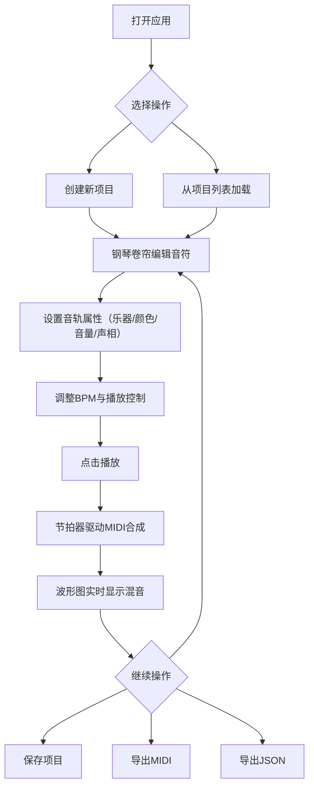

## 1. 产品概述

面向小型乐队与音乐爱好者的在线多轨乐谱编辑器与节拍同步混音预览平台，解决排练时需同时参考乐谱、节拍器、各声部音频对齐但缺乏一体化工具的痛点。目标用户为小型乐队成员、编曲爱好者和音乐教育工作者，产品价值在于将乐谱编辑、节拍同步播放与实时混音预览整合到一个浏览器端工具中，降低协作排练的门槛。

## 2. 核心功能

### 2.1 用户角色

| 角色 | 注册方式 | 核心权限 |
|------|----------|----------|
| 普通用户 | 无需注册，直接使用 | 创建/编辑/保存/删除/导出乐谱项目 |

### 2.2 功能模块

1. **主编辑页面**：钢琴卷帘乐谱编辑器、节拍器与播放控制、混音波形预览、项目列表抽屉、音轨设置面板
2. **项目列表抽屉**：项目卡片展示、加载与删除
3. **音轨设置面板**：乐器名称、颜色标识、音量与声相调节

### 2.3 页面详情

| 页面名称 | 模块名称 | 功能描述 |
|----------|----------|----------|
| 主编辑页面 | 顶部导航栏 | 应用Logo、项目名称、保存按钮、导出MIDI按钮、导出JSON按钮 |
| 主编辑页面 | 左侧项目列表抽屉 | 滑出动画显示项目卡片（名称、修改日期、音轨数量），点击加载项目 |
| 主编辑页面 | 中央乐谱编辑器 | Canvas钢琴卷帘，最多4条音轨，鼠标点击添加音符，拖拽调整，Delete删除，浅灰网格背景 |
| 主编辑页面 | 中央播放控制 | 圆形播放/暂停按钮，BPM滑块（30-240），播放时旋转动画，红色竖线指示当前位置 |
| 主编辑页面 | 右侧音轨设置面板 | 可折叠面板，每条音轨的乐器名称、颜色标记、音量滑块（0-100，初始80）、声相控制 |
| 主编辑页面 | 底部混音预览 | 800×150px波形图，蓝绿色线条，60FPS刷新，实时响应音量/声相变化 |

## 3. 核心流程

用户打开应用 → 创建或加载项目 → 在钢琴卷帘上编辑音符（多音轨） → 调整BPM与播放控制 → 点击播放，节拍器同步驱动MIDI合成 → 底部波形图实时显示混音振幅 → 调整各轨音量/声相即时反映 → 保存项目到后端 / 导出MIDI文件 / 导出JSON文件

## 4. 用户界面设计

### 4.1 设计风格

- 主色调：深色主题（背景 #1a1a2e，卡片/面板 #16213e，文字 #e0e0e0，强调色 #e94560）
- 音符颜色：#ff6b6b（红）、#4ecdc4（青）、#ffe66d（黄）、#95e1d3（薄荷绿）
- 钢琴卷帘背景：#2a2a3e，网格线：#ffffff20
- 按钮风格：圆角胶囊按钮，hover时发光效果
- 字体：JetBrains Mono（数据/代码风格UI元素）+ Outfit（标题与正文）
- 布局风格：左侧项目抽屉 + 中央编辑区 + 右侧设置面板 + 底部波形预览
- 图标风格：线性描边图标（lucide-react）

### 4.2 页面设计概述

| 页面名称 | 模块名称 | UI元素 |
|----------|----------|--------|
| 主编辑页面 | 顶部导航栏 | 深色背景#1a1a2e，Logo+项目名居左，按钮组居右，按钮hover发光#e94560 |
| 主编辑页面 | 左侧项目抽屉 | 宽度0→280px滑出动画transition:width 0.3s ease，卡片#16213e悬停#1a2a4e |
| 主编辑页面 | 钢琴卷帘 | Canvas全宽，左侧钢琴键标签，顶部小节号，网格线#ffffff20，音符圆角矩形 |
| 主编辑页面 | 播放控制 | 居中浮动栏，圆形播放按钮含旋转动画1圈/拍，BPM滑块自定义样式 |
| 主编辑页面 | 右侧音轨面板 | 可折叠，宽度280px，音轨色块+名称+滑块，transition:all 0.2s ease |
| 主编辑页面 | 底部波形预览 | 800×150px Canvas，蓝绿色(#4ecdc4)线条，暗底#16213e圆角容器 |

### 4.3 响应式设计

- 桌面优先（≥1024px）：三栏布局全展开
- 平板（768-1023px）：侧面板默认折叠为图标按钮，点击展开
- 手机（<768px）：侧面板完全隐藏为图标按钮，播放控制居中，波形预览全宽

### 4.4 动画与交互

- 项目抽屉滑出：transition: width 0.3s ease
- 所有滑块与面板切换：transition: all 0.2s ease
- 播放按钮旋转动画：1圈/拍
- 播放位置指示线：红色竖线平滑移动
- 音符添加/删除：淡入淡出效果
- 按钮hover：发光+微缩放
